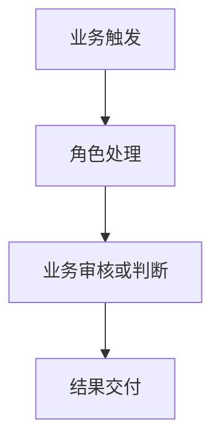

# 需求梳理文档生成参考

本文件只在需求基线达到锁定标准、用户确认最终共识摘要后读取。它负责把已确认结论组织成 `需求梳理文档.md`，不是分析问卷，也不用于补造缺失结论。

## 目录

- 生成前检查
- 文档组织规则
- 项目类型剪裁
- 文档头部
- 1 至 16 个考量点
- 待确认问题
- 写作约束

## 生成前检查

生成前必须满足：

1. 项目类型已由用户确认。
2. 适用的必填项已经确认，或有具体待确认问题及影响。
3. 条件填写项已判断为适用、不适用或待判断。
4. 核心痛点和关键功能已通过真实需求因果链与必要性检验。
5. 用户已确认最终共识摘要并同意生成文档。

任一关键条件不满足时，返回澄清阶段。不得为了交付完整文档而把当前推测写成已确认事实。

## 文档组织规则

- 认知层、边界层、交付层、防御层只用于内部覆盖判断，不作为正式文档标题。
- 16 点是完整度框架，不代表每个项目都要保留 16 个章节。
- 参考章节使用无编号标题，用于说明 16 个考量点的写法，不得直接复制成固定输出编号。
- 生成正式文档时，先删除不适用章节，再保持其余章节的业务顺序，从 1 开始连续重新编号，不允许跳号。
- 显示编号只表示文档阅读顺序，不承担与内部 16 点 ID 的映射职责。
- “当前推测”和“待确认”必须保留标记。
- 文末增加“待确认问题”，但不把它当作第 17 个考量点。
- 功能清单是必须保留的交付项，但按项目类型使用不同深度。
- 文档必须建立 `P1 → C1 → 功能项` 的结构化追溯链：痛点使用 `P` 编号，核心业务能力使用 `C` 编号并关联痛点或防御要求，功能项填写对应能力编号。
- 一个能力或功能关联多个编号时使用逗号分隔；不得出现没有来源的核心业务能力或没有对应能力编号的功能项。
- 篇幅由有效业务结论决定，不设最低字数或章节长度；能用一句话说清的内容不扩写成一段。

小工具剪裁示例：内部考量点保留业务背景、业务痛点、解决方案、实现边界、核心流程、功能清单、异常兜底时，正式文档标题依次写成 `## 1. 业务背景`、`## 2. 业务痛点`、`## 3. 解决方案`、`## 4. 实现边界`、`## 5. 核心流程`、`## 6. 功能清单`、`## 7. 异常兜底`。

默认标题：

```md
# 需求梳理文档
```

用户提供系统或工具名称时：

```md
# XXX 需求梳理文档
```

## 项目类型剪裁

| 层级 | 16 个核心考量点 | 全新产品 | 增量迭代 | 小工具 |
|---|---|---|---|---|
| 认知层 | 1. 名词解释 | 仅写核心领域术语 | 仅写新增核心领域术语 | 省略 |
| 认知层 | 2. 业务背景 | 详写 | 简写 | 简写 |
| 边界层 | 3. 业务痛点 | 详写 | 必填 | 必填 |
| 边界层 | 4. 涉及角色 | 与用户确认完整角色 | 与用户确认受影响角色 | 省略 |
| 边界层 | 5. 解决方案 | 详写 | 必填 | 必填 |
| 边界层 | 6. 实现边界 | 详写 | 必填 | 重中之重 |
| 交付层 | 7. 核心流程 | 全景流程 | 只写新老差异 | 输入、处理、输出 |
| 交付层 | 8. 功能清单 | 角色、场景、功能 | 角色、场景、功能及关联原功能 | 极简动作点 |
| 交付层 | 9. 业务实体 | 核心实体，控制粒度 | 核心实体，标明新增或修改 | 省略 |
| 交付层 | 10. 业务状态 | 详写 | 标明既有、新增或修改 | 省略 |
| 交付层 | 11. 数据权限 | 详写 | 仅写新增或修改 | 省略 |
| 防御层 | 12. 异常兜底 | 详写 | 仅写本次相关 | 必填 |
| 防御层 | 13. 外部依赖 | 详写 | 仅写本次相关 | 视情况 |
| 防御层 | 14. 老数据兼容 | 纯新项目省略 | 重中之重 | 省略 |
| 防御层 | 15. 非功能指标 | 详写 | 视业务量级 | 省略 |
| 防御层 | 16. 审计可观测 | 详写 | 仅写本次相关 | 省略 |

表中的“详写”表示结论覆盖完整，不表示增加篇幅、背景说明或通用知识。

### 全新产品

- 使用四层完整结构，纯新项目没有历史数据时省略老数据兼容。
- 角色必须经过用户确认；功能清单以角色、使用场景和功能为主线。
- 业务实体只保留有独立业务身份和生命周期的核心对象，不做细颗粒度拆分。
- 名词、全景流程、状态、权限、非功能和审计达到业务定义层。
- 不将业务定义扩写成数据库、接口、页面或技术架构设计。

### 增量迭代

- 只写本次变化及影响，不复述整个产品历史和未变化的全量能力。
- 名词解释只写本次新增的核心业务领域术语；受影响角色必须经过用户确认。
- 核心流程使用“现状流程 → 变化节点 → 目标流程”。
- 功能清单只列新增、修改和废弃项；修改项必须关联原有功能。
- 核心实体标明新增或修改；状态标明既有、新增或修改；数据权限标明新增或修改。
- 异常兜底、外部依赖和审计可观测只写本次相关内容。
- 老数据兼容必须覆盖历史数据、在途业务、既有流程、报表口径、通知和上下游影响。

### 小工具

- 保留最短背景、真实痛点、解决方案、实现边界、输入处理输出、极简功能点和异常兜底。
- 外部依赖仅在存在时保留。
- 不套用完整角色、实体、状态、权限、非功能和审计章节。

## 文档头部

标题后用简表说明当前基线：

```md
| 项目类型 | 文档状态 | 结论基线 |
|---|---|---|
| 全新产品 / 增量迭代 / 小工具 | 已确认 / 带待确认项 | 用户确认最终共识的日期或版本 |
```

用户没有提供日期或版本时，只写“本次确认”，不要编造具体时间。

## 名词解释

只用于统一核心业务领域中会影响业务判断的概念和口径，不作为关键词表或术语大全。推荐表格：

```md
| 名词 | 业务定义 | 边界或易混淆点 |
|---|---|---|
|  |  |  |
```

- 仅收录同时满足两个条件的词：属于核心业务领域，代表关键业务对象、规则、流程节点或计算口径；不定义时可能导致范围、流程、规则或结果被不同理解。
- 业务定义控制在一句话；“边界或易混淆点”只有确有歧义时才填写。
- 不收录普通系统词、页面操作词、通用管理词、语义明确的角色名称和只出现一次的边缘名词。
- 不写行业百科、背景知识、英文全称或常识性解释，除非它直接决定当前业务含义。
- 没有符合准入条件的术语时删除本节；增量迭代只解释本次新增的核心业务领域术语，既有术语不重复解释。

## 业务背景

写清谁在什么业务场景下处理什么事情、当前如何运行、为什么现在要改变。

- 全新产品：交代业务来龙去脉和当前承接方式。
- 增量迭代：只写触发本次变化的背景。
- 小工具：控制在 1 至 3 句话，说明使用场景和输入来源。
- 不写宏观行业背景和趋势铺垫。

## 业务痛点

先写总体描述，再列具体痛点。

### 总体描述

用 1 至 3 句话概括核心矛盾、主要影响对象和整体业务后果。总体描述负责建立全局判断，不重复表格中的每个细节。

具体痛点使用稳定编号 `P1`、`P2`、`P3`：

```md
| 痛点编号 | 发生场景 | 当前做法 | 真正障碍 | 业务影响 | 期望结果 |
|---|---|---|---|---|---|
| P1 |  |  |  |  |  |
```

- 痛点必须说明具体表现、原因和后果。
- 不把“想做某功能”直接写成痛点。
- 不写只有“效率低、体验差、管理难”的空泛结论。
- 痛点编号在单份文档内保持唯一和稳定；删除痛点后不自动复用已有编号。

## 涉及角色

```md
| 角色 | 参与场景 | 核心职责 | 交接对象 | 对结果负责的内容 |
|---|---|---|---|---|
|  |  |  |  |  |
```

- 使用业务角色名称，不使用页面端或技术账号代替角色。
- 全新产品的完整角色、增量迭代的受影响角色必须先与用户讨论并确认；未确认时标记为“当前推测”，不得直接定稿。
- 增量迭代只列受影响角色及本次职责变化。
- 不展开菜单、按钮和字段权限。

## 解决方案

先写总体结论，再说明核心业务机制：

```md
#### 总体思路

#### 核心业务能力

| 能力编号 | 核心业务能力 | 对应痛点/防御要求编号 | 作用对象 | 预期业务结果 |
|---|---|---|---|---|
| C1 |  | P1 |  |  |
```

- 能力编号使用 `C1`、`C2`、`C3`，在单份文档内保持唯一和稳定。
- 每项能力必须关联至少一个痛点或防御要求编号；对应多个编号时使用 `P1, P2` 或 `P1, E1`。
- 没有直接痛点的防御型能力，填写关联的异常、外部依赖、老数据兼容或审计要求编号，例如 `E1`、`D1`、`L1`、`A1`，并在对应章节保留同一编号。
- 不罗列“常见系统都有”的能力。
- 不写页面结构、接口调用和技术选型。

## 实现边界

```md
| 边界类型 | 内容 | 判断依据 |
|---|---|---|
| 本期包含 |  |  |
| 本期不包含 |  |  |
| 保持不变 |  |  |
| 后续可扩展 |  |  |
```

- 全新产品明确 V1.0 底线。
- 增量迭代明确未变化的现有能力。
- 小工具明确输入、处理、输出限制和不产品化范围。
- “后续可扩展”不得与本期范围混写。

## 核心流程

### 全新产品

使用 Mermaid 绘制主干全景流程，并补一行箭头文本：

````md


主流程：业务触发 → 角色处理 → 业务审核或判断 → 结果交付。
````

流程图只画主干。关键退回、取消、中断和转人工用 1 至 3 条补充说明。

### 增量迭代

```md
| 流程位置 | 现状做法 | 本次变化 | 目标做法 | 前后节点 | 影响 |
|---|---|---|---|---|---|
|  |  |  |  |  |  |
```

只画新老差异和插入、替换或删除的位置，不重画无变化的全系统流程。

### 小工具

```md
处理链路：输入 → 处理 → 输出。
```

存在人工复核或失败重跑时补充对应节点。

## 功能清单

功能清单用于把业务结论转成后续开发任务的输入，不代表页面菜单；每项功能必须能追溯到痛点、角色、流程节点或防御要求。

### 全新产品：角色与场景功能清单

```md
| 使用角色 | 使用场景 | 功能 | 对应能力编号 | 业务动作 | 业务对象 | 业务结果 | 版本边界 |
|---|---|---|---|---|---|---|---|
|  |  |  | C1 |  |  |  |  |
```

- 每一行必须直接回答谁在什么场景下使用什么功能。
- 同一功能被不同角色或在不同场景使用时，分别记录，不用笼统的“相关人员”合并。
- 每项功能必须关联至少一个能力编号；对应多个编号时使用 `C1, C2`。
- 版本边界使用“V1.0 包含 / 后续可扩展 / 待确认”。

### 增量迭代：变化清单

```md
| 变更类型 | 使用角色 | 使用场景 | 功能 | 关联原有功能（修改时必填） | 本次变化 | 对应能力编号 | 业务结果 | 兼容要求 |
|---|---|---|---|---|---|---|---|---|
| 新增 / 修改 / 废弃 |  |  |  |  |  | C1 |  |  |
```

- 只列本次变化，不重复未变化的全量功能。
- 每一行必须直接回答谁在什么场景下使用什么功能。
- 修改项必须填写关联的原有功能，并说明原场景或规则与本次变化；新增项没有原有功能时写“无”。
- 每项变更必须关联至少一个能力编号；对应多个编号时使用 `C1, C2`。

### 小工具：极简动作点

```md
| 动作点 | 对应能力编号 | 输入 | 处理规则 | 输出 | 异常处理 |
|---|---|---|---|---|---|
|  | C1 |  |  |  |  |
```

- 不拆业务模块和多级能力，除非用户明确将工具产品化。
- 每个动作点必须关联至少一个能力编号；对应多个编号时使用 `C1, C2`。

## 业务实体

### 全新产品

```md
| 核心业务实体 | 业务定义 | 关联实体 | 生命周期 |
|---|---|---|---|
|  |  |  |  |
```

- 只保留具有独立业务身份、能够被持续管理或追踪、具有相对独立生命周期的核心实体。
- 属性、明细项、规则、状态、流程步骤、操作记录、附件和页面区块并入所属核心实体，不单独拆分。

### 增量迭代

```md
| 变更类型 | 核心业务实体 | 原有定义或关系 | 本次变化 | 变更后定义或关系 | 生命周期影响 |
|---|---|---|---|---|---|
| 新增 / 修改 |  |  |  |  |  |
```

- 只列本次新增或修改的核心实体，不重复未变化实体。
- 控制实体粒度的规则与全新产品相同；不得把本次新增的字段、状态或明细误写成新增实体。
- 不写数据库字段、字段类型、主外键、索引和表结构。

## 业务状态

### 全新产品

```md
| 业务对象 | 当前状态 | 触发事件 | 流转条件 | 下一状态 | 禁止流转或异常去向 |
|---|---|---|---|---|---|
|  |  |  |  |  |  |
```

- 状态必须属于明确的业务对象。
- 区分业务状态和计算标记，例如逾期、高风险、异常。

### 增量迭代

```md
| 业务对象 | 状态 | 状态归类 | 原有定义或流转 | 本次定义或流转 | 触发事件 | 下一状态 | 异常去向 |
|---|---|---|---|---|---|---|---|
|  |  | 既有 / 新增 / 修改 |  |  |  |  |  |
```

- 每项状态必须标明“既有”“新增”或“修改”。
- 既有状态只保留理解本次新增或修改所必需的上下文，不复制完整状态机。
- 修改状态必须同时写清原有定义或流转与本次定义或流转。
- 不写技术状态机、状态码、枚举值和代码逻辑。

## 数据权限

### 全新产品

```md
| 角色 | 数据对象 | 可见范围 | 允许的业务动作 | 限制或例外 |
|---|---|---|---|---|
|  |  |  |  |  |
```

- 说明行级或敏感信息范围时使用业务语言表达组织、归属和业务属性边界。

### 增量迭代

```md
| 变更类型 | 角色 | 数据对象 | 原可见或操作边界 | 本次可见或操作边界 | 限制或例外 |
|---|---|---|---|---|---|
| 新增 / 修改 |  |  |  |  |  |
```

- 只写本次相关的新增或修改项，不重复未变化权限。
- 不设计菜单、按钮、字段权限配置和鉴权实现。

## 异常兜底

```md
| 异常编号 | 异常场景 | 触发条件 | 业务处理 | 是否继续主流程 | 人工介入或责任人 | 恢复方式 |
|---|---|---|---|---|---|---|
| E1 |  |  |  |  |  |  |
```

- 覆盖会造成业务中断、数据错误、重复处理或无人负责的关键异常。
- 增量迭代只写本次新增、修改功能或流程变化直接产生、改变或影响的异常。
- 小工具重点覆盖无效输入、部分失败、无结果、重复执行和输出失败。
- 不把“弹窗提示”当作完整兜底方案。

## 外部依赖

```md
| 依赖编号 | 依赖对象 | 业务用途 | 依赖负责人 | 不可用影响 | 降级或替代原则 | 当前结论 |
|---|---|---|---|---|---|---|
| D1 |  |  |  |  |  |  |
```

- 外部依赖包括第三方系统、内部系统、基础数据和人工线下动作。
- 增量迭代只写本次新增、修改功能或流程变化直接新增、改变或影响的依赖。
- 没有明确依赖时写“暂无明确外部依赖”，不要强行假设。
- 不写接口字段、协议和调用实现。

## 老数据兼容

```md
| 兼容编号 | 影响对象 | 当前情况 | 本次变化 | 保留或转换原则 | 默认规则 | 在途业务处理 | 验证口径 | 失败处理 |
|---|---|---|---|---|---|---|---|---|
| L1 |  |  |  |  |  |  |  |  |
```

至少检查：

- 历史数据是否保持原样、转换、补算或使用默认规则。
- 在途业务继续旧流程、切换新流程还是人工处理。
- 报表、统计口径、通知、权限和上下游数据是否受影响。
- 处理失败时是停止、回滚、补偿还是转人工。

只记录业务处理原则，不写迁移 SQL、脚本和字段实现。

## 非功能指标

```md
| 指标类型 | 业务场景 | 当前或预估量级 | 期望要求 | 信息状态 |
|---|---|---|---|---|
| 用户或业务量 |  |  |  | 已确认 / 当前推测 / 待测算 |
| 高峰与并发场景 |  |  |  |  |
| 响应或处理时效 |  |  |  |  |
| 数据容量与保留 |  |  |  |  |
| 可用性要求 |  |  |  |  |
```

- 用户给出 QPS、并发或容量数字时可以记录，但必须保留来源。
- 用户不知道技术数字时，记录用户数、业务频率、高峰时段和可接受等待时间。
- 不编造数字，不设计缓存、分库分表、压测和技术架构。

## 审计可观测

```md
| 审计编号 | 业务事件 | 操作者或来源 | 业务对象 | 必须留存的业务事实 | 查询、统计或告警用途 | 需要获知的角色 |
|---|---|---|---|---|---|---|
| A1 |  |  |  |  |  |  |
```

- 覆盖争议处理、责任追踪、关键统计和异常发现所需的业务事实。
- 增量迭代只写本次新增、修改功能或流程变化直接新增、改变或影响的留痕、统计和告警要求。
- 不设计日志格式、埋点代码、监控大盘和告警技术实现。

## 待确认问题

将所有未确认问题集中放在文末：

```md
## 待确认问题

| 编号 | 待确认问题 | 影响的考量点 | 为什么要确认 | 不确认的影响 |
|---|---|---|---|---|
| Q1 |  |  |  |  |
```

- 问题必须具体，能够直接交给业务方回答。
- 优先记录会影响目标、范围、流程、功能、数据、兼容或防御结论的问题。
- 不写“需求需要进一步确认”之类的空话。
- 没有待确认问题时删除本节。

## 写作约束

- 以最少文字表达完整业务结论，明确优先于篇幅。
- 第一段直接给结论，不铺垫行业背景。
- 一句话只表达一个事实、规则或决定。
- 表格单元格优先使用短语或短句。
- 只保留影响目标、范围、角色、流程、功能、实体、状态、权限或防御结论的信息。
- 同一事实只在最合适的章节完整表达一次；其他位置用编号关联，不换一种说法重复描述。
- 段落和表格不得复述彼此已经明确表达的内容。
- 禁止使用“为了更好地”“全面提升”“有效赋能”“形成闭环”“综上所述”等套话。
- 没有新增信息时写“无”“暂无”或“待确认”，不要用同义重复凑篇幅。
- “当前推测”和“待确认”不得改写为已确认事实。
- 不编造业务事实、指标、角色、系统、依赖和技术约束。
- 默认不写页面、按钮、弹窗、列表、表单、接口、数据库和技术架构细节。
- 完稿后逐段检查：删除该句不影响业务判断、执行边界或风险识别时，删除该句。
- 精简不得删掉结论依据、状态标记、`P/C` 追溯关系、范围边界、关键流程、异常处置和待确认影响。
