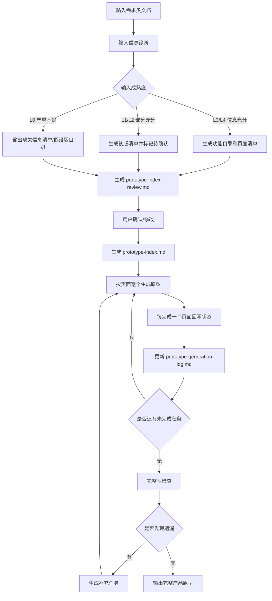

# prototype-generator

`prototype-generator` 是一个用于控制 AI 生成产品原型全过程的 skill。

它解决的问题是：

> 已经有产品说明书、PRD 或功能需求文档，但让 AI 生成原型时，经常会丢页面、丢子页面、丢弹窗、丢抽屉、丢深层交互。

这个 skill 的核心思路是：

> 不要只控制输入，要控制输出过程。  
> 先诊断输入，再建立页面 index，让用户确认，然后按页面逐个生成原型，每完成一页回写状态，最后统一检查遗漏。

这个 skill 可以独立使用，也可以和 `prototype-starter` 协同使用，但不强依赖 `prototype-starter`：

- 如果目标目录没有 `DESIGN.md`、`design-system/`、`shared/`、`scripts/new-feature.cjs`，按 standalone 模式生成原型。
- 如果目标目录存在这些 starter 工作区信号，自动进入 prototype-starter-compatible 模式：读取根 `DESIGN.md` 和 starter 护栏，生成 `feature-manifest.json`，优先通过 `scripts/new-feature.cjs --manifest` 创建页面骨架，并运行 starter compliance。
- `prototype-generator` 负责防止漏页面、漏弹窗、漏抽屉、漏路由；`prototype-starter` 负责设计系统一致性和工程结构约束。

## 最终输出是什么？

这个 skill 的最终输出是：

```text
可运行 / 可预览的产品原型
```

根据技术栈不同，可能包括：

- React / Vue / HTML 页面文件
- 路由配置
- Layout 组件
- 页面组件
- 弹窗 / 抽屉组件
- Mock 数据
- 表格 / 表单交互
- 页面跳转关系
- 本地运行或预览说明

中间过程会输出这些控制文档：

```text
prototype-index-review.md
prototype-index.md
prototype-generation-log.md
prototype-completeness-check.md
```

这些文档不是最终目标，而是为了保证最终原型不遗漏。

## 适合场景

- 根据产品说明书生成原型
- 根据 PRD 生成原型
- 根据功能需求文档生成原型
- 根据售前方案生成演示原型
- 根据调研纪要生成初版原型
- 检查已有原型是否遗漏页面或交互
- 在 Vibe Coding / Claude Code / Cursor / Codex 中控制原型生成过程

## 输入

支持任意包含原型生成所需信息的需求类文档，包括但不限于：

- 产品说明书
- PRD
- 功能需求文档
- 用户故事
- 业务需求文档
- 需求调研纪要
- 售前方案
- 业务流程说明
- 页面说明文档
- 已有原型说明

输入文档不要求固定格式，但最好包含：

1. 产品或业务背景
2. 用户角色
3. 功能模块
4. 页面或功能入口
5. 业务流程
6. 页面跳转关系
7. 核心交互
8. 数据对象与字段
9. 本次原型生成范围
10. 技术栈或设计规范

## 输出

### 1. 过程控制输出

```text
prototype-index-review.md       给人确认的页面索引确认文档
prototype-index.md              给 AI 执行的页面任务清单
prototype-generation-log.md     原型生成过程日志
prototype-completeness-check.md 最终完整性检查文档
```

在 prototype-starter-compatible 模式下，还会生成：

```text
feature-manifest.json           给 starter 脚本创建页面/场景骨架的交接文件
```

### 2. 最终交付输出

```text
完整产品原型
```

可能包括：

```text
src/pages/
src/components/
src/router/
src/mock/
src/layouts/
README.md
```

具体取决于项目技术栈和现有目录结构。

## 执行模式

默认模式为：

```text
interactive
```

也就是：

> 关键节点人工确认，普通执行自动推进。

支持模式：

| 模式 | 说明 |
|---|---|
| `interactive` | 默认模式，关键节点让用户确认 |
| `auto` | 自动推进，适合快速生成初稿 |
| `review-first` | 只生成 review 和 index，不生成页面 |
| `strict` | 信息不足时停止，必须补充输入 |
| `draft` | 信息不足也生成假设版原型草稿，但全部标记待确认 |

## 推荐工作流



## 关键机制

### 1. 输入诊断

先判断输入是否足够支撑原型生成。

输入成熟度分为：

| 等级 | 说明 |
|---|---|
| L0 | 信息严重不足，只有一句想法 |
| L1 | 有功能描述，但页面、流程、交互不清楚 |
| L2 | 有功能模块和部分页面/交互线索 |
| L3 | 页面、流程、交互和字段基本完整 |
| L4 | 需求、设计规范、技术栈、项目结构都完整 |

### 2. 页面索引确认

正式生成原型之前，必须生成：

```text
prototype-index-review.md
```

让用户确认：

- 功能模块是否完整
- 页面清单是否完整
- 页面关系是否正确
- 推导页面是否保留
- 待确认项如何处理
- 缺失信息如何补充

### 3. 执行索引

用户确认后生成：

```text
prototype-index.md
```

这个文件是 AI 后续逐页生成原型的执行依据。

### 4. 逐页生成

AI 不能一口气生成 20 个页面，而是：

1. 读取 `prototype-index.md`
2. 找到下一个可执行任务
3. 只生成一个页面或小模块
4. 生成路由、页面、组件、mock 数据
5. 回写任务状态
6. 更新生成日志
7. 再继续下一个任务

### 5. 完整性检查

所有任务完成后，输出：

```text
prototype-completeness-check.md
```

检查是否遗漏：

- 功能模块
- 页面
- 子页面
- 弹窗
- 抽屉
- 表单状态
- 表格操作
- 页面跳转
- 路由
- 生成文件

## 使用方式示例

### 生成确认文档

```text
请使用 prototype-generator，根据下面的 PRD 生成原型页面索引确认文档。
先不要生成代码，先输出 prototype-index-review.md。
```

### 生成执行索引

```text
请根据我修改后的 prototype-index-review.md，生成 prototype-index.md。
```

### 逐页生成原型

```text
请读取 prototype-index.md，选择下一个可以执行的 Not Started 任务。
本轮只生成一个页面，完成后回写状态并更新 prototype-generation-log.md。
```

### 完整性检查

```text
请对照需求文档、prototype-index.md 和当前已生成的原型文件，执行完整性检查。
输出 prototype-completeness-check.md。
```

## 和 prototype-index-planner 的区别

`prototype-index-planner` 更偏向：

```text
生成页面索引和任务清单
```

`prototype-generator` 更偏向：

```text
控制 AI 逐步生成完整产品原型
```

因此本 skill 的最终目标不是文档，而是：

```text
完整产品原型
```

中间文档只是为了防遗漏、控过程、可检查。

## 核心价值

这个 skill 可以显著降低 AI 生成原型时的遗漏问题：

- 不再一口气生成所有页面
- 先确认页面范围
- 显式暴露推导页面
- 逐页生成
- 每页回写状态
- 最后统一检查
- 发现遗漏后补充生成

适合用于产品经理的 Vibe Coding 原型生成流程。
