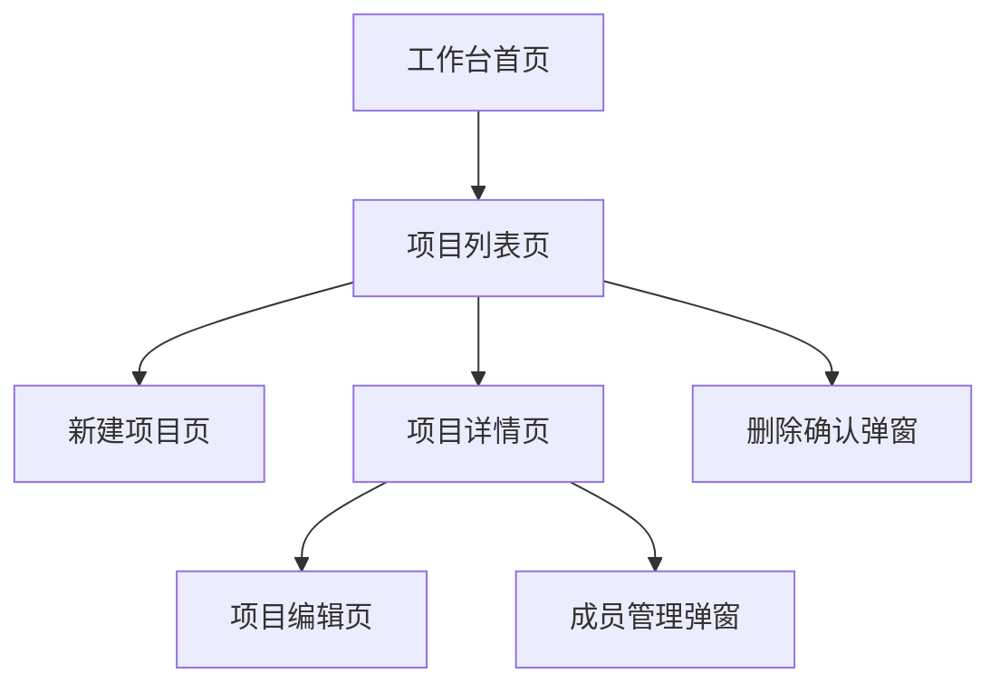

# Prototype Index：项目管理系统示例

## 1. 原型生成目标

| 项目 | 内容 |
|---|---|
| 产品 / 系统名称 | 项目管理系统 |
| 原型目标 | 生成工作台和项目管理模块的可交互前端原型 |
| 生成范围 | 工作台、项目列表、新建项目、项目详情、项目编辑、删除确认、成员管理 |
| 技术栈 | React + TypeScript + Vite |
| UI 组件库 | Ant Design |
| 设计规范 | 暂无，使用 Ant Design 默认风格 |
| 项目目录 | src/pages、src/components、src/router、src/mock |
| 执行模式 | interactive |

## 2. 执行规则

1. 每次只生成一个页面或一个小模块。
2. 生成页面前，必须读取当前 `prototype-index.md`。
3. 只执行状态为 `Not Started` 且无阻塞项的任务。
4. 如果任务状态为 `Needs Confirmation` 或 `Needs Input`，必须等待用户确认或补充。
5. 生成页面后，必须回写任务状态。
6. 生成页面后，必须记录生成文件。
7. 原型应尽量保持可运行 / 可预览。

## 3. 页面任务清单

| Task ID | Function Module | Page Name | Page Type | Source Section | Source Type | Previous Page | Trigger Operation | Next Page | Core Components | Key Fields | Required Route | Suggested File Path | Status | Check Result | Generated Files | Notes |
|---|---|---|---|---|---|---|---|---|---|---|---|---|---|---|---|---|
| T001 | 工作台 | 工作台首页 | Home | 3.1 工作台 | Explicit | 登录页 | 登录成功 | 项目列表页 | 指标卡片、待办列表、快捷入口 | 项目总数、进行中项目数、延期项目数 | Yes | src/pages/dashboard/Dashboard.tsx | Not Started | 待生成 |  |  |
| T002 | 项目管理 | 项目列表页 | List | 3.2 项目管理 | Inferred from operation | 工作台首页 | 点击项目管理入口 | 新建项目页、项目详情页、删除确认弹窗 | 搜索区、筛选区、表格、新建按钮、行内操作 | 项目名称、项目编号、项目状态、负责人、开始日期、结束日期 | Yes | src/pages/project/ProjectList.tsx | Not Started | 待生成 |  | 根据“项目查询”推导 |
| T003 | 项目管理 | 新建项目页 | Create | 3.2 项目管理 | Inferred from operation | 项目列表页 | 点击新建项目 | 项目列表页 | 表单、保存按钮、取消按钮 | 项目名称、项目编号、项目类型、负责人、开始日期、结束日期、项目描述 | Yes | src/pages/project/ProjectCreate.tsx | Not Started | 待生成 |  |  |
| T004 | 项目管理 | 项目详情页 | Detail | 3.2 项目管理 | Explicit | 项目列表页 | 点击查看详情 | 项目编辑页、成员管理弹窗 | 详情卡片、进度展示、成员列表、操作按钮 | 项目基本信息、项目进度、项目成员 | Yes | src/pages/project/ProjectDetail.tsx | Not Started | 待生成 |  |  |
| T005 | 项目管理 | 项目编辑页 | Edit | 3.2 项目管理 | Inferred from operation | 项目详情页 | 点击编辑 | 项目详情页 | 表单、保存按钮、取消按钮 | 项目名称、项目类型、负责人、日期、描述 | Yes | src/pages/project/ProjectEdit.tsx | Not Started | 待生成 |  |  |
| T006 | 项目管理 | 删除确认弹窗 | Dialog | 3.2 项目管理 | Inferred from operation | 项目列表页 | 点击删除 | 项目列表页 | 确认提示、取消按钮、确认删除按钮 | 项目名称 | No | src/components/project/DeleteProjectModal.tsx | Not Started | 待生成 |  |  |
| T007 | 项目管理 | 成员管理弹窗 | Dialog | 3.2 项目管理 | Inferred from operation | 项目详情页 | 点击成员管理 | 项目详情页 | 成员列表、添加成员、移除成员 | 姓名、角色、加入时间 | No | src/components/project/MemberManageModal.tsx | Not Started | 待生成 |  | 成员字段不完整，使用占位字段 |

## 4. 页面关系图

## 5. 待确认任务

| Task ID | Page Name | Reason | Required User Decision | Default Suggestion |
|---|---|---|---|---|
| T007 | 成员管理弹窗 | 成员字段不完整 | 是否使用默认字段 | 使用姓名、角色、加入时间 |

## 6. 待补充信息

| Item ID | Missing Information | Affected Tasks | Default Handling | User Input |
|---|---|---|---|---|
| Q001 | 成员管理字段 | T007 | 使用默认字段占位 |  |
