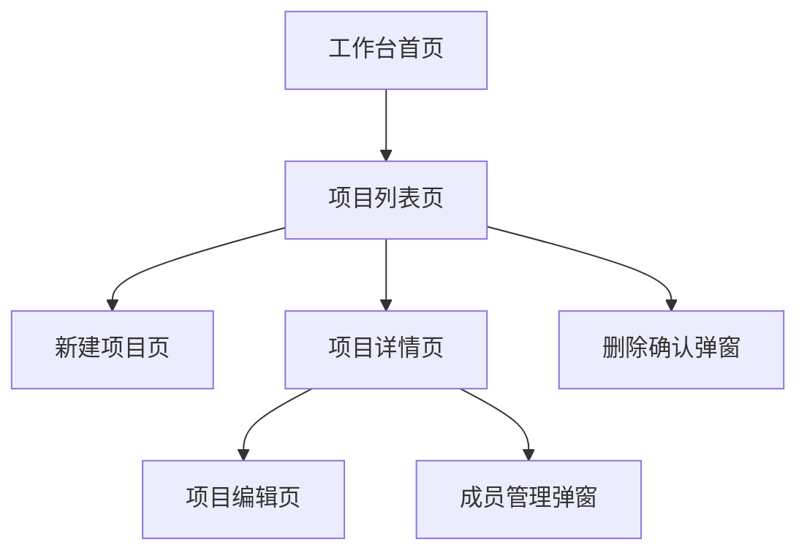

# 原型生成索引确认文档：项目管理系统示例

## 1. 输入诊断结果

### 1.1 输入文档类型

| 项目 | 内容 |
|---|---|
| 文档类型 | 功能需求文档 |
| 判断依据 | 文档包含产品背景、用户角色、功能模块、业务流程和字段说明 |
| 是否可用于生成原型 | 是 |

### 1.2 输入成熟度

| 项目 | 内容 |
|---|---|
| 当前等级 | L3 |
| 说明 | 已包含功能模块、页面线索、业务流程、核心交互和部分字段，可生成较完整 prototype-index |

## 2. 功能目录确认

| 模块ID | 功能模块 | 来源说明 | 是否纳入 | 确认状态 | 用户修改 |
|---|---|---|---|---|---|
| M001 | 工作台 | 文档明确提及 | 是 | 已确认 |  |
| M002 | 项目管理 | 文档明确提及 | 是 | 已确认 |  |

## 3. 页面清单确认

| 页面ID | 功能模块 | 页面名称 | 页面类型 | 来源 | 是否纳入 | 确认状态 | 用户修改 |
|---|---|---|---|---|---|---|---|
| P001 | 工作台 | 工作台首页 | 首页 | 文档明确提及 | 是 | 已确认 |  |
| P002 | 项目管理 | 项目列表页 | 列表页 | 根据“项目查询”推导 | 是 | 待确认 |  |
| P003 | 项目管理 | 新建项目页 | 新建页 | 根据“新建项目”推导 | 是 | 待确认 |  |
| P004 | 项目管理 | 项目详情页 | 详情页 | 文档明确提及 | 是 | 已确认 |  |
| P005 | 项目管理 | 项目编辑页 | 编辑页 | 根据“编辑项目信息”推导 | 是 | 待确认 |  |
| P006 | 项目管理 | 删除确认弹窗 | 弹窗 | 根据“删除项目”推导 | 是 | 待确认 |  |
| P007 | 项目管理 | 成员管理弹窗 | 弹窗 | 根据“维护项目成员”推导 | 是 | 待确认 |  |

## 4. 页面关系确认

| 关系ID | 前置页面 | 触发操作 | 目标页面 | 返回路径 | 关系来源 | 确认状态 | 用户修改 |
|---|---|---|---|---|---|---|---|
| R001 | 工作台首页 | 点击项目管理入口 | 项目列表页 | 工作台首页 | 文档明确提及 | 已确认 |  |
| R002 | 项目列表页 | 点击新建项目 | 新建项目页 | 项目列表页 | 根据操作推导 | 待确认 |  |
| R003 | 项目列表页 | 点击查看详情 | 项目详情页 | 项目列表页 | 文档明确提及 | 已确认 |  |
| R004 | 项目详情页 | 点击编辑 | 项目编辑页 | 项目详情页 | 根据操作推导 | 待确认 |  |
| R005 | 项目列表页 | 点击删除 | 删除确认弹窗 | 项目列表页 | 根据操作推导 | 待确认 |  |
| R006 | 项目详情页 | 点击成员管理 | 成员管理弹窗 | 项目详情页 | 根据操作推导 | 待确认 |  |

### 4.1 页面关系图

## 5. 推导项与待确认项

| 编号 | 推导内容 | 推导依据 | 建议处理 | 用户确认 |
|---|---|---|---|---|
| A001 | 项目列表页 | 查询操作通常对应列表页 | 建议保留 |  |
| A002 | 新建项目页 | 新建操作通常对应新建页 | 建议保留 |  |
| A003 | 项目编辑页 | 编辑操作通常对应编辑页 | 建议保留 |  |
| A004 | 删除确认弹窗 | 删除操作通常需要二次确认 | 建议保留 |  |
| A005 | 成员管理弹窗 | 成员维护可通过弹窗或抽屉完成 | 建议保留 |  |

## 6. 缺失信息清单

| 编号 | 缺失信息 | 影响范围 | 默认处理建议 | 用户补充 |
|---|---|---|---|---|
| Q001 | 成员管理字段不完整 | 成员管理弹窗 | 使用姓名、角色、加入时间作为占位字段 |  |
| Q002 | 删除规则不明确 | 删除确认弹窗 | 默认二次确认后删除 |  |
| Q003 | 普通成员可见范围不明确 | 菜单和页面权限 | 默认只展示参与项目 |  |

## 8. 确认结论

- [ ] 确认无误，继续生成 `prototype-index.md`
- [ ] 按本文档中的用户修改更新后，再生成 `prototype-index.md`
- [ ] 暂停生成，我需要补充需求文档
- [ ] 只生成原型 index，不进入页面代码生成
- [ ] 生成假设版原型，所有待确认项保留标记

### 用户补充说明

>
