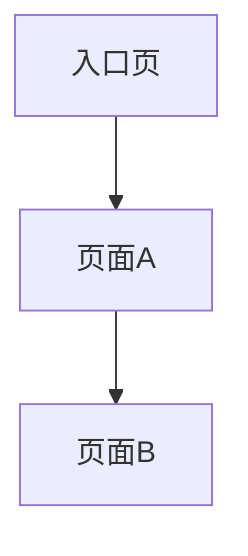

# 原型生成索引确认文档

> 文件名建议：`prototype-index-review.md`  
> 用途：给用户确认页面范围、页面关系、推导项和待补充信息。  
> 注意：本文档面向人，不是最终执行索引。用户可直接在“用户修改 / 用户确认 / 用户补充”列中修改。

---

## 1. 输入诊断结果

### 1.1 输入文档类型

| 项目 | 内容 |
|---|---|
| 文档类型 |  |
| 判断依据 |  |
| 是否可用于生成原型 | 是 / 否 / 部分可用 |
| 工作区模式 | standalone / prototype-starter-compatible |
| Starter 工作区判断依据 | DESIGN.md / design-system / shared / scripts/new-feature.cjs / 不适用 |

### 1.2 输入成熟度

| 项目 | 内容 |
|---|---|
| 当前等级 | L0 / L1 / L2 / L3 / L4 |
| 说明 |  |

### 1.3 信息完整度

| 信息项 | 判断结果 | 说明 |
|---|---|---|
| 产品 / 业务背景 | 已提供 / 部分提供 / 缺失 |  |
| 用户角色 | 已提供 / 部分提供 / 缺失 |  |
| 功能模块 | 已提供 / 部分提供 / 缺失 |  |
| 页面线索 | 已提供 / 部分提供 / 缺失 |  |
| 业务流程 | 已提供 / 部分提供 / 缺失 |  |
| 页面关系 | 已提供 / 部分提供 / 缺失 |  |
| 核心交互 | 已提供 / 部分提供 / 缺失 |  |
| 数据对象 | 已提供 / 部分提供 / 缺失 |  |
| 字段信息 | 已提供 / 部分提供 / 缺失 |  |
| 生成范围 | 已提供 / 部分提供 / 缺失 |  |
| 技术栈 | 已提供 / 部分提供 / 缺失 |  |
| 设计规范 | 已提供 / 部分提供 / 缺失 |  |
| 项目结构 | 已提供 / 部分提供 / 缺失 |  |

---

## 2. 功能目录确认

请确认以下功能模块是否需要纳入本次原型生成范围。

| 模块ID | 功能模块 | 来源说明 | 是否纳入 | 确认状态 | 用户修改 |
|---|---|---|---|---|---|
| M001 |  | 文档明确提及 / 根据业务流程推导 / 根据常见模式推导 | 是 / 否 / 待确认 | 已确认 / 待确认 |  |

---

## 3. 页面清单确认

请确认以下页面是否完整、是否需要保留、是否需要调整名称或类型。

| 页面ID | 功能模块 | 页面名称 | 页面类型 | 来源 | 是否纳入 | 确认状态 | 用户修改 |
|---|---|---|---|---|---|---|---|
| P001 |  |  | 首页 / 列表页 / 新建页 / 编辑页 / 详情页 / 弹窗 / 抽屉 / 二级页面 / 结果页 / 配置页 | 文档明确提及 / 根据操作推导 / 根据常见模式推导 | 是 / 否 / 待确认 | 已确认 / 待确认 |  |

---

## 4. 页面关系确认

请确认页面之间的进入关系和跳转关系是否正确。

| 关系ID | 前置页面 | 触发操作 | 目标页面 | 返回路径 | 关系来源 | 确认状态 | 用户修改 |
|---|---|---|---|---|---|---|---|
| R001 |  |  |  |  | 文档明确提及 / 根据操作推导 / 根据常见模式推导 | 已确认 / 待确认 |  |

### 4.1 页面关系图

---

## 5. 推导项与待确认项

以下内容不是文档明确写出的，而是根据操作线索或常见产品设计模式推导出来的，请重点确认。

| 编号 | 推导内容 | 推导依据 | 建议处理 | 用户确认 |
|---|---|---|---|---|
| A001 |  |  | 建议保留 / 可选 / 建议删除 / 需要补充信息 |  |

---

## 6. 缺失信息清单

以下信息缺失或不完整，可能影响后续原型生成质量。

| 编号 | 缺失信息 | 影响范围 | 默认处理建议 | 用户补充 |
|---|---|---|---|---|
| Q001 |  |  |  |  |

---

## 7. 原型生成范围确认

| 范围项 | 内容 | 用户修改 |
|---|---|---|
| 本次生成模块 |  |  |
| 本次不生成模块 |  |  |
| 本次生成页面类型 |  |  |
| 暂不处理内容 |  |  |
| 生成视角 | 管理员视角 / 普通用户视角 / 多角色视角 |  |
| 技术栈 | React / Vue / HTML / 其他 |  |
| UI 组件库 | Ant Design / Element Plus / Tailwind / 其他 |  |
| 是否生成 feature-manifest.json | 是 / 否 / 不适用 |  |
| 是否使用 starter shared 资产 | 是 / 否 / 不适用 |  |

---

## 8. Starter 兼容性确认

> 仅在 prototype-starter-compatible 模式下填写。standalone 模式可标记为“不适用”。

| 项目 | 建议 | 用户确认 |
|---|---|---|
| 根 DESIGN.md 是否作为设计约束 | 是 |  |
| 是否读取 fidelity-guardrails | 是，若文件存在 |  |
| 是否读取 shared-registry | 是，若文件存在 |  |
| 是否把确认后的任务转成 feature-manifest.json | 是 |  |
| 是否通过 `scripts/new-feature.cjs --manifest` 创建骨架 | 是，若脚本存在 |  |
| 是否排除未确认任务进入 manifest | 是 |  |

---

## 9. 确认结论

请在以下选项中选择一种处理方式：

- [ ] 确认无误，继续生成 `prototype-index.md`
- [ ] 按本文档中的用户修改更新后，再生成 `prototype-index.md`
- [ ] 暂停生成，我需要补充需求文档
- [ ] 只生成原型 index，不进入页面代码生成
- [ ] 生成假设版原型，所有待确认项保留标记
- [ ] 在 starter-compatible 模式下继续生成 `feature-manifest.json`

### 用户补充说明

>
