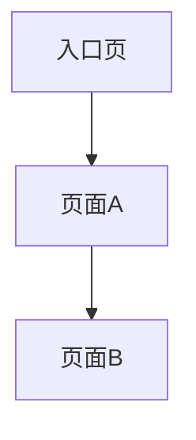

# Prototype Index

> 文件名建议：`prototype-index.md`  
> 用途：给 AI / Coding Agent 执行的页面级任务索引。  
> 原则：每次只执行一个页面或一个小模块，完成后回写状态。

---

## 1. 原型生成目标

| 项目 | 内容 |
|---|---|
| 产品 / 系统名称 |  |
| 原型目标 |  |
| 生成范围 |  |
| 技术栈 |  |
| UI 组件库 |  |
| 设计规范 |  |
| 项目目录 |  |
| 工作区模式 | standalone / prototype-starter-compatible |
| 根 DESIGN.md | 有 / 无 / 不适用 |
| Starter 共享资产 | 有 / 无 / 不适用 |
| Manifest 文件 | feature-manifest.json / 不适用 |
| 执行模式 | interactive / auto / review-first / strict / draft |

---

## 2. 执行规则

1. 每次只生成一个页面或一个小模块。
2. 生成页面前，必须读取当前 `prototype-index.md`。
3. 只执行状态为 `Not Started` 且无阻塞项的任务。
4. 如果任务状态为 `Needs Confirmation` 或 `Needs Input`，必须等待用户确认或补充。
5. 生成页面后，必须回写任务状态。
6. 生成页面后，必须记录生成文件。
7. 如果发现遗漏页面或交互，必须新增任务，并标记为 `Needs Confirmation`。
8. 不得私自删除 index 中的任务。
9. 如果发现目标项目是 prototype-starter 工作区，必须读取根 `DESIGN.md`、`design-system/fidelity-guardrails.json` 和 `design-system/shared-registry.json`。
10. 在 prototype-starter-compatible 模式下，已确认且无阻塞的任务必须同步生成到 `feature-manifest.json`。
11. 在 prototype-starter-compatible 模式下，优先使用 `node scripts/new-feature.cjs --manifest feature-manifest.json` 创建页面和独立场景骨架。
12. 所有任务完成后，必须执行完整性检查。
13. 原型应尽量保持可运行 / 可预览。

---

## 3. 页面任务清单

| Task ID | Function Module | Page Name | Page Type | Iteration Slug | Page Key | Surface | Parent Page Key | Source Section | Source Type | Previous Page | Trigger Operation | Next Page | Core Components | Key Fields | Required Route | Suggested File Path | Design Pattern Refs | Manifest Entry | Starter Compatible | Status | Check Result | Generated Files | Notes |
|---|---|---|---|---|---|---|---|---|---|---|---|---|---|---|---|---|---|---|---|---|---|---|---|
| T001 |  |  | Home / List / Create / Edit / Detail / Dialog / Drawer / Secondary Page / Result Page / Config Page |  |  | page / drawer / modal / side-panel / confirm |  |  | Explicit / Inferred from operation / Inferred from product pattern / Needs Confirmation / Needs Input |  |  |  |  |  | Yes / No |  |  | Yes / No | Yes / No | Not Started |  |  |  |

---

## 4. 页面关系图

---

## 5. 待确认任务

| Task ID | Page Name | Reason | Required User Decision | Default Suggestion |
|---|---|---|---|---|
|  |  |  |  |  |

---

## 6. 待补充信息

| Item ID | Missing Information | Affected Tasks | Default Handling | User Input |
|---|---|---|---|---|
|  |  |  |  |  |

---

## 7. 生成日志摘要

| Time | Task ID | Action | Result | Notes |
|---|---|---|---|---|
|  |  |  |  |  |

---

## 8. Manifest 映射

> 仅在 prototype-starter-compatible 模式下必填。只纳入已确认且无 `Needs Confirmation` / `Needs Input` 阻塞的任务。

| Task ID | Page Key | Surface | Parent Page Key | Manifest Path | Include In Manifest | Reason |
|---|---|---|---|---|---|---|
| T001 |  | page / drawer / modal / side-panel / confirm |  | feature-manifest.json | Yes / No |  |

---

## 9. Starter 兼容性要求

| 检查项 | 要求 | 当前状态 |
|---|---|---|
| 是否读取根 DESIGN.md | prototype-starter-compatible 模式必须读取 | 已读取 / 未读取 / 不适用 |
| 是否读取 fidelity-guardrails | 存在时必须读取 | 已读取 / 未读取 / 不适用 |
| 是否读取 shared-registry | 存在时必须读取 | 已读取 / 未读取 / 不适用 |
| 是否生成 feature-manifest.json | starter-compatible 模式且 index 已确认时必须生成 | 已生成 / 未生成 / 不适用 |
| 是否使用 new-feature.cjs | 可用时优先使用 manifest 创建骨架 | 已使用 / 未使用 / 不适用 |
| 是否复用 shared CSS/JS | starter 页面必须复用共享资源 | 已复用 / 未复用 / 不适用 |
| 是否运行 compliance | 可用时运行 `node scripts/check-prototype-compliance.cjs` | 已运行 / 未运行 / 不适用 |
