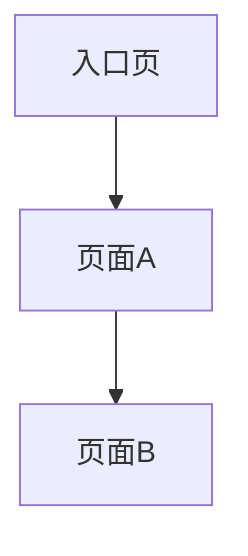

# Prototype Page Map

> 文件名建议：`prototype-page-map.md`  
> 用途：展示页面之间的关系，方便用户和 AI 理解原型结构。

---

## 1. Page Relationship Table

| Relationship ID | Previous Page | Trigger Operation | Target Page | Return Path | Source | Status |
|---|---|---|---|---|---|---|
| R001 |  |  |  |  | Explicit / Inferred / Needs Confirmation | Confirmed / Needs Confirmation |

---

## 2. Mermaid Page Map

---

## 3. Navigation Notes

-
