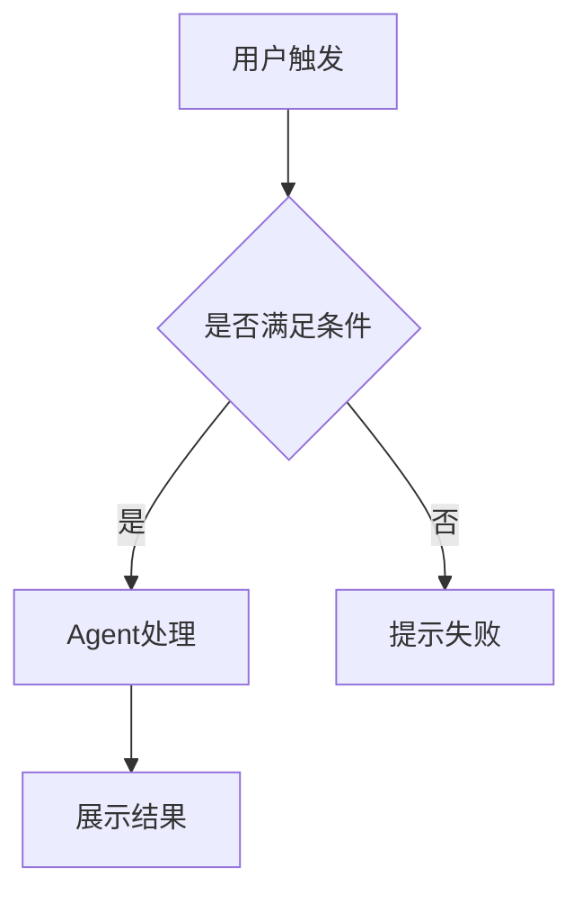
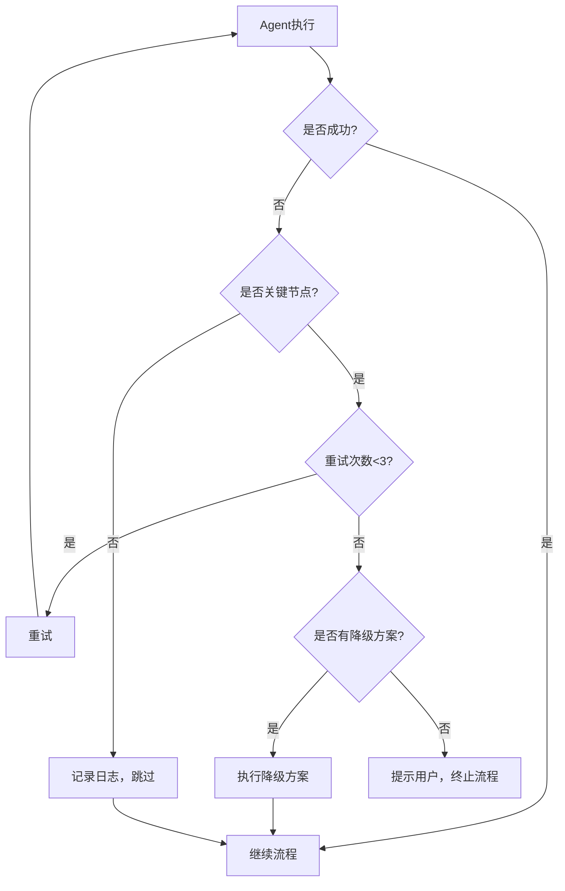

# Project Analyzer - 项目分析与PRD生成器

## ⚠️ 重要：执行指令

当用户触发此skill时，**必须严格按照以下两阶段流程执行**，不要跳过任何步骤，不要直接生成PRD。

## 任务目标

本Skill用于深度分析本地项目（特别是AI应用项目），完成以下两个阶段的任务：

**第一阶段：提示词分析**
- 扫描项目结构，识别和提取所有提示词
- 分析大模型API调用场景和数据流
- 生成 `AI_MODEL_USAGE_ANALYSIS.md` 分析报告和翻译文档

**第二阶段：PRD生成**（用户确认第一阶段后执行）
- 基于分析结果自动生成完整PRD文档
- 支持AI应用（14章节）和传统应用（8-10章节）两种模板
- 输出文件：`ai_analysis/prd/[项目名]-PRD.md`

## 执行模式：分步确认（必须遵守）

**严禁直接生成PRD文档！必须按以下流程执行：**

### 第一阶段：提示词分析（必须首先执行）

当用户触发skill后，立即开始第一阶段，**不要询问用户，直接执行**：

#### 核心执行范式：流式提取与批处理 (Map-Reduce)

**严禁高频串行**：不要"发现一个->翻译一个->验证一次"。
**必须采用批处理流转方案**：扫描提取全量列表 -> 循环处理单个文件(随记随忘) -> 最终统一汇编索引。

#### Step 1: 项目结构探索与全量提示词扫描 (Map 阶段)
1. 扫描项目根目录，识别主要编程语言和框架。**注意：默认过滤排除 `.git`, `node_modules`, `venv`, `tests/` 等非关键目录。**
2. 定位关键目录：`src/`、`prompts/`、`templates/`、`config/`、`agents/`、`tools/` 等。
3. **按以下特征全量优先搜索提示词**（必须考虑各大 AI 框架特征）：
   - **文件名特征**：`*prompt*.md`, `*prompt*.txt`, `*template*.md`, `*instruction*.md`, `system*.txt` 等
   - **变量名特征**：`*_prompt =`, `PROMPT_*`, `system_prompt`, `user_prompt`, `instruction` 等
   - **原生 API 调用特征**：`openai.ChatCompletion`, `messages.create`, `generate(`, `prompt=`, `system=`, `messages=[` 等
   - **AI 框架特征**：检索 LangChain (`PromptTemplate`, `ChatPromptTemplate`, `.invoke`), LlamaIndex (`PromptHelper`, `.query()`), AutoGen/Semantic Kernel (`AssistantAgent`, `kernel.invoke`), Dify/Coze 等编排设定
   - **Tools/Function Schema 特征**：工具声明本身的 `description` 是核心提示词，查找 `@tool`, `def tool_name`, `tools=[{...}]`
   - **RAG 上下文特征**：捕获向量检索代码（如 `Chroma`, `similarity_search`），关注检索引擎前置和后置的组装提示词
   - **配置文件特征**：检查 `config.yaml`、`.env`、`settings.py` 中可能包含的提示词常量或引用
4. **上下文读取要求**：
   - 发现可疑文件后，完整读取内容
   - 对于代码文件中的提示词，**关注提示词前后 20 行的上下文**
   - **追踪导入和引用关系**，确保识别跨文件定义的提示词
5. **阶段性检查点 (Checkpoint)**：
   - 筛选清单生成后，你必须首先计算清单总量 `N` 出具报告。然后**必须挂起（主动呼出 notify_user），等待用户显式通过后才可以进入下一个步骤**。
   - **此刻必须暂停执行，并向用户展示清单询问是否确认无遗漏。仅在用户确认后，再往下进入 Step 2。**

#### Step 2: 提示词流式翻译与特征提取 (Process 阶段)

对于 Step 1 发现的清单中的**每一个**提示词，执行以下严格的处理闭环：

1. **读取原文**：读取当前处理的提示词文件或对应的代码上下文。
2. **生成翻译文档**：
   - 提取元信息（原文件位置、类别、功能模块等）。
   - 翻译内容，并提取关键参数。
   - 使用 Write 工具，将内容写入单独的 `ai_analysis/translated_prompts/[提示词名称]_prompt_zh.md` 文件。
   - **每个翻译文档必须严格遵循以下 Markdown 结构模板**：

   ```markdown
   # 提示词翻译文档

   ## 元信息
   - 原文件位置: `path/to/original/file.py:line_number`
   - 变量名称: `variable_name`
   - 提示词类别: [系统提示词/用户提示词/任务提示词/工具提示词]
   - 功能模块: [描述该提示词所属的功能模块]
   - 调用场景: [描述何时/如何触发此提示词]

   ## 中文翻译
   [完整的中文翻译内容，保留原始格式（Markdown、JSON结构等）]

   ## 动态参数解析 (Prompt Lineage)
   - [列出提示词中使用的变量/占位符，如 {variables}, {{placeholders}} 等，保持原样]
   - [明确追踪并说明这些变量被注入的数据上下文来源]

   ## 相关代码上下文
   [简要说明该提示词在代码中的使用方式、所关联的工具定义、RAG 检索动作，链路和上下游关系]
   ```
3. **清理上下文槽（关键！）**：
   - 单个提示词写入文件成功后，**必须立刻将其原文从你当前的思考上下文中“忘掉/丢弃”**。
   - 你的上下文里只需隐式保留“我已经处理了 XX_prompt”这个进度信息。

*注意：此阶段不需要频繁修改或读取 `INDEX.md`，专注于独立生成全部的 `xxx_zh.md`。*
*注意：务必在所有文件生成结束后，使用文件系统工具（如 `list_dir`）验证 `translated_prompts/` 目录下的文件数量是否等于 `N`。*

#### Step 3: 全局索引汇编 (Reduce 阶段)

当所有 `N` 个提示词都翻译写盘完毕后：

1. **唯一事实来源：** 直接读取 `translated_prompts/` 目录下实际生成的 `.md` 文件列表。
2. 遍历这些已生成的文件，提取其顶部的**元信息**。
3. **一次性生成** `ai_analysis/translated_prompts/INDEX.md`，包含统计总览、分类表格和完整列表。

**INDEX.md 格式（必须严格遵守）：**

```markdown
# 提示词翻译文档索引

> 本索引由 project-analyzer skill 自动生成
> 生成时间: [ISO8601 格式时间戳]

---

## 统计总览

| 统计项 | 数量 | 说明 |
|--------|------|------|
| **总提示词数量** | N | 实际翻译文档总数 |
| 系统提示词 | X | SYSTEM/ROLE 类提示词 |
| 用户提示词 | Y | USER/HUMAN 类提示词 |
| 任务提示词 | Z | TASK/INSTRUCTION 类提示词 |
| 工具提示词 | W | TOOL/FUNCTION 类提示词 |

---

## 按类别分类

### 系统提示词 (X个)
| 序号 | 名称 | 原文件位置 | 功能描述 | 翻译文档 |
|------|------|-----------|----------|----------|
| 1 | xxx_system_prompt | src/xxx.py:25 | 系统角色定义 | [查看](./xxx_system_prompt_zh.md) |

### 用户提示词 (Y个)
| 序号 | 名称 | 原文件位置 | 功能描述 | 翻译文档 |
|------|------|-----------|----------|----------|
| 1 | xxx_user_prompt | src/xxx.py:30 | 用户交互模板 | [查看](./xxx_user_prompt_zh.md) |

### 任务提示词 (Z个)
| 序号 | 名称 | 原文件位置 | 功能描述 | 翻译文档 |
|------|------|-----------|----------|----------|
| 1 | xxx_task_prompt | src/xxx.py:35 | 任务执行指导 | [查看](./xxx_task_prompt_zh.md) |

### 工具提示词 (W个)
| 序号 | 名称 | 原文件位置 | 功能描述 | 翻译文档 |
|------|------|-----------|----------|----------|
| 1 | xxx_tool_prompt | src/xxx.py:40 | 工具使用说明 | [查看](./xxx_tool_prompt_zh.md) |

---

## 完整列表（按发现顺序）

| 全局序号 | 名称 | 类别 | 原文件位置 | 翻译文档 |
|----------|------|------|-----------|----------|
| 1 | intent_classification_prompt | 系统 | src/prompts/intent.py:25 | [查看](./intent_classification_prompt_zh.md) |
| 2 | sql_generation_prompt | 任务 | src/prompts/sql.py:30 | [查看](./sql_generation_prompt_zh.md) |
| ... | ... | ... | ... | ... |
| N | xxx_prompt | 系统 | src/xxx.py:xx | [查看](./xxx_prompt_zh.md) |

---

## 数据一致性声明

- 本索引记录提示词总数: N
- translated_prompts/ 目录实际文件数: N (不含本索引文件)
- AI_MODEL_USAGE_ANALYSIS.md 引用提示词数: N
- 三者一致性检查: ✅ 通过

---
最后更新时间: [ISO8601 格式时间戳]
```

**INDEX.md 各字段来源说明：**

| INDEX.md 字段 | 数据来源 | 获取方式 |
|--------------|----------|----------|
| 名称 | 翻译文档文件名 | 去掉 `_zh.md` 后缀 |
| 类别 | 翻译文档元信息中的"提示词类别" | Read 翻译文档提取 |
| 原文件位置 | 翻译文档元信息中的"原文件位置" | Read 翻译文档提取 |
| 功能描述 | 翻译文档元信息中的"功能模块" | Read 翻译文档提取 |
| 翻译文档链接 | 根据文件名生成 | 格式: `[查看](./xxx_zh.md)` |
| 数量统计 | 各类别的行数 | 统计表格行数

**Reduce 阶段最终校验（Step 3 末尾执行一次）：**

INDEX.md 生成完毕后，**必须执行一次最终一致性校验**：

```bash
# 验证1：统计实际翻译文件数（不含INDEX.md）
ls ai_analysis/translated_prompts/*_zh.md 2>/dev/null | wc -l

# 验证2：统计 INDEX.md 完整列表中的记录数
grep -c "|.*|.*|.*|.*|" ai_analysis/translated_prompts/INDEX.md

# 验证3：对比两者是否相等
```

**数量必须三者一致：**
- Step 1 扫描发现的提示词总数 `N`
- INDEX.md 中记录的提示词数量
- `translated_prompts/` 目录下的实际文件数量（不含 INDEX.md）

**如果验证失败：**
- ❌ 禁止启动 PRD 文档生成
- 通过 `list_dir` 对比 Step 1 清单和已生成文件列表，查漏补缺
- 仅补充缺失的翻译文档，然后重新生成 INDEX.md
- 再次执行上述校验，直到完全一致。

---

#### Step 4: 项目分析报告（Step 3 校验通过后执行）

**执行前验证（使用工具检查，不是假设）：**
1. 使用 Bash 执行 `ls ai_analysis/translated_prompts/*_zh.md | wc -l` 统计实际文件数
2. 使用 Read 读取 INDEX.md，检查"总提示词数量"字段
3. **比较两者是否相等**

**如果验证失败：**
- ❌ **禁止继续执行 Step 4**
- 返回 Step 3 执行补漏和重新校验
- 只有验证通过后（实际文件数 == INDEX记录数）才能继续

**创建 `ai_analysis/AI_MODEL_USAGE_ANALYSIS.md`（数据必须来自 INDEX.md）：**

**重要：不要独立统计提示词数量，必须从 INDEX.md 读取！**

```markdown
# [项目名称] 大模型应用分析报告

> 本报告由 project-analyzer skill 自动生成
> 生成时间: [ISO8601 时间戳]
> 关联索引: [translated_prompts/INDEX.md](./translated_prompts/INDEX.md)

---

## 1. 项目概述
- 项目名称: [项目名]
- 项目描述: [基于 README 的简要描述]
- 主要功能: [列出主要功能]
- 技术栈: [编程语言、框架、主要依赖]

---

## 2. 提示词统计（与 INDEX.md 一致）

**数据来源**: 本统计数据必须与 `translated_prompts/INDEX.md` 完全一致

### 2.1 总体统计
| 统计项 | 数量 | 来源验证 |
|--------|------|----------|
| 总提示词数量 | N | ✅ 与 INDEX.md 一致 |
| 系统提示词 | X | ✅ 与 INDEX.md 一致 |
| 用户提示词 | Y | ✅ 与 INDEX.md 一致 |
| 任务提示词 | Z | ✅ 与 INDEX.md 一致 |
| 工具提示词 | W | ✅ 与 INDEX.md 一致 |

### 2.2 分类详情
（直接从 INDEX.md 的分类表格复制，确保完全一致）

#### 系统提示词 (X个)
| 序号 | 名称 | 原文件位置 | 功能简述 |
|------|------|-----------|----------|
| 1 | [从 INDEX.md 复制] | [从 INDEX.md 复制] | [从 INDEX.md 复制] |

#### 用户提示词 (Y个)
| 序号 | 名称 | 原文件位置 | 功能简述 |
|------|------|-----------|----------|
| 1 | [从 INDEX.md 复制] | [从 INDEX.md 复制] | [从 INDEX.md 复制] |

[其他类别同上...]

---

## 3. 项目逻辑或数据流分析

```mermaid
[用 Mermaid 绘制时序图描述大模型在项目中的数据流]
```

---

## 4. 大模型应用场景分析

### 场景 1: [场景名称]
- **触发条件**: [什么情况下触发]
- **使用的提示词**: [链接到翻译文档，格式：](./translated_prompts/xxx_prompt_zh.md)
- **提示词来源**: [从 INDEX.md 引用的第X个提示词]
- **代码位置**: `path/to/file.py:line`
- **输入输出**: [描述输入输出]
- **作用**: [描述该场景的作用]

### 场景 2: [场景名称]
...

---

## 5. 上下文工程

### 5.1 Agent 循环分析（如适用）
- Agent 类型: [规划型/执行型/反思型等]
- 循环构造: 描述 LLM 如何制定计划、调用工具、根据结果决定下一步
- 决策逻辑: LLM 如何决定继续循环或结束
- **涉及的提示词**: [引用 INDEX.md 中的相关提示词]

### 5.2 工具清单（如适用）
| 工具名称 | 描述 | 参数 Schema | 使用场景 | 关联提示词 |
|---------|------|------------|----------|-----------|
| tool_name | [中文描述] | [参数说明] | [何时使用] | [INDEX.md 中的提示词] |

### 5.3 大模型嵌入型分析（如适用）
- 分析每个调用大模型环节的前序和后续流程
- 说明如何为大模型提供上下文
- 说明引导模型输出了什么（数据结构化、生产某种数据等）
- **涉及的提示词**: [引用 INDEX.md 中的相关提示词]

---

## 6. 数据一致性声明

本报告中的提示词统计数据：
- AI_MODEL_USAGE_ANALYSIS.md 记录总数: N
- translated_prompts/INDEX.md 记录总数: N
- translated_prompts/ 目录实际文件数: N

**三者一致性检查**: ✅ 通过

生成时间: [ISO8601 时间戳]
```

**重要提示：**
- AI_MODEL_USAGE_ANALYSIS.md 中的**所有提示词数量必须从 INDEX.md 获取**
- 禁止独立统计，避免两者不一致
- 如果 INDEX.md 结构变化，本报告必须同步更新

#### Step 5: 阶段一汇报
向用户汇报：
- 已发现的提示词数量和位置
- 识别的大模型应用场景数量
- 提取的工具清单
- 数据流分析摘要

**等待用户确认**后再进入第二阶段。

---

### 第二阶段执行流程（用户确认后）

#### Step 6: 产品类型判断
- **AI应用**：发现大模型API调用、Agent模式、提示词文件 → 使用AI应用PRD模板（14章节）
- **传统应用**：无明显AI能力 → 使用传统应用PRD模板（8-10章节）

#### Step 7: PRD章节生成策略

| PRD章节 | 内容来源 | 生成策略 |
|---------|----------|----------|
| 1. 需求背景 | AI_MODEL_USAGE_ANALYSIS.md | 从项目概述提取，不足时检查README、文档 |
| 2. 产品定位 | AI_MODEL_USAGE_ANALYSIS.md | 基于核心功能和技术栈推导，检查竞品对比 |
| 3. 用户故事 | 分析代码中的用户交互逻辑 | 见下方【用户故事深度格式】 |
| 4. Agent故事 | AI_MODEL_USAGE_ANALYSIS.md中的场景分析 | 见下方【Agent故事深度格式】 |
| 5. 用户旅程 | 代码中的用户流程 | 见下方【用户旅程深度格式】 |
| 6. Agent旅程 | AI_MODEL_USAGE_ANALYSIS.md中的数据流 | 自动绘制时序图，详细解释交互逻辑 |
| 7. 功能清单 | 代码结构+前端路由+API端点 | 按照PRD模板标准，分三部分详细描述 |
| 8. 提示词设计策略 | translated_prompts/中的提示词 | 见下方【提示词设计策略深度格式】 |
| 9. 数据集 | 代码中的数据需求 | 见下方【数据集深度格式】 |
| 10. 测试标准 | 代码中的测试用例 | 见下方【测试标准深度格式】 |
| 11. 异常处理 | 代码中的错误处理 | 见下方【异常处理深度格式】 |
| 12. 非功能性需求 | 代码中的配置 | 分析性能配置、安全设置 |
| 13. 迭代规划 | 综合推导 | 基于功能依赖关系规划迭代 |
| 14. 附录 | 收集整理 | 见下方【附录深度格式】 |

##### 【用户故事深度格式】（第3章）

每个用户故事必须包含三个子节，从 API 端点、路由、用户流程中推导：

```markdown
## [需求模块名称]
### 用户故事
:::info
**作为** [用户角色]
**我希望** [达成XX目标/获得XX能力]
**以便于** [解决XX问题/获得XX价值]
:::

### 验收标准
- [具体可验证的标准1]
- [具体可验证的标准2]
- [具体可验证的标准3]
- [具体可验证的标准4]

### 技术实现
- [对应的Agent/模块如何实现此需求]
- [关键技术路径说明]
- [输入输出约束]
```

##### 【Agent故事深度格式】（第4章）

每个 Agent 故事必须以**场景**为单位输出，包含以下区块：

```markdown
## [Agent名称] Agent故事
### Agent故事1：[场景名称/解决的问题]
#### 场景描述
:::info
[详细描述该Agent在什么情况下触发，需要达成什么目标]
:::

#### Agent故事
作为 [Agent角色]
在 [具体任务场景] 下
为了 [完成具体目标]
我需要:

【上下文信息】
- [需要的原始输入/状态]

【能力支持】
- [需要的核心能力，如意图分类/多语言理解]

【工具清单】
1. [工具名称](参数)
   - 用途: [描述]
   - 何时使用: [触发条件]

【约束条件】
- [强制性规则和限制]

#### 为什么需要这些
- [解释为什么此场景需要上述上下文和工具，帮助开发理解意图]
```

##### 【用户旅程深度格式】（第5章）

用户旅程必须按阶段展开，**每个阶段包含四个维度**：

```markdown
## 完整用户旅程

### 阶段1：[阶段名称]（预计时间）
#### 用户行为：
- [用户在这个阶段做什么]

#### 系统响应：
- [系统/Agent在这个阶段如何响应]

#### 关键交互点：
- [关键UI元素或交互节点]

#### 用户体验目标：
- [这个阶段的体验设计目标]

### 阶段2：[阶段名称]（预计时间）
...
```

此外，第5章末尾必须包含 **关键用户体验设计原则**（3-5条，如渐进式信息披露、透明化执行过程等）。

**强制要求**：用户旅程（或第6章 Agent 工作流）必须使用 `mermaid` 语法生成直观的可视化图表，例如：
```markdown
### 流程可视化

```

##### 【提示词设计策略深度格式】（第8章）

每个 Agent 的提示词设计策略必须包含 **5 个子节**：

```markdown
## [Agent名称] 提示词设计策略
### 角色定位
[Agent在系统中的角色描述]

### 核心挑战
1. [挑战1：如何让模型准确XX？]
2. [挑战2：如何避免模型YY？]
3. [挑战3：如何控制ZZ？]

### 设计策略
#### 策略1：[策略名称]
- 实施方法：[具体如何实现]
- 为什么这样设计：[解释设计决策的理由，帮助开发团队理解]

#### 策略2：[策略名称]
- 实施方法：[具体如何实现]
- 为什么这样设计：[解释设计决策的理由]
...

### 完整提示词
[附上完整的提示词原文或翻译]

### 关键输出控制
- 输出格式控制：[如JSON Schema、Markdown结构等]
- 内容质量控制：[如事实准确性、完整性、一致性]
- 边界情况处理：[如输入不完整、工具调用失败等]
```

##### 【数据集深度格式】（第9章）

每个数据集必须包含用途 + **数据维度表格** + **数据标注规范示例**：

```markdown
## [数据集名称]
**用途**：[评估什么能力]

**数据要求：**
| 数据维度 | 要求描述 | 样本量 |
|----------|----------|--------|
| [维度1] | [具体要求] | [数量] |
| [维度2] | [具体要求] | [数量] |

**数据标注规范：**
```json
{
  "input": "示例输入",
  "expected_output": "期望输出",
  "quality_metrics": {
    "metric1": 4.5,
    "metric2": 0.95
  }
}
```

**数据收集策略：**
1. 初期：[收集方式]
2. 标注：[标注规范]
3. 迭代：[持续优化方式]
```

若项目无显式数据集定义，**必须基于AI场景主动推导**需要的评测集类型（如 QA评估集、轨迹评测集、意图分类测试集等）。

##### 【测试标准深度格式】（第10章）

测试标准必须包含 **4 个子节**，每个子节需要 **详细测试表格 + 测试用例示例**：

```markdown
## 功能测试标准
### [Agent/模块名称] 测试
| 测试场景 | 测试方法 | 通过标准 | 测试用例量 |
|----------|----------|----------|------------|
| [场景1] | [方法] | [标准，如准确率≥95%] | [数量] |
| [场景2] | [方法] | [标准] | [数量] |

**测试用例示例：**
```yaml
- input: "示例输入"
  expected_output: "期望输出"
  expected_action: "期望动作"
```

## 性能测试标准
| 指标 | 测试方法 | 目标值 |
|------|----------|--------|
| [指标1] | [方法] | [目标值] |

## 用户体验测试标准
| 指标 | 测量方法 | 目标值 |
|------|----------|--------|
| [指标1] | [方法] | [目标值] |

## 线上监控指标
| 指标 | 监控方法 | 告警阈值 |
|------|----------|----------|
| [指标1] | [方法] | [阈值] |
```

若项目无显式测试定义，**必须推导合理的AI评测基准**（如 BLEU/ROUGE/LLM-as-a-judge/意图分类准确率等）。

##### 【异常处理深度格式】（第11章）

异常处理章节必须包含 **异常场景表格 + Mermaid降级流程图**：

```markdown
## 异常场景定义
| 异常场景 | 触发条件 | 用户感知 | 降级策略 |
|----------|----------|----------|----------|
| [场景1] | [触发条件] | [用户看到什么] | [如何降级] |
| [场景2] | [触发条件] | [用户看到什么] | [如何降级] |

## 降级流程图

```

##### 【附录深度格式】（第14章）

附录必须包含 **关键术语表** 和 **提示词文件路径映射表格**：

```markdown
## 关键术语表
| 术语 | 说明 |
|------|------|
| [术语1] | [定义] |
| [术语2] | [定义] |

## 提示词文件路径
| Agent | 提示词文件路径 |
|-------|----------------|
| [Agent1] | [文件路径] |
| [Agent2] | [文件路径] |
```

#### Step 8: 信息补充机制
当AI_MODEL_USAGE_ANALYSIS.md信息不足时：

| 缺失信息 | 补充来源 | 搜索策略 |
|----------|----------|----------|
| 产品描述 | README.md、docs/ | 读取项目根目录README |
| 目标用户 | 用户认证代码、权限配置 | 搜索`user`、`auth`、`role`、`permission` |
| 核心功能 | 主入口文件、API路由 | 搜索`main.py`、`app.py`、`router`、`endpoint` |
| 竞品对比 | 文档或注释 | 搜索`competitor`、`vs`、`compare` |
| 业务目标 | 配置文件、注释 | 搜索`TODO`、`FIXME`、`goal` |
| 用户流程 | 前端路由、页面组件 | 搜索`route`、`page`、`view` |
| 数据模型 | 数据库模型、Schema | 搜索`model`、`schema`、`table` |

#### Step 9: 功能清单生成规范

**7.1 核心功能模块**
- 格式：表格（模块 | 功能点 | 优先级 | 功能描述）
- 来源：代码目录结构、服务层、API路由
- 要求：
  - 功能描述需产品经理易懂（避免技术术语）
  - 按业务模块分组（如查询服务、数据服务、可视化服务）
  - 明确优先级（P0/P1/P2）

**7.2 大模型/Agent功能点**
- 格式：表格（功能点 | Agent | 大模型任务 | 输入约束 | 输出约束 | 技术要点）
- 来源：AI_MODEL_USAGE_ANALYSIS.md中的场景分析
- 要求：
  - 明确Agent与大模型的分工
  - 说明输入/输出的数据格式
  - 列出关键技术约束（如JSON Schema、重试机制）

**7.3 功能详细说明**
- **判断整体架构类型并自适应输出**：根据项目UI性质分类生成。
  - **如果是有界面的前端/全栈应用**，必须按照页面类型分类，参考以下模板：
    - 7.3.1 对话/AIGC类页面（Chat/GenAI）- AI应用必用
    - 7.3.2 复杂Web/工作台类页面（Dashboard/Workbench）
    - 7.3.3 后台管理类页面（Admin/Table-First）等...
    - **每个带UI功能必须包含**：页面概述、**ASCII页面布局线框图**、功能点表格、数据字段定义、交互流程、异常处理、性能要求。
  - **如果是无界面的后台/Headless AI Agent服务**，**必须跳过所有页面布局(UI线框图)和界面交互描述**，转而输出后端架构规格：
    - **核心API/Job描述**：该服务解决什么问题，核心调用链路
    - **API 负载结构 (Payload Schema)**：请求/响应(或事件)的字段定义
    - **Webhook / 事件流转**：事件监听与回调注册机制
    - **长时任务管理**：后台Agent任务的状态机流转机制
    - **异常与隔离**：重试机制、降级与熔断策略

- **从代码中提取的信息**：
  - API端点/Job定义 → 功能点/链路起点
  - 请求/响应Schema → 数据字段定义
  - 路由守卫/状态流转 → 交互/事件说明
  - 错误处理代码 → 异常与隔离处理

#### Step 10: 自动转换规则

**Agent故事转换规则：**
```
场景分析 → Agent故事
- 触发条件 → 场景描述
- 使用的提示词 → 上下文信息 + 完整提示词附录
- 输入输出 → 能力支持
- 代码位置 → 相关代码上下文
- 工具调用 → 工具清单
```

**提示词设计策略转换规则：**
```
提取的提示词 → 设计策略（5个子节）
- 提示词结构 → 角色定位 + 任务目标
- 变量/占位符 → 关键参数
- 约束描述 → 约束条件
- 使用场景 → 核心挑战
- 设计意图/注释 → 为什么这样设计（解释每个策略的设计理由）
- 输出格式/Schema → 关键输出控制（格式控制+质量控制+边界处理）
```

**Agent旅程转换规则：**
```
数据流分析 → Agent旅程
- 调用链 → 时序图参与者
- 工具调用 → 消息传递
- 循环逻辑 → 循环/条件节点
```

**功能清单转换规则（PRD第7章）：**
```
代码分析 → 功能清单（三部分结构）

7.1 核心功能模块：
- 按业务模块分类（如：查询服务、数据服务、可视化服务）
- 表格字段：模块 | 功能点 | 优先级(P0/P1/P2) | 功能描述（产品经理视角）
- 功能描述要说明：这个功能解决什么问题，用户如何使用，预期效果

7.2 大模型/Agent功能点：
- 聚焦AI能力
- 表格字段：功能点 | Agent | 大模型任务 | 输入约束 | 输出约束 | 技术要点
- 说明LLM在其中的作用

7.3 功能详细说明（自适应架构输出）：
**前端/全栈应用**识别页面类型，可能包括：
- 7.3.1 对话/AIGC类页面（Chat/GenAI）
- 7.3.2 复杂Web类页面（后台/大屏/工作台）等

每个带界面的功能详细说明必须包含：
1. 页面概述：功能背景、使用场景
2. 页面布局：ASCII线框图展示界面结构
3. 功能点说明：表格（功能点 | 描述 | 操作方式 | 来源）
4. 数据字段定义、交互说明、异常处理、性能要求。

**后台/Headless应用**跳过页面和线框图，包含：
1. 核心API/Job描述：解决的问题和触发方式
2. 负载结构(Payload Schema)：请求和响应格式
3. 事件/流转(Webhook)：数据异步流转逻辑
4. 长时任务管理(状态机) 和 异常隔离策略。
```

#### Step 11: 输出PRD文档

输出位置：`ai_analysis/prd/[项目名]-PRD.md`
```
ai_analysis/
├── translated_prompts/
│   ├── INDEX.md
│   └── [各个翻译文档]
├── AI_MODEL_USAGE_ANALYSIS.md
└── prd/
    └── [项目名]-PRD.md
```

---

## 资源索引

### AI应用PRD模板
- 参考：`references/ai-product-prd-template.md`
- 章节：14章（含Agent故事、提示词设计、数据集等）

### 传统应用PRD模板
- 参考：`references/traditional-prd-template.md`
- 章节：8-10章（标准PRD结构）

### Agent故事模板
- 参考：`assets/agent-story-template.md`
- 用于PRD第4章

### 提示词设计模板
- 参考：`assets/prompt-design-template.md`
- 用于PRD第8章

---

## 特殊情况处理（防溢出保护机制）

### 【强制规范】上下文溢出与超大型项目保护机制
为了防止大模型在面对大量提示词时发生上下文爆炸或遗忘，当处理大型项目时：
1. **禁止一次性加载全文**：在生成 PRD 的宏观章节（第 1-3、5、7、9 章）时，Agent **仅允许读取 INDEX.md** 以及骨架源文件，**严禁读取具体的 `xxx_zh.md` 原文**。
2. **分治流式生成**：在生成 Agent 相关或特定模块的功能章节（如第 4、6、8 章）时，必须**按角色/模块分组分批生成**。每次只读取相关的 2-3 个提示词文件，生成当前片段后，使用**追加写入 (Append)** 记录到目标 PRD 文件中。完成后立刻清理工作记忆（清洗上下文），再继续下一个 Agent 的处理。
3. **标准脚本物理拼接附录**：在需要输出所有提示词原文对照的"PRD 附录"环节，严禁大模型通过上下文一次性读取并生成。必须提供以下标准追加命令（Playbook），使用系统原生的 bash 工具完成大段文本的物理组装：
   ```bash
   cat ai_analysis/translated_prompts/*.md >> "ai_analysis/prd/[项目名]-PRD.md"
   ```
   *注意：使用该标准追加命令能保证长文本完整性，谨防因模型脑补输出导致的 PRD 内容中断或残缺。*

### 非AI项目处理
当项目没有以下特征时，判定为非AI项目：
- 无大模型API调用
- 无提示词文件或变量
- 无Agent/工具模式

**处理方案：**
1. 使用传统应用PRD模板
2. 跳过Agent故事、提示词设计策略、数据集章节
3. 重点生成功能清单、用户故事、技术架构

### 大型项目处理（>100个文件）
**全量分析策略：**
1. 优先分析关键目录：`src/`、`app/`、`core/`、`agents/`、`tools/`、`prompts/`
2. 其次分析配置和文档：`config/`、`docs/`、`*.md`
3. 最后分析测试和示例：`tests/`、`examples/`
4. 每完成一个目录汇报进度

### 多语言提示词处理
- 如果原始提示词已是中文，标注所在位置并跳过翻译
- 在索引中标记为"中文原文"

### 加密/混淆内容
- 标注为 [无法解析] 并记录位置
- 在报告中说明无法分析的原因

### 动态生成的提示词
- 分析生成逻辑，提取模板部分
- 记录动态生成代码位置和变量
- 在翻译文档中说明动态生成机制

### 超大提示词
- 分段翻译，保持结构完整性
- 在元信息中标注"超长提示词"和字符数
- 确保关键参数部分完整提取

---

## 输出质量要求

### PRD质量标准
1. **完整性**：所有章节必须有内容，不确定的标注"待确认"
2. **可追溯性**：每个结论需标注来源（如"基于`src/agent.py:45`"）
3. **一致性**：前后章节逻辑不矛盾
4. **可执行性**：功能描述具体到可实现

### 图表要求
- **流程图**：使用Mermaid语法
- **时序图**：使用Mermaid sequenceDiagram
- **页面布局**：使用ASCII线框图（非Mermaid）
- **数据流**：使用Mermaid flowchart

---

## 交互规范

### 第一阶段汇报模板
```markdown
## 📊 第一阶段分析完成

### 提取与处理漏斗总结

| 验证项 | 数量 | 状态 |
|--------|------|------|
| 扫描提取的初始清单数 | N | ✅ |
| 实际处理的翻译文件总数 | N | ✅ 数量一致 |

---

### 分类统计（来自 INDEX.md）

| 类别 | 数量 | 占比 |
|------|------|------|
| 系统提示词 | X | XX% |
| 用户提示词 | Y | XX% |
| 任务提示词 | Z | XX% |
| 工具提示词 | W | XX% |
| **总计** | **N** | **100%** |

---

### 提示词清单汇总

全部 N 个提示词都已顺利完成“流式翻译与信息提取”，并生成静态资源：

📄 **详细索引**: `translated_prompts/INDEX.md`
📁 **翻译文档**: `translated_prompts/` 目录下静态文件池

---

### 生成的文件

| 文件 | 路径 | 说明 |
|------|------|------|
| 提示词索引 | `translated_prompts/INDEX.md` | 由 N 个翻译文件元数据汇编而成 |
| 提示词翻译 | `translated_prompts/*_prompt_zh.md` | N 个独立的中文翻译记录集 |
| 分析报告 | `AI_MODEL_USAGE_ANALYSIS.md` | 基于元数据的项目系统分析 |

---

### 下一步

✅ 第一阶段信息提取与持久化已完毕。

请确认以上概览是否完整，确认无误后我将启动【流式结构化 PRD】的生成。
（注：若检测到项目提示词较多，为避免中断我将通过分批次追加生成与文件拼接构建完整 PRD）
```

### 第二阶段完成汇报
```
## ✅ PRD生成完成

### 输出文件
- **PRD文档**：`ai_analysis/prd/[项目名]-PRD.md`
- **分析报告**：`ai_analysis/AI_MODEL_USAGE_ANALYSIS.md`
- **提示词翻译**：`ai_analysis/translated_prompts/`

### PRD概要
- **产品类型**：[AI应用/传统应用]
- **章节数量**：X章
- **Agent角色**：X个（如适用）
- **功能模块**：X个

### 待确认事项
- [列出需要用户补充或确认的内容]
```

---

## 示例

### 示例1：AI应用项目

**用户输入**：分析这个项目并生成PRD

**执行过程**：
1. 扫描项目 → 发现Python项目，使用OpenAI API
2. 提取提示词 → 发现5个提示词文件，3个代码内提示词
3. 分析场景 → 识别Coordinator、Planner、Researcher三个Agent
4. 生成报告 → 保存到`ai_analysis/`
5. **汇报用户** → 等待确认
6. **用户确认** → 进入第二阶段
7. 生成PRD → 14章节AI应用PRD，包含：
   - Agent故事：3个Agent的完整模型故事
   - 提示词设计策略：基于提取的提示词生成
   - Agent旅程：多Agent协作时序图

### 示例2：传统应用项目

**用户输入**：分析这个项目并生成PRD

**执行过程**：
1. 扫描项目 → 发现Node.js项目，无大模型API调用
2. 提取提示词 → 未发现提示词
3. **判定为非AI项目**
4. 生成PRD → 8章节传统应用PRD，包含：
   - 功能清单、用户故事、技术架构
   - 跳过Agent相关章节
