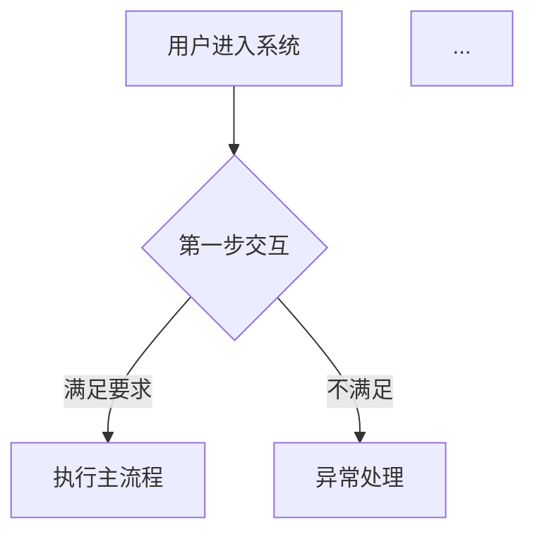
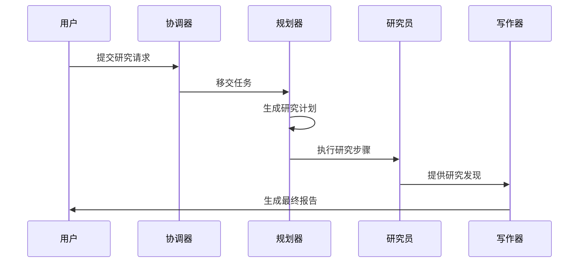
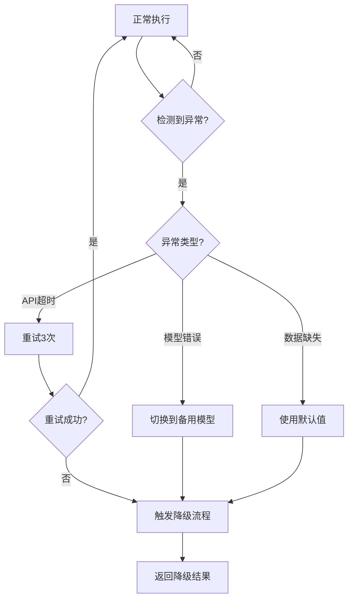

# AI产品PRD模板

## 目录
1. 需求背景
2. 产品定位
3. 用户故事
4. Agent故事
5. 用户旅程
6. Agent旅程
7. 功能清单
   - 7.1 核心功能模块
   - 7.2 大模型/Agent功能点
   - 7.3 功能详细说明
8. 提示词设计策略
9. 数据集
10. 测试标准
11. 异常处理与降级策略
12. 非功能性需求
13. 迭代规划
14. 附录

---

# 1. 需求背景

## 1.1 问题描述
描述当前市场/场景中存在的问题或痛点

## 1.2 目标用户
列出核心用户群体及其特征

## 1.3 业务目标
明确的量化目标和成功指标

# 2. 产品定位

## 2.1 产品定义
一句话定义产品是什么

## 2.2 核心价值
3-5个核心价值点

## 2.3 产品差异化
与竞品或传统方案的对比

## 2.4 大模型优势
相比传统方案，使用大模型的优势

# 3. 用户故事

用户故事格式：
```
作为【用户角色】
在【XX使用场景】下，
为了【达成XX目标/解决XX问题】
需要【功能XX支持/具备XX能力】。
```

按需求模块组织用户故事，每个模块必须包含：

### [需求模块名称]
#### 用户故事
:::info
**作为** [用户角色]
**我希望** [达成XX目标/获得XX能力]
**以便于** [解决XX问题/获得XX价值]
:::

#### 验收标准
- [具体可验证的标准1]
- [具体可验证的标准2]
- [具体可验证的标准3]

#### 技术实现
- [对应的Agent/模块如何实现此需求]
- [关键技术路径说明]
- [输入输出约束]

# 4. Agent故事

按Agent角色组织，每个 Agent 故事必须以**场景**为单位输出。

## 4.1 [Agent名称] Agent故事

### 4.1.1 Agent故事1：[场景名称/解决的问题]
#### 场景描述
:::info
[详细描述该Agent在什么情况下触发，需要达成什么目标]
:::

#### Agent故事
作为 [Agent角色]
在 [具体任务场景] 下
为了 [完成具体目标]
我需要:

【上下文信息】
- [需要的原始输入/状态]

【能力支持】
- [需要的核心能力，如意图分类/多语言理解]

【工具清单】
1. [工具名称](参数)
   - 用途: [描述]
   - 何时使用: [触发条件]

【约束条件】
- [强制性规则和限制]

#### 为什么需要这些
- [解释为什么此场景需要上述上下文和工具，帮助开发理解意图]

# 5. 用户旅程

## 5.1 完整用户旅程
按阶段描述用户从首次使用到完成目标的完整流程。本节必须包含 **Markdown Mermaid 语法可视化的全局流程流转图 (Flowchart)** 以及每个阶段四个维度的详细拆解。

### 流程可视化


### 阶段1：[阶段名称]（预计时间）
#### 用户行为：
- [用户在这个阶段做什么]

#### 系统响应：
- [系统/Agent如何响应]

#### 关键交互点：
- [关键UI元素或交互节点]

#### 用户体验目标：
- [这个阶段的体验设计目标]

### 阶段2：[阶段名称]（预计时间）
...

## 5.2 关键用户体验设计原则
列出3-5个核心设计原则（如渐进式信息披露、透明化执行过程、个性化定制能力等）

# 6. Agent旅程 (Agent 工作流)

## 6.1 完整Agent协作时序图或工作流
必须使用 mermaid 流程图甚至序列图 (Sequence Diagram) 描绘多Agent协作的完整流程，例如：

```mermaid
sequenceDiagram
    participant User
    participant Coordinator
    participant Planner
    User->>Coordinator: 提出需求
    Coordinator->>Planner: 分配任务
    Planner-->>Coordinator: 返回计划
    ...
```

## 6.2 各Agent职责说明
每个Agent的职责边界和协作关系

## 6.3 关键时序流程
关键场景的Agent交互时序图，使用mermaid时序图绘制：


# 7. 功能清单

## 7.1 核心功能模块
| 模块 | 功能点 | 优先级 | 功能描述 |
|------|--------|--------|----------|
| xxx | xxx | PO | xxx |

## 7.2 大模型/Agent功能点
| 功能点 | Agent | 大模型任务 | 输入约束 | 输出约束 | 技术要点 |
|--------|-------|------------|----------|----------|----------|
| xxx | xxx | xxx | xxx | xxx | xxx |

# 7.3 功能详细说明

按照页面类型详细描述每个功能的具体实现，不同页面类型采用不同的输出格式。本章节输出的PRD文档为Markdown格式，其中的页面布局使用ASCII线框图展示。

---

### 7.3.1 后台管理类页面功能说明 (Admin / Table-First)

#### [功能名称]列表页
##### 页面概述
简要说明该列表页的用途和展示内容

##### 页面布局
使用ASCII线框图展示页面布局结构，示例如下：
```
+------------------------------------------------+
|  侧边栏          |          主内容区           |
| +-------------+  | +----------------------------+ |
| | 菜单导航     |  | | 页面标题 | 搜索 | 新增 | | |
| | +---------+ |  | +----------------------------+ |
| | |数据管理 | |  | 筛选区                        |
| | |用户管理 | |  | [状态▼] [日期范围] [搜索]    |
| | |系统设置 | |  | +--------------------------+ |
| | +---------+ |  | | 操作栏 | 导出 | 批量操作| | |
| +-------------+  | +--------------------------+ |
|                  | | 表格区域                    | |
|                  | | +------+------+--------+ | |
|                  | | |ID|名称 | 状态 | 操作 | | |
|                  | | |001|项目A|进行中|[...]| | |
|                  | | +------+------+--------+ | |
|                  | | 分页器 共100条 [1] [2]    | |
|                  | +--------------------------+ |
+------------------------------------------------+
```

##### 功能点说明
| 功能点 | 功能描述 | 操作方式 | 数据来源 |
|--------|----------|----------|----------|
| 数据展示 | 展示[数据类型]的列表信息 | 自动加载 | [数据源说明] |
| 筛选查询 | 支持按[筛选条件]筛选数据 | 用户输入筛选条件 | [数据源说明] |
| 排序功能 | 支持[排序字段]排序 | 点击表头 | 当前数据 |
| 批量操作 | 支持批量[删除/导出/审核] | 勾选后点击批量操作 | - |
| 操作按钮 | [新增/编辑/删除]等操作 | 点击操作按钮 | - |

##### 数据字段定义
| 字段名称 | 字段类型 | 是否必填 | 显示说明 | 取值范围 |
|----------|----------|----------|----------|----------|
| field1 | String | 是 | 显示在表格第一列 | - |
| field2 | Number | 否 | 显示在表格第二列 | 0-100 |
| field3 | Date | 是 | 显示在表格第三列 | YYYY-MM-DD |

##### 交互说明
- 加载逻辑：页面首次加载时，[说明加载逻辑]
- 筛选逻辑：用户选择筛选条件后，[说明筛选逻辑]
- 批量操作：勾选多个数据项后，批量操作按钮高亮可用
- 操作逻辑：点击操作按钮后，[说明操作逻辑]

##### 异常处理
- 数据加载失败：显示错误提示，提供重试按钮
- 无数据：显示空状态提示和引导操作
- 筛选无结果：显示"暂无数据"提示
- 批量操作失败：提示失败项，支持重试

##### 性能要求
- 列表加载时间 ≤ 2秒
- 筛选响应时间 ≤ 1秒
- 分页切换时间 ≤ 0.5秒
- 批量操作响应时间 ≤ 3秒

---

### 7.3.2 移动端类页面功能说明 (App / H5 / Mini-Program)

#### [功能名称]移动端列表页
##### 页面概述
简要说明该移动端列表页的用途和展示内容

##### 页面布局
使用ASCII线框图展示页面布局结构，示例如下：
```
+--------------------------+
|  <  列表页           | + |
+--------------------------+
|  搜索框                  |
|  [___________________]    |
+--------------------------+
|  筛选标签                |
|  [全部▼] [最新] [热门]   |
+--------------------------+
|  卡片列表                 |
|  +----------------------+ |
|  | 项目A                 | |
|  | 进行中   2024-01-01   | |
|  | [查看详情] >>         | |
|  +----------------------+ |
|  +----------------------+ |
|  | 项目B                 | |
|  | 已完成   2024-01-02   | |
|  | [查看详情] >>         | |
|  +----------------------+ |
+--------------------------+
|  + [加载更多]            |
+--------------------------+
```

##### 功能点说明
| 功能点 | 功能描述 | 操作方式 | 数据来源 |
|--------|----------|----------|----------|
| 卡片展示 | 展示[数据类型]的卡片信息 | 自动加载 | [数据源说明] |
| 搜索功能 | 支持按关键词搜索 | 用户输入搜索词 | [数据源说明] |
| 筛选标签 | 支持按[筛选条件]筛选 | 点击标签 | 当前数据 |
| 下拉刷新 | 下拉刷新列表数据 | 下拉手势 | [数据源说明] |
| 上拉加载 | 上拉加载更多数据 | 上拉手势 | [数据源说明] |

##### 数据字段定义
| 字段名称 | 字段类型 | 显示说明 |
|----------|----------|----------|
| title | String | 卡片标题，加粗显示 |
| status | String | 状态标签，颜色区分 |
| date | Date | 日期，格式YYYY-MM-DD |

##### 交互说明
- 触摸反馈：点击卡片有视觉反馈
- 手势操作：支持下拉刷新、上拉加载
- 搜索体验：实时搜索或搜索按钮触发
- 筛选体验：标签切换时平滑过渡

##### 异常处理
- 加载失败：显示错误提示，提供重试按钮
- 网络异常：显示网络错误提示，支持点击重试
- 无数据：显示空状态插画和引导文字

##### 性能要求
- 首屏加载时间 ≤ 2秒
- 下拉刷新响应时间 ≤ 1秒
- 上拉加载响应时间 ≤ 1秒

---

### 7.3.3 复杂Web/工作台类页面功能说明 (Dashboard / Workbench)

#### [功能名称]工作台页
##### 页面概述
简要说明该工作台页的用途和展示内容

##### 页面布局
使用ASCII线框图展示页面布局结构，示例如下：
```
+--------------------------------------------------+
|  顶部导航栏                           [用户▼]    |
+--------------------------------------------------+
|  侧边栏          |    主内容区                     |
| +-------------+  | +----------------------------+ |
| |工作台       |  | | 欢迎回来，用户名            | | |
| |-------------|  | +----------------------------+ |
| |数据看板     |  | 统计卡片行                   |
| |-------------|  | +--------+--------+--------+ | |
| |报表中心     |  | |总用户  |活跃用户|转化率  | | |
| |-------------|  | |10,000  |8,500   |35%     | | |
| |任务管理     |  | +--------+--------+--------+ | |
| |-------------|  | |今日新增|待处理  |已完成  | | |
| |系统设置     |  | |+200    |15      |50      | | |
| +-------------+  | +--------+--------+--------+ | |
|                  | +----------------------------+ | |
|                  | 图表区域                       | |
|                  | +--------------------------+  | |
|                  | |   数据趋势图（折线图）    |  | |
|                  | |  /\        /\            |  | |
|                  | | /  \______/  \_______   |  | |
|                  | +--------------------------+  | |
|                  | +------------+-------------+ | |
|                  | | 任务分布   | 数据来源    | | |
|                  | |  （饼图）  |  （柱状图） | | |
|                  | +------------+-------------+ | |
+--------------------------------------------------+
```

##### 功能模块说明
**统计卡片**
| 指标名称 | 指标类型 | 计算规则 | 更新频率 |
|----------|----------|----------|----------|
| 总用户 | 数值 | 统计所有用户 | 实时 |
| 活跃用户 | 数值 | 统计7日内活跃用户 | 每日 |
| 转化率 | 百分比 | 转化数/访问数 | 实时 |

**图表配置**
| 图表类型 | 图表标题 | 数据维度 | 交互方式 |
|----------|----------|----------|----------|
| 折线图 | 数据趋势图 | 时间维度 | 悬停显示详情 |
| 饼图 | 任务分布 | 类别维度 | 点击扇区过滤 |
| 柱状图 | 数据来源 | 来源维度 | 点击柱子过滤 |

##### 数据字段定义
| 字段名称 | 字段类型 | 显示规则 |
|----------|----------|----------|
| total_users | Number | 使用千位分隔符 |
| active_users | Number | 对比昨日显示涨跌 |
| conversion_rate | Percentage | 保留两位小数 |

##### 交互说明
- 数据刷新：支持手动刷新和自动定时刷新
- 图表交互：点击图表元素可过滤关联数据
- 布局调整：支持拖拽调整卡片位置
- 视图切换：支持切换日/周/月视图

##### 异常处理
- 数据加载失败：显示错误提示，提供重试按钮
- 部分数据异常：正常显示可用数据，异常区域标注
- 实时数据中断：显示最后已知数据，标注更新失败

##### 性能要求
- 首屏加载时间 ≤ 3秒
- 图表渲染时间 ≤ 2秒
- 数据刷新时间 ≤ 1秒

---

### 7.3.4 对话/AIGC类页面功能说明 (Chat / GenAI)

#### [功能名称]对话页面
##### 页面概述
简要说明该对话页的用途和AI能力

##### 页面布局
使用ASCII线框图展示页面布局结构，示例如下：
```
+--------------------------------------------------+
|  对话助手                           [设置] [历史] |
+--------------------------------------------------+
|  对话历史区域                      |
|  +----------------------------------------------+ |
|  | 你: 帮我分析一下这个数据                     | |
|  |                                              | |
|  | 助手: [AI回复...]                           | |
|  | +---------+                                 | |
|  | | 数据分析| [复制] [重新生成]              | |
|  | +---------+                                 | |
|  |                                              | |
|  | 你: 能详细解释一下吗？                       | |
|  +----------------------------------------------+ |
|  | ...                                           |
|  +----------------------------------------------+ |
+--------------------------------------------------+
|  输入区域                        |
|  +----------------------------------------------+ |
|  | [输入您的问题...]                    | |
|  | [📎] [📷] [🎤]                    | |
|  +----------------------------------------------+ |
|                                  [发送]          |
+--------------------------------------------------+
```

##### 功能点说明
| 功能点 | 功能描述 | 操作方式 | AI能力 |
|--------|----------|----------|---------|
| 对话交互 | 支持多轮对话交互 | 文本输入/语音输入 | 自然语言理解 |
| 多模态输入 | 支持文本、图片、语音 | 点击上传/录音 | 多模态识别 |
| 内容生成 | 自动生成回复内容 | 发送后自动生成 | 内容生成能力 |
| 上下文记忆 | 记住对话上下文 | 自动维护 | 长上下文理解 |
| 回复操作 | 支持复制、重新生成 | 点击操作按钮 | - |

##### 对话字段定义
| 字段名称 | 字段类型 | 显示说明 | AI处理 |
|----------|----------|----------|--------|
| user_message | String | 显示用户输入 | 理解用户意图 |
| ai_response | Markdown | 显示AI回复，支持富文本 | 生成回复内容 |
| message_type | Enum | 区分用户/系统/助手消息 | - |

##### 交互说明
- 输入体验：支持Enter发送，Shift+Enter换行
- 语音交互：长按录音按钮，松开发送
- 流式输出：AI回复采用流式输出，逐字显示
- 回复操作：支持重新生成当前回复、复制内容

##### 异常处理
- AI响应超时：显示"AI正在思考..."，超时后提示重试
- 内容审核失败：提示内容违规，建议重新输入
- 网络异常：显示网络错误，支持离线缓存
- 上下文丢失：提示对话已重置，建议重新开始

##### 性能要求
- 首字响应时间 ≤ 1秒
- 流式输出延迟 ≤ 500ms/字符
- 语音转文字响应时间 ≤ 2秒

---

### 7.3.5 数据可视化大屏类页面功能说明 (Data Visualization / Large Screen)

#### [功能名称]数据大屏
##### 页面概述
简要说明该数据大屏的用途和展示内容

##### 页面布局
使用ASCII线框图展示页面布局结构，示例如下：
```
+--------------------------------------------------------+
|                    数据可视化大屏                        |
|                                  [2024-01-01 10:00:00] |
+--------------------------------------------------------+
|  左侧区域              |        中间区域          | 右 |
| +-------------------+  | +---------------------+ | 侧 |
| | 关键指标           |  | |    核心地图展示     | | 区 |
| | +----------------+ |  | |   +-------------+   | | 域 |
| | | 总用户: 10,000   | |  | |             |   | |    |
| | | +200 ▲         | |  | |             |   | |    |
| | +----------------+ |  | |             |   | |    |
| | +----------------+ |  | |             |   | |    |
| | | 今日新增: 200    | |  | |             |   | |    |
| | | +50 ▲           | |  | |             |   | |    |
| | +----------------+ |  | |   +-------------+   | |    |
| +-------------------+  | +---------------------+ |    |
|                      |                        |    |
| | 排行榜             |  | 实时数据流           | | 实 |
| | 1. 区域A: 5000     |  | 10:00:00 用户A登录    | | 时 |
| | 2. 区域B: 3000     |  | 10:00:01 订单B创建    | | 告 |
| | 3. 区域C: 2000     |  | 10:00:02 支付C成功    | | 警 |
| +-------------------+  | +---------------------+ |    |
+--------------------------------------------------------+
|  底部区域                                               |
| +-----------------------------------------------------+ |
| | 数据趋势图（时间轴展示）                             | |
| | +-----------------------------------------------+   | |
| | |          /\        /\                         |   | |
| | |         /  \______/  \_____                   |   | |
| | +-----------------------------------------------+   | |
| +-----------------------------------------------------+ |
+--------------------------------------------------------+
```

##### 功能模块说明
**关键指标卡片**
| 指标名称 | 显示格式 | 对比方式 | 更新频率 |
|----------|----------|----------|----------|
| 总用户 | 数值 | 同比/环比 | 实时 |
| 今日新增 | 数值 | 对比昨日 | 实时 |
| 转化率 | 百分比 | 对比上周 | 实时 |

**地图可视化**
| 展示维度 | 图标类型 | 交互方式 | 数据来源 |
|----------|----------|----------|----------|
| 地域分布 | 热力图/气泡图 | 点击区域查看详情 | 地理位置数据 |
| 实时动态 | 动态标记 | 悬停显示信息 | 实时数据流 |

##### 数据字段定义
| 字段名称 | 字段类型 | 显示规则 | 实时性 |
|----------|----------|----------|--------|
| metric_value | Number | 大字体显示，带趋势箭头 | 实时 |
| location | String | 地图位置坐标 | 准实时 |
| timestamp | DateTime | 精确到秒 | 实时 |

##### 交互说明
- 全屏展示：支持全屏模式，隐藏边框
- 自动轮播：支持多页面自动轮播切换
- 实时刷新：数据实时推送到大屏
- 钻取分析：点击图表/区域查看详细数据

##### 异常处理
- 数据中断：显示最后已知数据，标注更新时间
- 部分异常：异常区域标注，正常区域继续展示
- 网络波动：使用本地缓存数据，显示网络状态

##### 性能要求
- 大屏初始化时间 ≤ 5秒
- 数据刷新延迟 ≤ 1秒
- 地图渲染帧率 ≥ 30fps

---

### 7.3.6 分步流程/向导类页面功能说明 (Step Wizard)

#### [功能名称]流程向导页
##### 页面概述
简要说明该流程向导页的用途和步骤

##### 页面布局
使用ASCII线框图展示页面布局结构，示例如下：
```
+--------------------------------------------------------+
|                    流程向导页                            |
+--------------------------------------------------------+
|  步骤进度                                                |
|  +----------+  +----------+  +----------+  +----------+  |
|  | ● 步骤1 |  | ○ 步骤2 |  | ○ 步骤3 |  | ○ 步骤4 |  |
|  | 基本信息 |  | 详细配置 |  | 确认信息 |  | 完成    |  |
|  +----------+  +----------+  +----------+  +----------+ |
+--------------------------------------------------------+
|                                                        |
|  当前步骤：步骤1 - 基本信息                             |
|  +----------------------------------------------------+ |
|  | 表单区域                                           | |
|  | +------------------------------------------------+ | |
|  | | 项目名称: [___________________] *              | | |
|  | +------------------------------------------------+ | |
|  | +------------------------------------------------+ | |
|  | | 项目类型: [下拉选择 ▼] *                      | | |
|  | +------------------------------------------------+ | |
|  | +------------------------------------------------+ | |
|  | | 项目描述: [_____________________________]     | | |
|  | |           [_____________________________]     | | |
|  | +------------------------------------------------+ | |
|  +----------------------------------------------------+ |
|                                                        |
|                                    [上一步]  [下一步]   |
+--------------------------------------------------------+
```

##### 功能点说明
| 功能点 | 功能描述 | 操作方式 | 数据验证 |
|--------|----------|----------|----------|
| 步骤导航 | 显示当前步骤和总步骤 | 点击步骤/按钮 | - |
| 数据验证 | 每步离开前验证数据 | 自动验证 | 表单验证规则 |
| 数据保存 | 每步数据暂存 | 自动保存 | - |
| 步骤回退 | 返回上一步修改 | 点击上一步 | - |
| 流程完成 | 所有步骤完成后提交 | 点击完成 | 全量验证 |

##### 步骤配置
| 步骤编号 | 步骤名称 | 字段列表 | 必填验证 |
|----------|----------|----------|----------|
| 1 | 基本信息 | name, type, description | name, type必填 |
| 2 | 详细配置 | config1, config2, config3 | config1必填 |
| 3 | 确认信息 | 所有字段展示 | - |
| 4 | 完成 | 结果展示 | - |

##### 数据字段定义
| 字段名称 | 字段类型 | 是否必填 | 验证规则 |
|----------|----------|----------|----------|
| name | String | 是 | 1-100字符 |
| type | Enum | 是 | 固定选项 |
| config1 | Number | 是 | 0-100 |

##### 交互说明
- 进度指示：清晰显示当前步骤位置
- 表单验证：实时验证，离开时验证
- 步骤切换：支持点击步骤直接跳转（已完成步骤）
- 数据暂存：每步数据自动保存，支持返回修改
- 完成提交：最后一步显示所有信息，确认后提交

##### 异常处理
- 验证失败：高亮错误字段，显示错误提示
- 数据丢失：提示数据未保存，建议返回
- 提交失败：显示错误信息，返回失败步骤

##### 性能要求
- 步骤切换时间 ≤ 0.5秒
- 数据验证响应时间 ≤ 0.3秒
- 自动保存延迟 ≤ 1秒

---

# 8. 提示词设计策略

每个 Agent 的提示词设计策略包含 5 个子节：

## [Agent名称] 提示词设计策略
### 角色定位
[Agent在系统中的角色描述]

### 核心挑战
1. [挑战1]
2. [挑战2]
3. [挑战3]

### 设计策略
#### 策略1：[策略名称]
- 实施方法：[具体如何实现]
- 为什么这样设计：[解释设计决策的理由]

#### 策略2：[策略名称]
...

### 完整提示词
[附上完整的提示词原文或翻译]

### 关键输出控制
#### 输出格式控制
- [具体格式要求1]
- [具体格式要求2]

#### 内容质量控制
- [质量控制标准1]
- [质量控制标准2]

#### 边界情况处理
- [边界情况1及处理方式]
- [边界情况2及处理方式]

# 9. 数据集

## 9.1 [数据集名称]
**用途**：[评估什么能力]

**数据要求：**
| 数据维度 | 要求描述 | 样本量 |
|----------|----------|--------|
| [维度1] | [具体要求] | [数量] |
| [维度2] | [具体要求] | [数量] |

**数据标注规范：**
```json
{
  "input": "示例输入",
  "expected_output": "期望输出",
  "quality_metrics": {
    "metric1": 4.5
  }
}
```

**数据收集策略：**
1. 初期：[收集方式]
2. 标注：[标注规范]
3. 迭代：[持续优化方式]

## 9.2 [其他数据集]
（同上格式）

# 10. 测试标准

## 10.1 功能测试标准
### [Agent/模块名称] 测试
| 测试场景 | 测试方法 | 通过标准 | 测试用例量 |
|----------|----------|----------|------------|
| [场景1] | [方法] | [标准] | [数量] |

**测试用例示例：**
```yaml
- input: "示例输入"
  expected_output: "期望输出"
  expected_action: "期望动作"
```

## 10.2 性能测试标准
| 指标 | 测试方法 | 目标值 |
|------|----------|--------|
| [指标] | [方法] | [目标值] |

## 10.3 用户体验测试标准
| 指标 | 测量方法 | 目标值 |
|------|----------|--------|
| [指标] | [方法] | [目标值] |

## 10.4 线上监控指标
| 指标 | 监控方法 | 告警阈值 |
|------|----------|----------|
| [指标] | [方法] | [阈值] |

# 11. 异常处理与降级策略

## 11.1 异常场景定义
| 异常场景 | 触发条件 | 用户感知 | 降级策略 |
|----------|----------|----------|----------|
| [场景1] | [触发条件] | [用户看到什么] | [如何降级] |

## 11.2 降级流程图
描述异常时的降级策略和流程，使用mermaid流程图绘制：


# 12. 非功能性需求

## 12.1 性能需求
性能指标和优化目标

## 12.2 可用性需求
系统可用性要求

## 12.3 安全需求
数据安全、隐私保护等

## 12.4 数据统计需求
需要统计的数据和分析维度

# 13. 迭代规划
描述产品迭代路线图和里程碑

# 14. 附录

## 14.1 关键术语表
| 术语 | 说明 |
|------|------|
| [术语1] | [定义] |

## 14.2 提示词文件路径
| Agent | 提示词文件路径 |
|-------|----------------|
| [Agent1] | [文件路径] |
| [Agent2] | [文件路径] |
