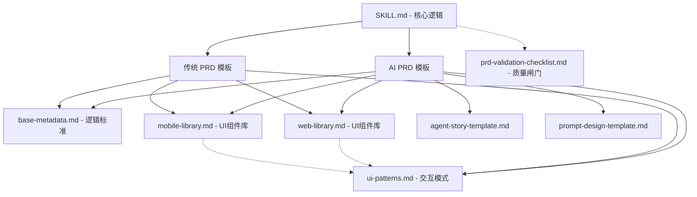

# ProtoToPRD（原型 → 深度 PRD 生成器）

## 0. 引用体系架构 (Reference Architecture)

本 Skill 采用“复合模板架构”，确保生成质量的标准化与解析效率。由于 vibe coding 的输出通常较零散，依靠这些标准库可以补全逻辑欠账。



## ⚠️ 重要：执行指令

当用户触发此 skill 时，**必须严格按照以下两阶段流程执行**，严禁直接生成 PRD。

### 最高优先级质量目标（评审关注）
1. **功能覆盖（Coverage）**：PRD 中必须覆盖第一阶段识别出的全部页面/模块，禁止遗漏。
2. **业务逻辑清晰**：搜索筛选规则、行内操作按钮、页面间跳转逻辑必须描述清楚。
3. **流程图（Mermaid）**：关键业务流程必须可视化，并覆盖异常分支；每张图必须附逐段解释。
4. **业务抽象 (Business Abstraction)**：提取原型背后的“业务字段”而非“Mock 数据”；排除原型中的暂定技术接口（如 mock api），聚焦业务语义。

### 来源说明规范（可选，用于追溯）
- `code:` 代码参考（文件路径 + 关键符号）
- `screenshot:` 截图参考（位置描述 + 识别到的文字）
- `old_prd:` 旧 PRD 参考（章节/表格行）
- `unknown:` 无法确认（需写明缺失原因，转为 `[待确认]`）

> 第一阶段重点识别业务逻辑，来源说明为可选，聚焦于准确描述业务需求。

---

## 第一阶段：深度解析与需求盘点（必须首先执行）

### Step 1: 输入判定与业务识别
1. **识别与提取**（根据输入类型选择合适工具，灵活处理）：
   - **HTML/前端框架代码文件**：使用 `Read` 工具直接读取，识别页面结构、组件层级、表单字段、按钮及交互逻辑。
   - **需要运行的前端项目/在线原型**：使用 `browser` 工具渲染，获取视觉布局和实际交互效果。
   - **原型截图/设计稿**：使用 OCR 及视觉分析，识别页面布局、文字内容、按钮及表单字段。

   > **工具选择建议**：
   > - 代码文件可直接读取 → 优先使用 `Read`（效率更高）
   > - 需要查看实际渲染效果 → 使用 `browser`
   > - 只有截图/设计稿 → 使用视觉分析
2. **业务维度分析与意图重构**（聚焦业务意图，减少工程细节）：
   - **[新增] 意图重构 (Intent Reconstruction)**：
     - 通过分析代码备注、变更历史或页面标题，尝试还原 PM 生成该原型的“初衷”。
     - 识别原型正在解决的核心问题（如：提高数据录入效率、增加 AI 诊断维度）。
   - **UI 元素与页面类型识别**：
     - **平台识别 (Platform Detection)**：识别终端类型（Web-PC / H5-Mobile / App / 小程序）。
     - **页面/交互分类**：对比 `references/ui-patterns.md` 进行模式匹配，明确区分：
       - **Modal** (弹窗：居中、强交互、阻塞)
       - **Drawer** (抽屉：边缘滑出、辅助上下文、不丢失页面状态)
       - **Message/Toast** (全局提示/吐司：顶部/角落、非阻塞、轻量反馈、自动消失)
     - **CRUD 页面识别（关键）**：
       - **列表页**：表格/列表 + 筛选条件 + 操作按钮。
       - **新建/编辑页**：表单 + 提交按钮 + 校验逻辑。
       - **详情页**：只读展示 + 关联操作。
       - **看板页 (Dashboard)**：指标卡 + 统计图表 + 时间筛选。
       - **向导页 (Wizard)**：分步进度条 + 上/下一步。
       - **对话页 (Dialogue & AI)**：消息流 + 模型状态 + 输入框。
       - **权限/设置页 (RBAC)**：权限矩阵 + 角色/用户列表。
     - **反馈与轻量交互识别**：
       - **弹窗/抽屉**：Modal / Drawer (侧边) / Bottom Sheet (底端)。
       - **反馈轻提示**：Message (顶部) / Toast (角落)。
       - **结果状态**：成功/失败/空状态 (Empty)。
     - **列表页细拆**：搜索条件、全局操作按钮（新建/导入/导出）、表格列字段、行内操作按钮（编辑/删除/启用/停用/日志/报告等）、批量操作。
     - **表单页细拆**：输入字段、字段类型、是否必填、字段间联动关系。
- **业务逻辑与流转**：
  - **状态流转**：识别业务对象的状态变化（如草稿→审核中→已发布）。
  - **校验规则**：识别字段的必填校验、格式校验、唯一性校验等业务规则。
  - **页面间跳转**：识别页面间的跳转逻辑（如列表 → 新建 → 保存 → 返回列表）。
- **数据抽象与 Mock 处理（核心原则）**：
  - **去 Mock 化**：原型中的 `mock_data` 或固定的 `test_user` 仅作为字段类型的示例依据，**严禁**将其作为业务规则写入 PRD。
  - **接口脱钩**：原型代码中的临时路由（如：`/api/v1/mock/list`）仅用于推导数据流向，**严禁**将其列为正式接口规范，应描述为“获取[对象]列表”的业务接口意图。
- **AI 功能识别（如有）**：识别 AI 功能点（对话、生成、分析等），暂不需要深入提示词细节。
4. **[新增] Vibe Coding 一致性自检（核心需求）**：
   - **一致性扫描**：扫描 UI 流转中的“死胡同”（有去无回）或组件命名冲突（如：A 页面引用了已不存在的旧 ID）。
   - **状态残留识别**：发现原型中由于多次对话重构导致的过时交互逻辑。
   - **异常分支探测**：识别 PM 可能在 vibe coding 时忽略的失败路径（如：网络超时、模型无响应）。
5. **[优化] 存量 PRD 分析（仅针对升级迭代场景）**：
   - **导入分析**：若用户提供了旧版 PRD，需解析其功能模块、业务规则及数据定义。
   - **差异比对 (Diff Analysis)**：将旧版 PRD 与当前原型进行对撞，识别：
     - **新增项**：新页面、新按钮、新业务规则。
     - **变更项**：交互逻辑修改、字段变动、UI 布局调整。
     - **遗留/下线项**：原型中已移除但在旧 PRD 中存在的逻辑。

### Step 2: 输出需求盘点看板（必须暂停并请求确认）
在生成 PRD 前，必须呼出 `notify_user` 展示以下 **“需求看板”**。

#### 2.1 业务架构概览 (Functional Architecture Map)
**2.1 业务架构概览 (Functional Architecture Map)**
以直观的“功能树”形式展示，确保 PM 快速核对功能完整性。

**💡 UI 命名规范 (强制推荐)**：
- **`[Pxx]` (Page)**：代表 **独立页面/主路由**（如：列表页、看板页）。
- **`[Dxx]` (Dialog/Drawer)**：代表 **二级辅助界面**（如：新建弹窗、详情抽屉、确认对话框）。

**核心功能路径及页面识别：**
- 📂 **[大模块名称 A]** - *模块核心价值/意图*
  - 🛠️ **功能点 1**：[功能描述]
    - [P01] 页面/组件名称
    - [P02] 页面/组件名称
    - [D01] 级联弹窗名称
  - 🛠️ **功能点 2**：[功能描述]
    - [P3] 页面/组件名称
- 📂 **[大模块名称 B]**...

> [!TIP]
> 如果当前界面支持 Mermaid 渲染，请查看下方的逻辑拓扑（双击可查看源码）：
> ```mermaid
> flowchart TD
>   ... (业务逻辑流转简图)
> ```

#### 2.2 业务需求卡片 (Business Intent Cards)
> 按“意图 -> 能力 -> 页面”的叙事路径重新梳理需求，取代繁琐的表格，大幅提升确认效率。

---
### 📦 模块 [ID]：[模块名称]
- **💡 核心意图**：[描述该模块存在的业务价值，如：实现数据源的一站式接入与生命周期管理]
- **🛠️ 核心能力与页面分布**：
  1. **[能力 A]**：[简述该能力的行为] -> 关联页面：📄 [P1] xxx
  2. **[能力 B]**：[简述该能力的行为] -> 关联方式：🪟 [Modal] yyy、📥 [Drawer] zzz
- **📊 关键数据清单**：[字段1](类型/必填)、[字段2](校验规则)...
- **🔍 来源依据**：[code: /src/List.tsx | screenshot: 列表界面]
---

> **判定标准**：若一个业务模块涉及多个交互环节，必须在“能力与页面分布”中全部列出，禁止漏项。

#### 2.3 原型一致性风险雷达 (Consistency Alarm)
> 专门针对 Vibe Coding 产生的“残留逻辑”或“死胡同”进行警示。

| 风险点 | 表现描述 | 潜在影响 | 建议处理方式 |
|---|---|---|---|
| 死胡同 | P1 页面有详情跳转按钮，但未定义 P2 详情页 | 交互中断，研发无法闭环 | 是补全 P2 还是移除按钮？ |
| 命名冲突 | 角色设置页使用了旧版 ID 字段 `user_id` | 状态残留，逻辑混乱 | 统一修改为新版 ID |
| 异常缺失 | AI 对话原型未展示“模型超时”状态 | 交互不完整 | 在 PRD 中增加降级逻辑描述 |

#### 2.4 待确认问题清单与评估 (Open Questions)
| ID | 关键问题 | 阻塞级别(P0/P1) | 建议负责人 |
|---|---|---|---|
| Q01 | 列表页翻页是否需要前端缓存？ | P1 | 业务方 |

#### 2.5 变更汇总（仅针对升级迭代场景）
| 变更项 | 变更描述 | 影响面评估 |
|---|---|---|
| [NEW] | 增加 AI 诊断报告导出 | 涉及存储与 PDF 生成服务 |
| [MODIFY] | 个人中心布局重构 | 仅 UI 变动 |

**⚠️ 强制停止点：必须等待用户明确确认后，方可进入第二阶段。**

输出上述清单后，**立即停止执行**，并使用以下提示语：

```
╔════════════════════════════════════════════════════════════════╗
║  🔍 第一阶段：深度解析与需求盘点 - 完成                          ║
╠════════════════════════════════════════════════════════════════╣
║  以上为从原型/源码中解析出的全部信息。                          ║
║                                                                ║
║  ⚠️ 重要：请确认以上内容准确无误，或补充缺失信息。               ║
║                                                                ║
║  在得到您的明确确认（如"确认"、"继续"、"可以生成PRD"）之前，     ║
║  ████████████████████████ 不会进入第二阶段 ███████████████████║
║                                                                ║
║  特别注意：                                                     ║
║  • 请检查页面/模块清单是否完整                                  ║
║  • 请确认待确认问题清单中的 P0 问题                             ║
║  • 如有旧版 PRD，请确认变更影响面评估                           ║
╚════════════════════════════════════════════════════════════════╝
```

---

## 第二阶段：PRD 生成（用户确认后执行）

### Step 3: 产品类型判断与模板选择（强制检查点）

#### 3.1 AI 应用判定标准
检测到以下任一特征，即判定为 **AI 应用**：
- [ ] 包含"AI"、"大模型"、"LLM"、"Agent"、"智能"、"智能体"等关键词
- [ ] 有模型配置界面（如：GPT、Claude、智谱、文心一言等模型选择）
- [ ] 有 AI 相关功能（AI 对话、AI 生成、AI 分析、AI 审核等）
- [ ] 有提示词配置或提示词模板管理功能
- [ ] 代码中包含模型参数（temperature、maxTokens、topP 等）
- [ ] 有 Agent 编排、多 Agent 协作或 Agent 工作流功能

#### 3.2 模板选择
- **AI 应用**：使用 `references/ai-product-prd-template.md`
- **传统应用**：使用 `references/traditional-prd-template.md`

**⚠️ 强制输出：在 PRD 开头添加模板声明**
```markdown
---
product_type: [AI应用/传统应用]
template_source: references/[ai-product/traditional]-prd-template.md
generated_at: YYYY-MM-DD HH:mm:ss
---
```

#### 3.3 章节模板映射表（必须严格遵循）

| AI 应用章节 | 传统应用章节 | 强制引用文件 | 说明 |
|------------|-------------|-------------|------|
| 1. 需求背景 | 1. 需求背景 | base-metadata.md | 通用 |
| 2. 产品定位 | 2. 产品定位 | base-metadata.md | AI应用需补充"AI相比传统方案的优势" |
| 3. 用户故事 | 3. 用户故事 | base-metadata.md | 必须包含正负向 EARS 验收标准 |
| **4. Agent 故事** | - | **agent-story-template.md** | **AI应用专有，必须存在** |
| 5. 用户旅程 | 4. 用户旅程 | - | 必须包含 Mermaid Flowchart + 5.1 主流程覆盖模块对齐表 |
| **6. Agent 旅程与协作流** | - | - | **AI应用专有，必须存在，使用 Sequence Diagram** |
| 7. 功能清单与详细说明 | 5. 功能清单与详细说明 | web-library.md/mobile-library.md | 7.0 功能覆盖索引必须存在 |
| **7.2 大模型/Agent 任务清单** | - | - | **AI应用专有，必须存在** |
| **8. 提示词设计策略** | - | **prompt-design-template.md** | **AI应用专有，必须按标准格式** |
| **9. 数据集需求** | - | - | **AI应用专有** |
| 10. 测试标准 | 6. 测试标准 | - | AI应用需包含大模型效果评测标准 |
| **11. 异常处理与 AI 降级方案** | - | - | **AI应用专有** |
| 12. 技术可行性与风险预判 | 7. 技术可行性与风险预判 | - | AI应用需包含 Token 成本与延迟、模型可靠性风险 |
| 13. 非功能性需求 | 8. 非功能性需求 | base-metadata.md | 通用 |
| 14. 附录 | 9. 附录 | - | 通用 |

**AI 应用必须包含的专有章节（共7个）**：
- 第4章 Agent 故事
- 第6章 Agent 旅程与协作流
- 第7.2节 大模型/Agent 任务清单
- 第8章 提示词设计策略
- 第9章 数据集需求
- 第11章 异常处理与 AI 降级方案
- 第12章中 AI 相关的风险项

---

### Step 4: 核心内容补全策略
1. **模板拼装化生成**：
   - 从 `references/base-metadata.md` 获取通用框架。
   - **多端匹配**：根据识别的平台类型，从 `references/web-library.md` 或 `references/mobile-library.md` 按模块匹配并调取组件规范。

2. **[新增]### 7.0 功能覆盖索引（Coverage Index，强制新增）
- **💡 UI 命名规范**：请使用第一阶段生成的 ID（如：**[Pxx]** 代表页面，**[Dxx]** 代表弹窗/抽屉）进行全局索引。
- 将 Step 2 的 `pages` 表复制进入 PRD，并新增两列：
     - `PRD章节定位`：指向本页面在 PRD 中的章节号（如 4.2.3 / 7.3.5）。
     - `覆盖状态`：✅已覆盖 / ⚠️部分覆盖 / ❌缺失。
   - 禁止出现 `❌缺失`。若信息不足导致无法覆盖，必须：
     - 在对应页面章节中写明 `[待确认]`，并
     - 在 `open_questions` 表中创建 P0/P1 问题闭环。

3. **[新增] 数据字典分层与优先级（聚焦业务字段）**：
   - **页面级字段（P0，必须详细）**：当前页面涉及的表单字段、表格列字段，必须包含：字段名、字段含义、类型、是否必填、业务说明。
   - **页面级字段示例（P1，尽量提供）**：校验规则、默认值、字段联动关系。
   - **系统级数据字典（P2，可选精简）**：所有实体的完整字段定义，仅在信息充足时补充，可放入附录。
   - 对任何无法确认的信息，统一写：`[待确认: 缺失项 | 影响 | 建议负责人]`，严禁猜测。

4. **[新增] Mermaid 图表规范（流程图为评审重点）**：
   - 全局必须至少 1 张 **Mermaid Flowchart**（端到端主流程），并 **必须放在 PRD 的"用户旅程"章节**（传统模板第 5 章 / AI 模板第 5 章）。
   - **5.1 主流程覆盖模块对齐表（强制）**：
     ```markdown
     ### 5.1 主流程覆盖模块对齐表

     | Coverage Index ID | 页面/模块 | PRD章节定位 | 流程图节点名 | 是否覆盖 |
     |---|---|---|---|---|
     ```
   - **对齐要求**：端到端主流程图必须覆盖 Coverage Index 中的核心模块路径（至少覆盖 Top 3 核心模块；若模块优先级不明确，则覆盖用户最高频主路径）。
   - **节点名一致性（强制）**：在"主流程覆盖模块对齐表"中填写的 **流程图节点名**，必须在 Mermaid 图中以**完全一致的节点文本**出现（逐字一致，用于评审快速对齐）。
   - 页面级图表选型：
     - **State Diagram**：用于状态流转（审批/订单/任务等）。
     - **Flowchart**：用于页面内操作流程/分支。
     - **Sequence Diagram**：用于前后端/多 Agent/工具调用时序（AI 场景优先）。
   - **异常分支强制**：关键流程图必须包含至少 1 条异常/失败分支，并在用户故事 AC 中以 EARS `Unwanted Behavior` 对齐。
   - **数量控制**：单页面最多 2 张主图，其余放入 PRD 附录《流程图集》（允许新增章节）。
   - **逐段解释强制**：每张图下必须有"逐段文字解释"，逐条对应关键节点/分支。

5. **页面章节来源说明（可选）**：
   - 每个页面/模块章节末尾可选择性追加 **来源说明** 小节，简要说明识别来源（如"基于原型截图识别"、"基于组件结构识别"）。
   - 无需强制要求代码级证据，聚焦于业务逻辑的准确描述。

6. **[AI应用] Agent 故事章节（必须按模板）**：
   - **必须**按 `assets/agent-story-template.md` 格式输出。
   - 每个 Agent 必须包含：场景描述（`:::info` 格式）、模型故事（含上下文信息、能力支持、工具清单、约束条件）、为什么需要这些。
   - 常见 Agent 类型：Coordinator（协调器）、Planner（规划器）、Researcher（研究员）、Coder（编码器）、Writer（写作器）。

7. **[AI应用] Agent 旅程与协作流（必须使用 Sequence Diagram）**：
   - 使用 `Mermaid Sequence Diagram` 描述多 Agent 间或 Agent 与业务逻辑间的时序交互。
   - 必须展示：Agent 之间的调用关系、消息传递、工具调用、异步处理等。

8. **[AI应用] 提示词设计策略（强制要求）**：
    - **必须**为识别出的**每一个** Agent 独立定义提示词设计策略。
    - **必须**包含：角色定义、任务目标、输出要求。
   - **可选**包含：核心能力、工具使用、约束条件、示例。
   - 标准结构（简化）：
     ```markdown
     ## [Agent名称] 提示词设计策略

     ### 角色定义
     - 角色名称：[具体名称]
     - 核心职责：[职责描述]

     ### 任务目标
     当收到[任务触发条件]时，需要：
     1. [步骤1]
     2. [步骤2]

     ### 输出要求
     - [格式要求]
     - [内容要求]
     ```

9. **[AI应用] 大模型/Agent 任务清单**（聚焦业务）：
   - 列出 AI 功能涉及的任务（分类、生成、分析等）。
   - 格式：
     ```markdown
     ### 7.2 大模型/Agent 任务清单

     | 任务名称 | 业务场景 | 触发条件 | 输入 | 输出 | 异常处理 |
     |---|---|---|---|---|---|
     | 智能分类 | 自动分类用户反馈 | 收到新反馈 | 反馈内容 | 分类结果 | 置信度低时转人工 |
     | 内容生成 | 生成报告摘要 | 用户点击生成 | 报告数据 | 摘要文本 | 超时提示重试 |
     ```

10. **[AI应用] 异常处理与 AI 降级方案**（聚焦业务层面）：
    - **必须包含**：业务降级逻辑（模型不可用时如何降级）。
    - **可选包含**：模型超时处理、幻觉过滤机制、提示词注入防护（如原型中有明确体现）。
    - 格式：
      ```markdown
      ## 11. 异常处理与 AI 降级方案

      ### 11.1 业务降级逻辑（必须）
      | 场景 | 降级方案 | 触发条件 | 恢复策略 |
      |---|---|---|---|
      | 模型超时 | 返回预设回复/引导人工处理 | 请求超过X秒无响应 | 自动重试/提示用户 |
      | 模型不可用 | 切换备用模型/显示维护页面 | 模型服务异常 | 服务恢复后自动切换 |

      ### 11.2 模型超时处理（可选）
      - 超时阈值：[秒]
      - 降级方案：[描述]
      ```

11.    - **[新增] 禁绝原则 (Prohibited Principles - 强制准则)**：
      在生成 PRD 时，**严禁**输出任何带有“免责声明”、“演示性质”或“缩减篇幅”倾向的元描述文字。具体禁令如下：
      1. **禁绝“后续章节按规范输出”**：严禁出现“后续章节同样按 xxx 输出”、“此处为节省篇幅”或“PRD 文件内将完整展开”等逃避生成的废话。
      2. **禁绝“示例/占位符”**：严禁在功能详细说明章节使用 `[待补充]`、`...` 或“以下略”等占位符。若信息不足，必须写明 `[待确认]` 及具体影响。
      3. **禁绝“建议参考”**：严禁让用户去参考 `ui-patterns.md` 或其他文件。所有规范必须**直接落实**为 PRD 里的表格和 ASCII 图。

    - **[优化] 增量更新策略（仅针对升级迭代场景）**：
    - **保留结构**：在原 PRD 框架内进行"手术刀式"更新，禁止全量重写。
    - **版本标识**：对新增或修改的章节标注 `[vNext]` 或使用行内 diff 标记。
    - **变更日志**：自动在文档开头生成 **《版本变更记录表》**。

12. **页面功能深度描述 (全量映射强制)**：
    - **描述规范**：严格参考 `references/ui-patterns.md` 中的 CRUD 描述标准。
    - **独立子标题要求（强制）**：禁止将多个页面/弹窗混在一个大节下描述。每个识别出的 `[Pxx]` 页面或 `[Dxx]` 弹窗必须拥有独立的 #### 标题（例如：#### [P02] 列表页、#### [D01] 新建弹窗等）。
    - **禁止合并或省略**：为每一个已识别页面/模块生成独立章节。
    - **Vibe Coding 意图记录**：在每个页面章节增加 **“业务意图”** 小节，记录该设计背后的原始思考。
    - **页面类型判定标准**：
      - [x] 检测到 `Dialog`/`Modal` 组件 + 表单 → 判定为**新建/编辑弹窗页**
      - [x] 检测到表格/列表 + 分页 → 判定为**列表管理页**
      - [x] 检测到只读信息展示 + 无编辑控件 → 判定为**详情页**
      - [x] 检测到分步表单/向导 → 判定为**向导页**（独立章节）

    - **[强制] 独立章节内容要求（针对 CRUD 页面）**：
      为确保 PRD 质量，每个独立页面/弹窗章节必须包含以下 **P0 级结构**：
      1. **页面布局 (ASCII)**：必须展示视觉结构（引用 `ui-patterns.md` 中的示例）。
      2. **搜索筛选区（表格）**：必须使用 `ui-patterns.md` 1.3 节定义的表格头。
      3. **全局操作按钮（表格）**：必须使用 `ui-patterns.md` 1.4 节定义的表格头。
      4. **表格列定义（表格）**：仅列表页需要，必须使用 `ui-patterns.md` 1.5 节定义的表格头。
      5. **行内操作按钮（表格）**：仅列表页需要，必须使用 `ui-patterns.md` 1.5.2 节定义的表格头。
      6. **业务规则描述**：必须包含 Mermaid 图及逐段解释。

    - **页面类型与 UI 库映射**：
      | 页面类型 | 引用 web-library.md | 引用 mobile-library.md | 典型特征 |
      |---|---|---|---|
      | 列表页 | 第1节"列表管理页" | 第1节"移动端列表/卡片页" | Table/List + Pagination + Filter |
      | 新建页 | 第2节"复杂表单" | 第2.1节"移动端表单页-新建页" | Form + Submit + 空初始值 |
      | 编辑页 | 第2节"复杂表单" | 第2.2节"移动端表单页-编辑页" | Form + Submit + 数据回显 |
      | 详情页 | 第3节"看板/详情" | 第3节"移动端详情页" | 只读展示 + InfoCard |
      | 看板页 | 第6.1节"数据看板" | - | 指标卡 + 统计图表 |
      | 向导页 | 第5.1节"向导页" | 第5.1节"向导页" | Step + 多步骤表单 |
      | 对话页 | 第5.3节"对话与AI" | 第5.3节"对话与AI" | 消息气泡 + 模型状态 |
      | 权限页 | 第6.2节"权限与RBAC" | - | 权限矩阵 / 成员列表 |
      | 结果页 | 第5.2节"结果页" | 第5.2节"结果页" | 状态图标 + 结果信息 |

    - **内容优先级说明**：
      - **P0（必须详细）**：搜索筛选区、行内操作按钮、页面交互逻辑、与其他页面的交互、表单字段定义
      - **P1（需要说明）**：表格列定义（列表页）、批量操作、操作按钮区、字段联动规则
      - **P2（可选精简）**：系统级完整数据字典（所有实体的所有字段，可放附录）、来源说明（可选）

    - **关于"数据字典"的区分**：
      - **页面级字段说明（P0，必须详细）**：当前页面涉及的字段，如列表页的表格列、表单页的表单字段，包含字段名、类型、必填、业务说明
      - **系统级数据字典（P2，可选）**：所有实体的完整字段定义，通常作为独立章节或附录存在

### Step 5: 自洽性检查（防脑补）与品质验证

#### 5.1 章节完整性检查（强制）

**AI 应用专用检查清单：**
- [ ] 是否包含第4章 **Agent 故事**？（按 agent-story-template.md 格式，聚焦业务场景）
- [ ] 是否包含第6章 **Agent 旅程与协作流**？（使用 Sequence Diagram 描述多 Agent 协作）
- [ ] 是否包含第7.2节 **大模型/Agent 任务清单**？（任务名称、触发条件、输入输出）
- [ ] 第8章 **提示词设计策略** 是否符合标准格式？（角色定位/核心挑战/设计策略/完整提示词）
- [ ] 是否包含第9章 **数据集需求**？（可选，有明确需求时补充）
- [ ] 是否包含第11章 **异常处理与 AI 降级方案**？（模型超时/业务降级逻辑）
- [ ] 第12章 **技术可行性与风险预判** 是否包含 AI 相关风险项？（可选，Token 成本、模型可靠性等属于技术细节）

**传统应用专用检查清单：**
- [ ] 是否包含第4章 **用户故事**？（正负向 EARS 验收标准）
- [ ] 是否包含第5章 **用户旅程**？（Mermaid Flowchart）
- [ ] 是否包含第7章 **技术可行性与风险预判**？（可选）

**通用检查清单：**
- [ ] 是否包含 **功能覆盖索引（Coverage Index）**？
- [ ] Coverage Index 中是否存在 `❌缺失` 状态？（禁止出现）
- [ ] 是否包含 **5.1 主流程覆盖模块对齐表**？
- [ ] **CRUD 页面是否拆分独立章节**？（列表页、新建页、编辑页、详情页等分别成节）
- [ ] **列表页描述是否完整**？（搜索筛选区、全局操作按钮、表格列、行内操作、批量操作、分页器、页面交互逻辑）
- [ ] **行内操作按钮是否清晰罗列**？（详情、编辑、删除、上线、下线、启用、停用、日志、查看报告等）
- [ ] **页面间交互逻辑是否说明**？（与其他页面的跳转关系、传参、返回行为）
- [ ] **表单页字段说明是否完整**？（字段、类型、必填、校验规则、默认值、说明）
- [ ] 所有 Mermaid 图是否包含 **异常/失败分支**？
- [ ] 所有 Mermaid 图是否附 **逐段文字解释**？
- [ ] 单页面 Mermaid 图是否超过 2 张？（超过需移入附录）

#### 5.2 业务逻辑质量检查（P0优先级）
- [ ] **搜索筛选规则**是否清晰？（字段、类型、联动、默认值）
- [ ] **行内操作按钮**是否完整？（展示条件、点击行为、二次确认、成功后行为）
- [ ] **批量操作**是否定义清楚？（适用场景、前置条件、批量限制）
- [ ] **页面跳转逻辑**是否完整？（来源页→目标页、传参、返回刷新策略）
- [ ] **状态流转**是否可视化？（状态图或状态说明表）
- [ ] **异常处理**是否覆盖？（加载失败、操作失败、无权限、网络中断）

#### 5.3 字段说明质量检查（P1优先级）
- [ ] **列表页表格列**是否有完整说明？（列名、字段、宽度、排序、说明）
- [ ] **表单页字段**是否有完整说明？（字段、类型、必填、校验规则、默认值、说明）
- [ ] 复杂字段是否有示例值或取值范围？

#### 5.4 系统级数据字典质量检查（P2优先级，可选精简）
- [ ] 核心业务实体是否有字段定义？（可选）
- [ ] 缺失信息是否标注 `[待确认]`？

#### 5.5 来源说明质量检查（可选）
- [ ] 关键业务结论是否有简要来源说明？（可选）
- [ ] 无法确认的信息是否转为 `[待确认]`？

#### 5.6 强制自检（可选）
可参照 `assets/prd-validation-checklist.md` 进行全量自检（非强制）。

### Step 6: 迭代反馈循环
- 展示 PRD 摘要，询问用户对特定模块（如 AI 策略或复杂交互逻辑）的修改意见。
- 根据用户反馈，局部修正 `PRD.md`，并同步更新数据字典或 EARS AC。

---

## 交付物规范

- 输出文件：根目录 `PRD.md`（或用户指定位置）。
- 输出格式：标准 Markdown，含 Mermaid 渲染块。

---

## 技术工具建议

- **UI 渲染**：`browser` 工具渲染原型，识别页面结构、表单字段、操作按钮。
- **页面分析**：识别页面层级、跳转关系、状态流转。
- **逻辑表达**：Mermaid 用于业务流程可视化。
