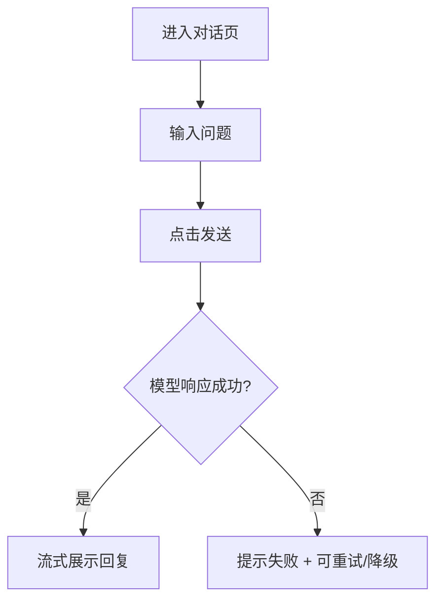
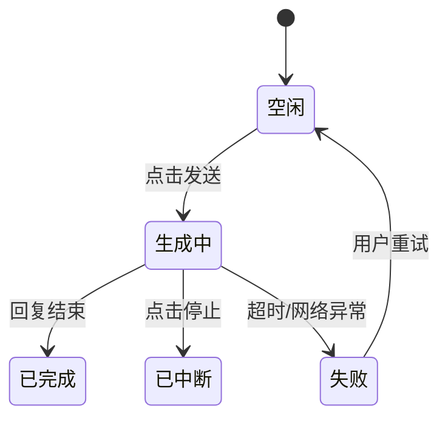
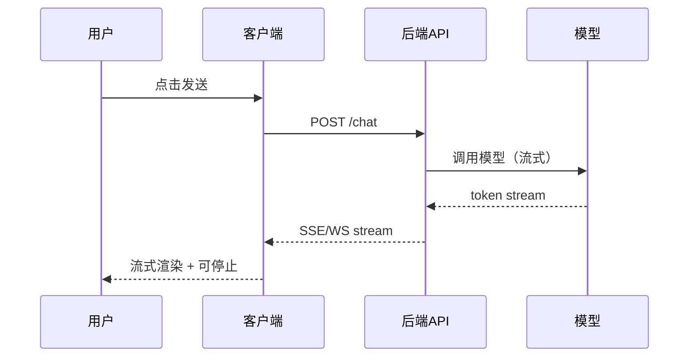

# 移动端 UI 组件库 (Mobile Library)

本文件定义了移动端（App、H5、小程序）的标准页面布局及手势交互规范。
页面交互模式请参考：[ui-patterns.md](./ui-patterns.md)

---

## 0. Mermaid 图表模板与命名规范（推荐）

> 用于提升 PRD 中流程图一致性与可读性。生成 PRD 时可直接复制并替换节点名称。

### 0.1 节点命名规范
- 节点名建议采用 **"动词 + 对象"**：如 `发送消息`、`停止生成`、`上传附件`。
- 异常分支节点必须显式包含 **失败语义**：如 `网络异常`、`上传失败`、`生成超时`、`内容审核失败`。

### 0.2 Flowchart（端到端流程）模板


### 0.3 State Diagram（状态流转）模板


### 0.4 Sequence Diagram（端到端调用）模板


---

## 页面类型总览

移动端页面按功能分为以下类型，每个类型都有对应的布局规范和交互标准：

| 页面类型 | 对应章节 | 典型特征 | 常见场景 |
|---------|---------|---------|---------|
| 列表页 | 第1节 | 卡片/列表 + 搜索筛选 + 上拉加载 | 订单列表、消息列表、商品列表 |
| 新建页 | 第2.1节 | 表单输入 + 分组展示 + 底部固定按钮 | 创建订单、发布内容、填写资料 |
| 编辑页 | 第2.2节 | 表单输入 + 数据回显 + 底部固定按钮 | 修改资料、编辑订单 |
| 详情页 | 第3节 | 信息展示 + 操作按钮 + 滑动返回 | 订单详情、商品详情 |
| 对话页 | 第4节 | 消息气泡 + 底部输入框 + 流式输出 | 客服对话、AI助手、聊天 |
| 结果页 | 第5节 | 状态图标 + 结果信息 + 操作按钮 | 操作成功/失败、空状态 |
| 搜索页 | 第6节 | 搜索框 + 历史记录 + 热门推荐 | 商品搜索、内容搜索 |

---

## 1. 移动端列表/卡片页 (Card List)

##### 页面介绍
基于卡片式布局，适应垂直滚动及手势习惯，强调简洁性和单手操作体验。是移动端最常见的页面类型。

### UI 布局 (ASCII)
```
+---------------------------------+
| [搜索关键词...        ] [消息] |
+---------------------------------+
|  [ 全部  ] [ 进行中 ] [ 已完成 ] |
+---------------------------------+
|                                 |
| +-----------------------------+ |
| | [图标] 标题名称        [更多]| |
| | 描述内容描述内容描述...     | |
| | 状态: [进行中]  ¥1,234      | |
| | 2024-01-15 14:30            | |
| +-----------------------------+ |
|                                 |
| +-----------------------------+ |
| | [图标] 标题名称             | |
| | 描述内容...                 | |
| | 状态: [已完成]  ¥2,500      | |
| +-----------------------------+ |
|                                 |
|          [加载更多...]          |
+---------------------------------+
|      [    + 新 建    ]          |
+---------------------------------+
```

---

### 1.1 搜索筛选区

##### 搜索框
| 属性 | 说明 |
|-----|------|
| placeholder | 搜索关键词... |
| 触发方式 | 输入关键词后点击键盘搜索键 |
| 历史记录 | 展示最近5条搜索历史 |
| 热门搜索 | 展示系统推荐的热门关键词 |

##### 快捷筛选标签
| 标签名称 | 对应筛选条件 | 默认选中 |
|---------|-------------|---------|
| 全部 | 无筛选 | ✅ |
| 进行中 | status=in_progress | - |
| 已完成 | status=completed | - |
| 已取消 | status=cancelled | - |

##### 筛选联动规则
| 触发条件 | 联动效果 |
|---------|---------|
| 点击筛选标签 | 列表刷新，标签高亮 |
| 搜索关键词 | 自动选中"全部"标签 |
| 下拉刷新 | 保持当前筛选条件 |

---

### 1.2 操作按钮区

##### 顶部操作
| 按钮名称 | 位置 | 点击行为 | 权限 |
|---------|-----|---------|-----|
| 消息 | 右上角 | 跳转消息中心 | 登录用户 |
| 扫一扫 | 右上角 | 唤起扫码 | 已授权 |

##### 底部固定操作
| 按钮名称 | 按钮类型 | 点击行为 | 悬浮位置 |
|---------|---------|---------|---------|
| + 新建 | 悬浮按钮(FAB) | 跳转新建页/打开抽屉 | 右下角 |

##### 下拉刷新
- 顶部下拉触发数据刷新
- 显示刷新动画和最后更新时间
- 刷新后保持当前筛选条件

---

### 1.3 数据展示区（卡片列表）

##### 卡片结构
| 区域 | 内容 | 说明 |
|-----|------|-----|
| 头部 | 图标 + 标题 + 更多按钮 | 标题点击可跳转详情 |
| 内容区 | 描述信息 | 最多2行，超出截断 |
| 元信息区 | 状态标签 + 金额 + 时间 | 状态使用颜色区分 |

##### 卡片交互
| 交互 | 触发 | 行为 |
|-----|------|-----|
| 点击卡片 | 整卡点击 | 跳转详情页 |
| 长按卡片 | 长按500ms | 唤起操作菜单 |
| 侧滑卡片 | 左滑 | 显示快捷操作按钮 |

##### 侧滑操作按钮
| 按钮名称 | 显示条件 | 点击行为 | 颜色 |
|---------|---------|---------|-----|
| 编辑 | 状态可编辑 | 跳转编辑页 | 蓝色 |
| 删除 | 有删除权限 | 删除确认 | 红色 |
| 置顶 | 非置顶状态 | 置顶到列表顶部 | 灰色 |

##### 上拉加载
- 滚动到底部自动加载下一页
- 加载中显示loading动画
- 无更多数据时显示"没有更多了"

---

### 1.4 行内操作

##### 卡片内操作（点击"更多"展开）
| 操作名称 | 显示条件 | 点击行为 | 二次确认 |
|---------|---------|---------|---------|
| 查看详情 | 始终显示 | 跳转详情页 | 否 |
| 编辑 | 状态=草稿/进行中 | 跳转编辑页 | 否 |
| 取消 | 状态=进行中 | 取消订单 | 是 |
| 删除 | 状态=已取消/已完成 | 删除记录 | 是 |
| 分享 | 始终显示 | 唤起分享面板 | 否 |

---

### 1.5 页面交互逻辑

##### 列表页 → 其他页面
| 触发操作 | 目标页面 | 携带参数 | 返回行为 |
|---------|---------|---------|---------|
| 点击"+新建" | 新建页 | - | 返回后刷新列表，置顶新数据 |
| 点击卡片 | 详情页 | id=当前行ID | 返回后保持位置 |
| 点击"编辑" | 编辑页 | id=当前行ID | 返回后刷新当前卡片 |
| 点击"搜索" | 搜索页 | keyword | 返回带回搜索结果 |

---

## 2. 移动端表单页 (Form Pages)

### 2.1 新建页 (Create)

##### 页面介绍
用于移动端创建新数据或提交新内容，强调简洁的输入体验和底部固定的提交按钮。适配键盘弹起、单手操作。

### UI 布局 (ASCII)
```
+---------------------------------+
| [<返回]       新建订单           |
+---------------------------------+
|                                 |
| 基本信息                         |
| +-----------------------------+ |
| | 订单名称 *                   | |
| | [请输入订单名称________]     | |
| +-----------------------------+ |
|                                 |
| +-----------------------------+ |
| | 订单类型 *                   | |
| | [请选择类型           >]    | |
| +-----------------------------+ |
|                                 |
| +-----------------------------+ |
| | 金额 *                       | |
| | [¥ 0.00              ]      | |
| +-----------------------------+ |
|                                 |
| 备注信息                         |
| +-----------------------------+ |
| | [请输入备注...              | |
| |                             | |
| +-----------------------------+ |
|                                 |
+---------------------------------+
|         [    提 交    ]         |
+---------------------------------+
```

---

### 2.1.1 表单分区与字段

##### 基础信息区字段
| 字段名称 | 字段名 | 输入类型 | 必填 | 校验规则 | placeholder | 键盘类型 |
|---------|-------|---------|-----|---------|------------|---------|
| 订单名称 | orderName | text | 是 | 2-50字符 | 请输入订单名称 | text |
| 订单类型 | orderType | picker | 是 | 单选 | 请选择类型 | - |
| 金额 | amount | number | 是 | >0 | ¥ 0.00 | decimal |

##### 扩展信息区字段
| 字段名称 | 字段名 | 输入类型 | 必填 | 校验规则 | 备注 |
|---------|-------|---------|-----|---------|-----|
| 备注 | remark | textarea | 否 | ≤200字符 | 多行输入 |
| 附件 | attachment | 上传 | 否 | ≤5张图片 | 支持相机/相册 |

---

### 2.1.2 字段联动规则

| 触发字段 | 触发条件 | 联动字段 | 联动规则 |
|---------|---------|---------|---------|
| 订单类型 | 选择"企业版" | 金额 | 自动填充¥10,000 |
| 订单类型 | 选择"免费试用" | 金额 | 禁用，自动填充¥0 |

---

### 2.1.3 输入交互规则

##### 键盘适配
| 输入类型 | 键盘类型 | 页面行为 |
|---------|---------|---------|
| 普通文本 | 默认键盘 | 输入框获取焦点时页面上推 |
| 数字金额 | 数字键盘 | 自动添加¥符号和千分位 |
| 选择类 | 底部Picker | 底部弹出选择器 |
| 日期 | 日期选择器 | 底部弹出日期选择 |

##### 实时校验
| 校验字段 | 校验时机 | 错误提示方式 |
|---------|---------|-------------|
| 订单名称 | 失焦 | 输入框下方红色文字 |
| 金额 | 实时 | 输入时校验数字格式 |
| 必填项 | 点击提交 | 未填字段高亮+Toast提示 |

---

### 2.1.4 操作按钮区

##### 底部固定按钮
| 按钮名称 | 按钮类型 | 点击行为 | 禁用条件 | 交互反馈 |
|---------|---------|---------|---------|---------|
| 提交 | primary | 提交表单 | 必填项未填/校验未通过 | Toast成功+跳转列表 |
| 保存草稿 | default | 保存为草稿 | - | Toast成功+返回列表 |

##### 返回确认
- 有未保存内容时，点击返回触发二次确认弹窗
- 确认放弃后返回列表页
- 保存草稿后返回列表页

---

### 2.1.5 页面交互逻辑

##### 新建页 → 其他页面
| 触发操作 | 目标页面 | 携带参数 | 返回行为 |
|---------|---------|---------|---------|
| 提交成功 | 详情页 | id=新创建ID | 直接进入详情查看 |
| 提交成功 | 结果页 | type=success | 结果页提供"查看详情"入口 |
| 保存草稿 | 列表页 | - | 列表顶部显示草稿提示 |

---

### 2.2 编辑页 (Edit)

##### 页面介绍
用于移动端修改已有数据，与新建页布局类似，但需预填充原有数据并增加变更检测。

### UI 布局 (ASCII)
```
+---------------------------------+
| [<返回]       编辑订单           |
+---------------------------------+
|                                 |
|  [提示: 最后修改: 2024-01-15]    |
|                                 |
| 基本信息                         |
| +-----------------------------+ |
| | 订单名称 *                   | |
| | [山东公共数据月度评测___]    | |
| +-----------------------------+ |
|                                 |
| +-----------------------------+ |
| | 订单类型 *                   | |
| | [数据评测              >]    | |
| +-----------------------------+ |
|                                 |
| +-----------------------------+ |
| | [    保 存 修 改    ]        | |
| | [    删 除 订 单    ]        | |
| +-----------------------------+ |
|                                 |
+---------------------------------+
```

---

### 2.2.1 与新建页的差异

##### 数据回显
- 页面加载时自动填充已有数据
- 只读字段展示为纯文本（如订单编号、创建时间）
- 不可修改字段置灰显示

##### 保存策略
| 按钮名称 | 按钮类型 | 点击行为 | 禁用条件 | 交互反馈 |
|---------|---------|---------|---------|---------|
| 保存修改 | primary | 提交变更 | 无修改/校验未通过 | Toast成功+跳转详情 |
| 删除订单 | danger | 删除确认 | - | 弹窗确认+返回列表 |

##### 变更检测
- 无修改时禁用保存按钮
- 有未保存修改时，点击返回触发二次确认
- 显示"有未保存的更改"提示

##### 冲突处理
- 提交时检测数据是否被他人修改
- 冲突时提示"数据已被修改，请刷新后重试"

---

## 3. 移动端详情页 (Mobile Detail)

##### 页面介绍
用于展示单条数据的完整信息，强调信息层级、快捷操作和滑动返回体验。

### UI 布局 (ASCII)
```
+---------------------------------+
| [<返回]   订单详情      [分享]  |
+---------------------------------+
|                                 |
| +-----------------------------+ |
| | 订单号: ORD-20240315-001    | |
| | 状态: ● 进行中               | |
| |                             | |
| | [   取 消 订 单    ]        | |
| +-----------------------------+ |
|                                 |
| 基本信息                         |
| +-----------------------------+ |
| | 订单名称                     | |
| | 山东公共数据月度评测         | |
| |                             | |
| | 订单类型                     | |
| | 数据评测                     | |
| |                             | |
| | 创建时间                     | |
| | 2024-03-15 14:30            | |
| +-----------------------------+ |
|                                 |
| 金额信息                         |
| +-----------------------------+ |
| | 订单金额          ¥15,000.00 | |
| | 优惠金额          -¥500.00   | |
| | 实付金额          ¥14,500.00 | |
| +-----------------------------+ |
|                                 |
+---------------------------------+
| [   编  辑   ]  [   分  享   ]  |
+---------------------------------+
```

---

### 3.1 信息分区展示

##### 关键信息区（顶部卡片）
| 字段名称 | 字段名 | 展示形式 | 特殊规则 |
|---------|-------|---------|---------|
| 订单号 | orderNo | 文本 | 可复制 |
| 状态 | status | 彩色标签 | 绿=进行中，灰=已完成，红=已取消 |
| 快捷操作 | - | 操作按钮 | 根据状态显示不同按钮 |

##### 详细信息区（分组展示）
| 分组名称 | 包含字段 | 展示形式 |
|---------|---------|---------|
| 基本信息 | 名称、类型、时间 | 键值对 |
| 金额信息 | 各项金额明细 | 带符号金额 |
| 操作记录 | 时间线 | 倒序列表 |

---

### 3.2 操作按钮区

##### 卡片内快捷操作
| 按钮名称 | 显示条件 | 点击行为 | 二次确认 |
|---------|---------|---------|---------|
| 取消订单 | 状态=进行中 | 取消订单 | 是 |
| 去支付 | 状态=待支付 | 唤起支付 | 否 |
| 查看物流 | 状态=已发货 | 跳转物流详情 | 否 |
| 确认收货 | 状态=已发货 | 确认收货 | 是 |
| 申请售后 | 状态=已完成 | 跳转售后申请 | 否 |

##### 底部固定操作
| 按钮名称 | 显示条件 | 点击行为 |
|---------|---------|---------|
| 编辑 | 可编辑状态 | 跳转编辑页 |
| 分享 | 始终显示 | 唤起分享面板 |
| 联系客服 | 始终显示 | 跳转客服对话 |

##### 更多操作（分享菜单）
| 操作名称 | 点击行为 |
|---------|---------|
| 分享给好友 | 唤起微信分享 |
| 复制链接 | 复制详情页链接 |
| 生成海报 | 生成分享图片 |

---

### 3.3 页面交互逻辑

##### 详情页 → 其他页面
| 触发操作 | 目标页面 | 携带参数 | 返回行为 |
|---------|---------|---------|---------|
| 点击"编辑" | 编辑页 | id=当前ID | 返回详情页刷新 |
| 点击"取消订单" | 列表页 | - | 返回列表，状态已更新 |
| 点击"去支付" | 支付页 | orderId | 支付成功返回刷新 |
| 滑动返回 | 列表页 | - | 保持列表页位置 |

##### 滑动返回
- 支持从屏幕左边缘右滑返回上一页
- 滑动过程中显示上一页预览
- 滑动距离超过阈值时触发返回

---

## 4. 移动端对话页 (Mobile Chat)

##### 页面介绍
AI 原生对话界面，强调底部输入交互及流控体验。支持多模态输入和流式输出。

### UI 布局 (ASCII)
```
+---------------------------------+
| [返回]     智能助理      [设置] |
+---------------------------------+
|                                 |
|  [ 08:30 ]                      |
|  +---------------------------+  |
|  | [AI]: 您好，有什么可以帮您？|  |
|  +---------------------------+  |
|                      +-------+  |
|                      | [ME]: |  |
|                      +-------+  |
|  +---------------------------+  |
|  | [AI]: 正在输入...          |  |
|  | ████░░░░░░                 |  |
|  +---------------------------+  |
|                                 |
+---------------------------------+
| [+] [输入问题...         ] [🎙️] |
+---------------------------------+
```

---

### 4.1 消息展示区

##### 消息气泡
| 消息类型 | 展示位置 | 展示形式 | 特殊交互 |
|---------|---------|---------|---------|
| 用户消息 | 右侧 | 蓝色气泡 | 长按菜单 |
| AI消息 | 左侧 | 白色/灰色气泡 | 长按菜单、双击点赞 |
| 系统消息 | 居中 | 灰色小字 | - |
| 时间分隔 | 居中 | 时间标签 | - |

##### 消息交互
| 交互 | 触发 | 行为 |
|-----|------|-----|
| 长按气泡 | 长按500ms | 唤起操作菜单（复制、引用、朗读、删除） |
| 双击AI消息 | 双击 | 快捷点赞/点踩 |
| 点击引用 | 点击 | 滚动到被引用消息 |
| 加载更多 | 下拉 | 加载历史消息 |

---

### 4.2 输入区

##### 输入模式切换
| 模式 | 触发 | 展示 |
|-----|------|-----|
| 文字输入 | 点击输入框 | 键盘弹出 |
| 语音输入 | 点击🎙️ | 语音录制界面 |
| 附件输入 | 点击+ | 附件选择面板 |

##### 附件类型
| 类型 | 支持格式 | 大小限制 |
|-----|---------|---------|
| 图片 | jpg/png/gif | ≤5MB/张 |
| 文件 | pdf/doc/xlsx | ≤20MB |
| 语音 | mp3/m4a | ≤60秒 |

---

### 4.3 流式输出

##### AI回复状态
| 状态 | 展示 |
|-----|------|
| 思考中 | "正在思考..." + 动画 |
| 生成中 | 逐字显示 + 停止按钮 |
| 已完成 | 完整内容 + 功能按钮 |
| 失败 | 错误提示 + 重试按钮 |

##### 流控操作
| 按钮名称 | 显示时机 | 点击行为 |
|---------|---------|---------|
| 停止生成 | AI生成中 | 中断生成 |
| 重新生成 | AI完成后 | 重新发送请求 |
| 复制 | AI完成后 | 复制完整回复 |

---

## 5. 移动端结果页 (Mobile Result)

##### 页面介绍
用于展示操作结果、状态反馈、空状态等场景，提供明确的反馈和下一步引导。

### UI 布局 (ASCII) - 成功状态
```
+---------------------------------+
|                                 |
|                                 |
|              ✅                 |
|           提交成功              |
|                                 |
|    您的订单已成功创建           |
|    订单号: ORD-20240315001     |
|                                 |
|                                 |
|      [    查 看 订 单    ]      |
|      [    返 回 首 页    ]      |
|                                 |
+---------------------------------+
```

### UI 布局 (ASCII) - 失败状态
```
+---------------------------------+
|                                 |
|                                 |
|              ❌                 |
|           提交失败              |
|                                 |
|    网络异常，请稍后重试         |
|    错误码: NETWORK_TIMEOUT     |
|                                 |
|                                 |
|      [    重  试    ]          |
|      [    返  回    ]          |
|                                 |
+---------------------------------+
```

### UI 布局 (ASCII) - 空状态
```
+---------------------------------+
|                                 |
|                                 |
|            📭                   |
|          暂无订单               |
|                                 |
|    您还没有创建任何订单         |
|    点击下方按钮开始创建         |
|                                 |
|                                 |
|      [    立 即 创 建    ]      |
|                                 |
+---------------------------------+
```

---

### 5.1 状态类型配置

| 状态类型 | 图标 | 标题 | 描述 | 典型按钮 |
|---------|------|------|------|---------|
| 成功 | ✅ | 操作成功 | 具体操作成功信息 | 查看详情、完成 |
| 失败 | ❌ | 操作失败 | 失败原因说明 | 重试、返回 |
| 警告 | ⚠️ | 需要注意 | 警告信息说明 | 我知道了、处理 |
| 空状态 | 📭/🔍 | 暂无数据 | 引导用户创建 | 立即创建、去浏览 |
| 加载中 | ⏳ | 处理中 | 进度说明 | 取消（可选） |

---

### 5.2 交互规则

- **自动跳转**：成功状态3秒后自动跳转（可配置）
- **失败重试**：失败时提供明确重试按钮
- **空状态引导**：空状态必须提供明确的创建/浏览引导
- **状态图标**：使用动画图标增强反馈感

---

## 6. 移动端搜索页 (Search)

##### 页面介绍
独立的搜索页面，提供搜索建议、历史记录和热门推荐，优化搜索体验。

### UI 布局 (ASCII)
```
+---------------------------------+
| [×] [搜索关键词...      ] [搜索]|
+---------------------------------+
|                                 |
|  搜索历史                       |
|  [关键词1] [关键词2] [关键词3]  |
|  [清空历史]                     |
|                                 |
|  热门搜索                       |
|  [热词1] [热词2] [热词3]        |
|                                 |
|  搜索建议（输入时展示）         |
|  关键词匹配结果1                |
|  关键词匹配结果2                |
|                                 |
+---------------------------------+
```

---

### 6.1 搜索功能

##### 搜索框
| 属性 | 说明 |
|-----|------|
| placeholder | 搜索商品/订单/内容 |
| 清空按钮 | 有输入时显示×按钮，一键清空 |
| 搜索按钮 | 点击触发搜索 |
| 语音搜索 | 支持语音输入（可选） |

##### 搜索历史
| 特性 | 说明 |
|-----|------|
| 存储数量 | 最近10条 |
| 去重策略 | 相同关键词去重，移到首位 |
| 清空操作 | 一键清空所有历史 |
| 点击行为 | 直接搜索该关键词 |

##### 热门搜索
| 特性 | 说明 |
|-----|------|
| 数据来源 | 系统配置的热门关键词 |
| 更新频率 | 每日更新 |
| 点击行为 | 直接搜索该关键词 |

##### 搜索建议
| 触发条件 | 输入关键词时实时请求 |
| 展示内容 | 匹配的关键词列表 |
| 点击行为 | 选中建议词并搜索 |

---

## 7. 全局移动特性

### 7.1 推送通知 (Push Notification)

##### 触发时机
- 状态变更（订单状态更新）
- Agent 任务完成
- 审批流转
- 系统公告

##### 通知模板
```
[标题] + [摘要] + [落地页跳转路径]
```

### 7.2 页面转场

- 左右滑入滑出效果
- 采用渐进式加载（Skeleton Screen）避免白屏
- 页面返回保持滚动位置

### 7.3 手势操作

| 手势 | 适用页面 | 行为 |
|-----|---------|------|
| 下拉刷新 | 列表页 | 刷新数据 |
| 上拉加载 | 列表页 | 加载下一页 |
| 侧滑返回 | 详情页、表单页 | 返回上一页 |
| 长按菜单 | 列表项 | 唤起操作菜单 |
| 双击点赞 | 对话页 | 快捷反馈 |

### 7.4 适配规范

##### 安全区适配
- iOS 刘海屏、Android 水滴屏自动适配
- 底部固定按钮避开手势条区域

##### 键盘弹起
- 输入框聚焦时页面自动上推，避免遮挡
- 键盘收起时页面恢复

##### 横竖屏
- 默认竖屏
- 横屏时提示用户竖屏使用（或自适应布局）

### 7.5 通用反馈

| 操作类型 | 反馈方式 | 持续时间 |
|---------|---------|---------|
| 成功操作 | Toast 提示 | 2s |
| 失败操作 | Toast 提示 | 3s |
| 加载中 | Loading/骨架屏 | - |
| 二次确认 | 底部弹窗/居中弹窗 | - |
