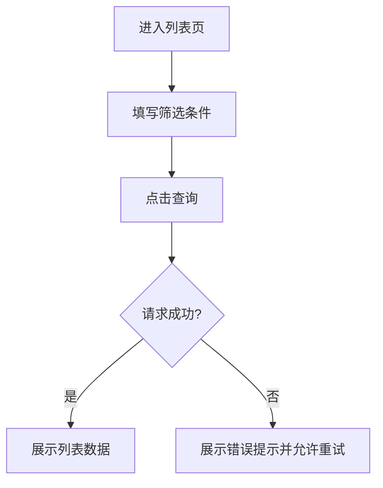
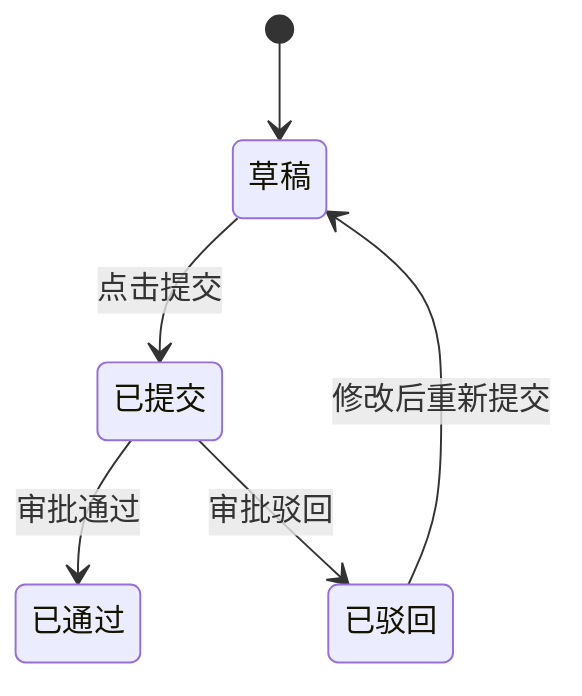
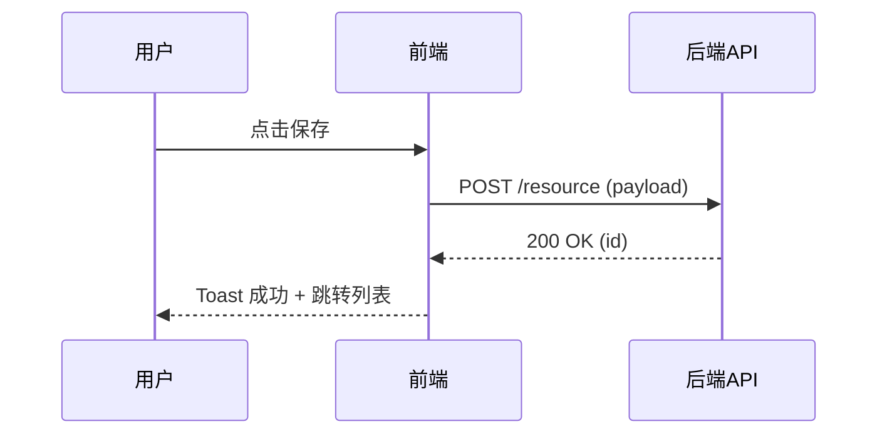

# PC/Web 端 UI 组件库 (Web Library)

本文件定义了 PC 端（管理后台、桌面应用）的标准页面布局及交互规范。
页面交互模式请参考：[ui-patterns.md](./ui-patterns.md)

---

## 0. Mermaid 图表模板与命名规范（推荐）

> 用于提升 PRD 中流程图一致性与可读性。生成 PRD 时可直接复制并替换节点名称。

### 0.1 节点命名规范
- 节点名建议采用 **"动词 + 对象"**：如 `提交表单`、`校验失败`、`创建导出任务`。
- 异常分支节点必须显式包含 **失败语义**：如 `权限不足`、`参数非法`、`保存失败`、`超时`。

### 0.2 Flowchart（端到端流程）模板


### 0.3 State Diagram（状态流转）模板


### 0.4 Sequence Diagram（前后端/服务时序）模板


---

## 页面类型总览

PC/Web 端页面按功能分为以下类型，每个类型都有对应的布局规范和交互标准：

| 页面类型 | 对应章节 | 典型特征 | 常见场景 |
|---------|---------|---------|---------|
| 列表页 | 第1节 | 搜索筛选 + 表格 + 分页 + 行操作 | 用户管理、订单列表、内容管理 |
| 新建页 | 第2.1节 | 表单输入 + 分组展示 + 提交按钮 | 创建用户、新增订单、发布内容 |
| 编辑页 | 第2.2节 | 表单输入 + 数据回显 + 保存按钮 | 修改资料、编辑订单 |
| 详情页 | 第3节 | 信息展示 + 操作按钮 + 状态追踪 | 订单详情、用户详情 |
| 向导页 | 第4节 | 分步骤表单 + 进度指示 | 复杂配置、开通流程 |
| 看板/工作台 | 第5节 | 图表 + KPI + 待办 | 数据监控、运营中心 |
| 结果页 | 第6节 | 状态图标 + 结果信息 | 操作成功/失败 |

---

## 1. 列表管理页 (List Page)

##### 页面介绍
用于 PC 端海量数据的展示与管理，强调高密度信息展示及多维筛选。是管理后台最常见的页面类型。

### UI 布局 (ASCII)
```
+--------------------------------------------------+
| [LOGO] 菜单1 | 菜单2 | [搜索框]       用户头像  |
+--------------------------------------------------+
| [ 面包屑: 首页 / 用户管理 ]                      |
+--------------------------------------------------+
|                                                  |
|  [搜索区]                                        |
|  +----------------------------------------------+|
|  | 订单编号: [________]  状态: [全部 ▼]         ||
|  | 创建时间: [____]~[____] [查询] [重置]        ||
|  +----------------------------------------------+|
|                                                  |
|  [操作按钮区]                                    |
|  +----------------------------------------------+|
|  | [+ 新增] [批量删除] [导入] [导出]            ||
|  +----------------------------------------------+|
|                                                  |
|  [数据展示区 - 表格]                             |
|  +----------------------------------------------+|
|  | [ ] | 编号 | 名称 | 状态 | 创建时间 | 操作   ||
|  |-----------------------------------------------||
|  | [ ] | 001  | A    | 启用 | 2024-01 | [详情] ||
|  | [ ] | 002  | B    | 停用 | 2024-02 | [详情] ||
|  +----------------------------------------------+|
|                                                  |
|  [分页区]                                        |
|  +----------------------------------------------+|
|  | 共 100 条  [<] 1 2 3 [>]  每页 20 条          ||
|  +----------------------------------------------+|
|                                                  |
+--------------------------------------------------+
```

---

### 1.1 搜索筛选区

##### 搜索条件清单
按以下结构描述每个搜索条件：

| 条件名称 | 字段名 | 输入类型 | 默认值 | 是否支持多选 | 触发方式 |
|---------|-------|---------|-------|------------|---------|
| 订单编号 | orderNo | 输入框 | 空 | 否 | 回车/点击查询 |
| 状态 | status | 下拉单选 | 全部 | 是 | change |
| 创建时间 | createTime | 日期范围 | 近7天 | - | 点击查询 |

##### 搜索条件说明
- **订单编号**：支持模糊查询，输入后按回车或点击查询触发
- **状态**：枚举值（全部/进行中/已完成/已取消），多选时OR关系
- **创建时间**：日期范围选择，快捷选项（今天/近7天/近30天/自定义）

##### 筛选联动规则
| 触发条件 | 联动字段 | 联动规则 | 异常处理 |
|---------|---------|---------|---------|
| 选择"特定状态" | 时间范围 | 自动切换为"全部时间" | 保持原有选择 |

##### 快捷筛选标签
- 提供常用筛选组合作为快捷标签（如"我负责的"、"待处理"）
- 点击标签后自动填充对应筛选条件

---

### 1.2 操作按钮区

##### 全局操作按钮
按以下结构描述：

| 按钮名称 | 权限/角色 | 点击行为 | 二次确认 | 成功反馈 | 跳转目标 |
|---------|----------|---------|---------|---------|---------|
| + 新增 | 管理员 | 打开新建抽屉/跳转新页面 | 否 | Toast成功 | 新建页 |
| 导入 | 管理员 | 打开导入弹窗 | 否 | Toast成功+刷新列表 | - |
| 导出 | 全部 | 异步导出/立即下载 | 否 | Toast成功 | 下载文件 |

##### 按钮说明
- **+ 新增**：页面右上角主要操作，蓝色主按钮
- **导入**：支持 Excel 批量导入，需下载模板
- **导出**：大数据量时采用异步任务，完成后通知下载

##### 按钮显隐规则
| 按钮 | 显示条件 | 禁用条件 | 提示文案 |
|-----|---------|---------|---------|
| 导入 | 有导入权限 | 导入任务进行中 | "导入中，请稍候" |
| 导出 | 始终显示 | 列表为空时 | "暂无数据可导出" |

---

### 1.3 数据展示区（表格）

##### 表格列定义
按以下结构描述：

| 列名称 | 字段名 | 数据类型 | 排序 | 可隐藏 | 特殊展示 |
|-------|-------|---------|-----|-------|---------|
| 订单编号 | orderNo | string | 是 | 否 | 点击可跳转详情 |
| 状态 | status | enum | 是 | 否 | Tag标签色展示 |
| 金额 | amount | number | 是 | 是 | 千分位+¥符号 |
| 创建时间 | createTime | datetime | 是 | 是 | YYYY-MM-DD HH:mm |

##### 表格交互规则
- **列排序**：点击列头升序/降序切换，支持多列排序
- **列宽调整**：拖拽列边框调整宽度
- **列显示控制**：右上角设置按钮控制列显隐
- **行选择**：支持单选/多选（checkbox），全选当前页/跨页

##### 数据加载策略
- 首次进入默认加载近7天数据
- 分页切换保留当前筛选条件
- 自动刷新频率：每5分钟（可配置）

---

### 1.4 行内操作

##### 行内操作按钮清单
| 按钮名称 | 显示条件 | 点击行为 | 二次确认 | 成功反馈 |
|---------|---------|---------|---------|---------|
| 详情 | 始终显示 | 跳转详情页/打开抽屉 | 否 | - |
| 编辑 | 状态≠已取消 | 跳转编辑页/打开抽屉 | 否 | Toast成功 |
| 删除 | 状态=草稿 | 软删除 | 是 | Toast+刷新列表 |
| 启用 | 状态=停用 | 修改状态 | 否 | Toast+状态变绿 |
| 停用 | 状态=启用 | 修改状态 | 是 | Toast+状态变灰 |
| 日志 | 始终显示 | 打开操作记录弹窗 | 否 | - |
| 查看报告 | 状态=已完成 | 打开报告页 | 否 | 新标签页打开 |

##### 操作按钮布局
- 常规操作（编辑、删除）直接展示为文字链接
- 更多操作折叠在"更多 ▼"下拉菜单中
- 危险操作（删除）使用红色文字

##### 批量操作
| 按钮名称 | 可选条件 | 批量操作逻辑 | 二次确认 | 成功反馈 |
|---------|---------|-------------|---------|---------|
| 批量删除 | 选中任意行 | 批量软删除 | 是 | Toast+刷新列表 |
| 批量启用 | 选中任意停用行 | 批量修改状态 | 是 | Toast+刷新列表 |
| 批量导出 | 选中任意行 | 仅导出选中行 | 否 | 下载文件 |

---

### 1.5 页面交互逻辑

##### 列表页 → 其他页面
| 触发操作 | 目标页面 | 携带参数 | 返回行为 |
|---------|---------|---------|---------|
| 点击"+新增" | 新建页 | - | 返回后刷新列表 |
| 点击"编辑" | 编辑页 | id=当前行ID | 返回后刷新列表，保持页码 |
| 点击"详情" | 详情页 | id=当前行ID | 返回后保持页码和筛选条件 |
| 点击"查看报告" | 报告页 | reportId | 新标签页打开 |

##### 状态流转触发
- 启用/停用操作后，该行状态实时更新，无需刷新整页
- 删除操作后，移除当前行并Toast提示"删除成功"

---

## 2. 表单页 (Form Pages)

### 2.1 新建页 (Create)

##### 页面介绍
用于创建新数据或提交新内容，强调清晰的字段分组、实时的校验反馈和直观的提交体验。

### UI 布局 (ASCII)
```
+--------------------------------------------------+
| [面包屑: 首页 / 用户管理 / 新增用户]             |
+--------------------------------------------------+
|                                                  |
|  基础信息                                        |
|  +----------------------------------------------+|
|  | 用户名 *                                      ||
|  | [________________]  3-20字符，字母开头        ||
|  |                                               ||
|  | 邮箱 *                                        ||
|  | [________________]  用于接收通知              ||
|  +----------------------------------------------+|
|                                                  |
|  角色权限                                        |
|  +----------------------------------------------+|
|  | 所属部门                                      ||
|  | [请选择部门 >]                                ||
|  |                                               ||
|  | 角色 *                                        ||
|  | [□ 管理员  □ 运营  □ 访客]                    ||
|  +----------------------------------------------+|
|                                                  |
|  扩展信息                                        |
|  +----------------------------------------------+|
|  | 备注                                          ||
|  | [                        ]                    ||
|  | [                        ]                    ||
|  +----------------------------------------------+|
|                                                  |
+--------------------------------------------------+
|                [取消]  [提 交]                   |
+--------------------------------------------------+
```

---

### 2.1.1 表单分区与字段

##### 基础信息区字段
| 字段名称 | 字段名 | 类型 | 必填 | 校验规则 | placeholder | 禁用条件 |
|---------|-------|------|-----|---------|------------|---------|
| 用户名 | username | text | 是 | 3-20字符，字母开头 | 请输入用户名 | - |
| 邮箱 | email | email | 是 | 邮箱格式 | 请输入邮箱 | - |
| 手机号 | phone | tel | 否 | 11位手机号 | 请输入手机号 | - |

##### 角色权限区字段
| 字段名称 | 字段名 | 类型 | 必填 | 校验规则 | 数据来源 | 默认值 |
|---------|-------|------|-----|---------|---------|-------|
| 所属部门 | department | 级联选择 | 是 | - | 部门树接口 | - |
| 角色 | roles | 多选框 | 是 | 至少选1项 | 角色列表 | - |

##### 扩展信息区字段
| 字段名称 | 字段名 | 类型 | 必填 | 校验规则 | 备注 |
|---------|-------|------|-----|---------|-----|
| 头像 | avatar | 上传 | 否 | jpg/png, ≤2MB | 支持裁剪 |
| 备注 | remark | 文本域 | 否 | ≤500字符 | - |

---

### 2.1.2 字段联动规则

| 触发字段 | 触发条件 | 联动字段 | 联动规则 | 异常处理 |
|---------|---------|---------|---------|---------|
| 所属部门 | 选择"技术部" | 角色 | 默认选中"开发" | 允许手动修改 |
| 角色 | 选中"管理员" | 所属部门 | 自动选中"总部" | 校验提示 |

---

### 2.1.3 实时校验规则

| 校验字段 | 校验时机 | 校验规则 | 错误提示 | 阻止提交 |
|---------|---------|---------|---------|---------|
| 用户名 | 失焦+实时 | 3-20字符，字母开头 | "用户名格式不正确" | 是 |
| 邮箱 | 失焦 | 唯一性校验 | "邮箱已被使用" | 是 |

---

### 2.1.4 操作按钮区

| 按钮名称 | 按钮类型 | 点击行为 | 禁用条件 | 交互反馈 |
|---------|---------|---------|---------|---------|
| 提交 | primary | 提交表单 | 必填项未填/校验未通过 | Toast成功+跳转列表 |
| 保存草稿 | default | 保存为草稿 | - | Toast成功+保留当前页 |
| 取消 | text | 返回列表 | - | 有修改时二次确认 |
| 重置 | text | 清空表单 | - | 二次确认 |

---

### 2.1.5 页面交互逻辑

##### 新建页 → 其他页面
| 触发操作 | 目标页面 | 携带参数 | 返回行为 |
|---------|---------|---------|---------|
| 提交成功 | 列表页 | - | 列表页显示"新增成功"Toast |
| 提交成功 | 详情页 | id=新创建ID | 直接进入详情查看 |
| 点击取消 | 列表页 | - | 放弃当前填写内容 |

---

### 2.2 编辑页 (Edit)

##### 页面介绍
用于修改已有数据，与新建页布局类似，但需预填充原有数据并增加变更检测。

### UI 布局 (ASCII)
```
+--------------------------------------------------+
| [面包屑: 首页 / 用户管理 / 编辑用户]             |
+--------------------------------------------------+
|                                                  |
|  [提示: 最后修改时间: 2024-01-15 14:30]          |
|                                                  |
|  基础信息                                        |
|  +----------------------------------------------+|
|  | 用户ID   [只读: USER_001]                     ||
|  |                                               ||
|  | 用户名 * [Alice________]                      ||
|  +----------------------------------------------+|
|                                                  |
|  [其他表单分区...]                               |
|                                                  |
+--------------------------------------------------+
|                [取消]  [保存修改]                |
+--------------------------------------------------+
```

---

### 2.2.1 与新建页的差异

##### 数据回显
- 页面加载时自动填充已有数据
- 只读字段展示为纯文本（如用户ID、创建时间）
- 支持"查看历史版本"入口

##### 保存策略
| 按钮名称 | 按钮类型 | 点击行为 | 禁用条件 | 交互反馈 |
|---------|---------|---------|---------|---------|
| 保存修改 | primary | 提交变更 | 无修改/校验未通过 | Toast成功+跳转列表 |
| 保存并继续 | default | 保存后继续编辑 | 校验未通过 | Toast成功+保留当前页 |

##### 变更检测
- 无修改时禁用保存按钮
- 有未保存修改时，点击取消/返回触发二次确认
- 显示"有未保存的更改"提示

##### 冲突处理
- 提交时检测数据是否被他人修改（乐观锁）
- 冲突时提示"数据已被修改，请刷新后重试"
- 提供"强制保存"选项（覆盖他人修改）

---

## 3. 详情页 (Detail Page)

##### 页面介绍
用于展示单条数据的完整信息，强调信息层级、状态追踪和快捷操作。

### UI 布局 (ASCII)
```
+--------------------------------------------------+
| [面包屑: 首页 / 用户管理 / 用户详情]             |
+--------------------------------------------------+
|                                                  |
|  [基本信息卡片]                                  |
|  +----------------------------------------------+|
|  |  状态: [● 正常]              [编辑] [删除]   ||
|  |                                               ||
|  |  用户ID: USER_001                             ||
|  |  用户名: Alice                                ||
|  |  邮箱: alice@example.com                      ||
|  +----------------------------------------------+|
|                                                  |
|  [详细信息Tab]                                   |
|  +----------------------------------------------+|
|  | [基础信息] [操作记录] [关联数据]             ||
|  |----------------------------------------------||
|  | 所属部门: 技术部                              ||
|  | 角色: 管理员                                  ||
|  | 创建时间: 2024-01-15 14:30                    ||
|  | 最后登录: 2024-03-15 09:20                    ||
|  +----------------------------------------------+|
|                                                  |
|  [操作记录Tab - 选中时展示]                      |
|  +----------------------------------------------+|
|  | 时间              操作人    操作      结果   ||
|  | 2024-03-15 10:00  Alice     编辑资料   成功  ||
|  | 2024-03-14 09:30  Admin     重置密码   成功  ||
|  +----------------------------------------------+|
|                                                  |
+--------------------------------------------------+
```

---

### 3.1 信息分区展示

##### 基础信息区（卡片形式）
| 字段名称 | 字段名 | 展示形式 | 特殊规则 |
|---------|-------|---------|---------|
| 状态 | status | Tag标签 | 颜色区分（绿=正常，红=禁用） |
| 用户ID | userId | 文本 | 可复制 |
| 用户名 | username | 文本 | - |
| 头像 | avatar | 图片 | 点击放大 |

##### 详细信息区（Tab切换）
| Tab名称 | 内容类型 | 数据展示形式 |
|--------|---------|------------|
| 基础信息 | 字段列表 | 键值对形式 |
| 操作记录 | 时间线 | 倒序时间线 |
| 关联数据 | 关联列表 | 小表格展示 |

---

### 3.2 操作按钮区

##### 顶部操作按钮
| 按钮名称 | 显示条件 | 点击行为 | 二次确认 | 成功反馈 |
|---------|---------|---------|---------|---------|
| 编辑 | 有编辑权限 | 跳转编辑页/打开抽屉 | 否 | - |
| 删除 | 有删除权限+非系统用户 | 软删除 | 是 | Toast+返回列表 |
| 启用 | 状态=禁用 | 修改状态 | 否 | Toast+刷新页面 |
| 禁用 | 状态=正常 | 修改状态 | 是 | Toast+刷新页面 |

##### 更多操作（下拉菜单）
| 操作名称 | 显示条件 | 点击行为 |
|---------|---------|---------|
| 重置密码 | 管理员 | 发送重置邮件/弹窗设置 |
| 查看日志 | 始终显示 | 打开日志弹窗 |
| 导出资料 | 始终显示 | 导出PDF/Excel |

---

### 3.3 页面交互逻辑

##### 详情页 → 其他页面
| 触发操作 | 目标页面 | 携带参数 | 返回行为 |
|---------|---------|---------|---------|
| 点击"编辑" | 编辑页 | id=当前ID | 返回详情页，显示"已更新" |
| 点击"删除" | 列表页 | - | 返回列表，Toast"删除成功" |
| 点击"返回" | 列表页 | - | 保持列表页筛选条件和页码 |

##### 状态变更反馈
- 启用/禁用操作后，状态Tag实时变色
- 操作成功后，操作记录Tab自动刷新

---

## 4. 向导/分步表单页 (Wizard)

##### 页面介绍
适用于复杂业务流程，将长表单拆分为多个步骤，降低用户认知负担，提供清晰的进度指示。

### UI 布局 (ASCII)
```
+--------------------------------------------------+
| [面包屑: 首页 / 服务开通]                        |
+--------------------------------------------------+
|                                                  |
|  [步骤指示器]                                    |
|  ●─────○─────○                                   |
|  基础配置  参数设置  确认提交                      |
|                                                  |
+--------------------------------------------------+
|                                                  |
|  [当前步骤: 基础配置]                            |
|  +----------------------------------------------+|
|  | 服务名称 * [________________]                ||
|  | 服务类型 * [○ 类型A  ○ 类型B]                ||
|  +----------------------------------------------+|
|                                                  |
+--------------------------------------------------+
|                [取消]  [下一步 →]                |
+--------------------------------------------------+
```

---

### 4.1 步骤配置

##### 步骤定义
| 步骤序号 | 步骤名称 | 包含字段数 | 是否可跳过 | 完成条件 |
|---------|---------|-----------|-----------|---------|
| 1 | 基础配置 | 3 | 否 | 必填项完整 |
| 2 | 参数设置 | 5 | 是 | - |
| 3 | 确认提交 | 摘要展示 | 否 | 确认无误 |

##### 步骤导航
- **上一步**：返回上一步，已填写数据保留
- **下一步**：校验当前步骤，通过则进入下一步
- **保存草稿**：任意步骤可保存，下次从该步骤继续
- **步骤跳转**：已完成的步骤可点击标题直接跳转

---

### 4.2 分步校验

| 步骤 | 校验内容 | 校验失败处理 |
|-----|---------|-------------|
| 基础配置 | 必填项、格式校验 | 提示错误，阻止进入下一步 |
| 参数设置 | 参数范围、依赖校验 | 高亮错误字段 |
| 确认提交 | 最终确认 | 展示摘要供确认 |

---

## 5. 看板/工作台 (Dashboard)

##### 页面介绍
决策与监控中心，聚合图表、关键 KPI 及待办事项，提供一目了然的业务概览。

### UI 布局 (ASCII)
```
+--------------------------------------------------+
| [面包屑: 首页 / 工作台]                          |
+--------------------------------------------------+
|                                                  |
|  [KPI 卡片区]                                    |
|  +---------+---------+---------+---------+       |
|  | 总销售额 | 订单数  | 转化率  | 待处理  |       |
|  | ¥1.2M   | 1,234   | 8.5%    | 12      |       |
|  +---------+---------+---------+---------+       |
|                                                  |
|  [图表区]          |  [待办事项]                  |
|  +----------------+|  +------------------------+  |
|  | [趋势图]       ||  | ● 审核订单(5)           |  |
|  |                ||  | ● 处理退款(2)           |  |
|  +----------------+|  | ● 用户反馈(3)           |  |
|  +----------------+|  +------------------------+  |
|  | [饼图]         ||                            |
|  +----------------+|                            |
|                                                  |
+--------------------------------------------------+
```

---

### 5.1 KPI 卡片

##### KPI 定义
| KPI名称 | 数值字段 | 环比字段 | 点击行为 |
|--------|---------|---------|---------|
| 总销售额 | totalAmount | weekOverWeek | 跳转到订单列表 |
| 订单数 | orderCount | weekOverWeek | 跳转到订单列表 |
| 转化率 | conversionRate | weekOverWeek | - |

---

### 5.2 待办事项

##### 待办类型
| 事项名称 | 数量字段 | 点击行为 | 优先级标记 |
|---------|---------|---------|-----------|
| 待审核订单 | pendingAudit | 跳转审核列表 | 高>10件 |
| 待处理退款 | pendingRefund | 跳转退款列表 | 高>5件 |

---

## 6. 结果页 (Result Page)

##### 页面介绍
用于展示操作结果、状态反馈、空状态等场景，提供明确的反馈和下一步引导。

### UI 布局 (ASCII) - 成功状态
```
+--------------------------------------------------+
|                                                  |
|                                                  |
|                       ✅                         |
|                    提交成功                      |
|                                                  |
|           您的订单已成功创建                     |
|           订单号: ORD-20240315001                |
|                                                  |
|                                                  |
|              [    查 看 详 情    ]               |
|              [    返 回 列 表    ]               |
|                                                  |
+--------------------------------------------------+
```

### UI 布局 (ASCII) - 失败状态
```
+--------------------------------------------------+
|                                                  |
|                                                  |
|                       ❌                         |
|                    提交失败                      |
|                                                  |
|           网络异常，请稍后重试                   |
|           错误码: NETWORK_TIMEOUT                |
|                                                  |
|                                                  |
|              [    重    试    ]                  |
|              [    返    回    ]                  |
|                                                  |
+--------------------------------------------------+
```

---

### 6.1 状态类型配置

| 状态类型 | 图标 | 标题 | 描述 | 典型按钮 |
|---------|------|------|------|---------|
| 成功 | ✅ | 操作成功 | 具体操作成功信息 | 查看详情、返回列表 |
| 失败 | ❌ | 操作失败 | 失败原因说明 | 重试、返回 |
| 警告 | ⚠️ | 需要注意 | 警告信息说明 | 我知道了、去处理 |
| 空状态 | 📭 | 暂无数据 | 引导用户创建 | 立即创建、去浏览 |
| 加载中 | ⏳ | 处理中 | 进度说明 | 取消（可选） |

---

### 6.2 交互规则

- **自动跳转**：成功状态3秒后自动跳转（可配置）
- **失败重试**：失败时提供明确重试按钮
- **空状态引导**：空状态必须提供明确的创建/浏览引导
- **状态图标**：使用动画图标增强反馈感

---

## 7. 全局交互规范

### 7.1 通用操作反馈

| 操作类型 | 反馈方式 | 持续时间 | 位置 |
|---------|---------|---------|-----|
| 成功操作 | Toast 成功提示 | 2s | 顶部居中 |
| 失败操作 | Toast 错误提示 | 3s | 顶部居中 |
| 加载中 | Loading 遮罩/按钮loading | - | 操作区域 |
| 二次确认 | Modal 确认弹窗 | - | 屏幕中央 |

### 7.2 快捷键支持

| 快捷键 | 功能 | 适用页面 |
|-------|-----|---------|
| Enter | 触发搜索/提交 | 列表页、表单页 |
| Esc | 关闭弹窗/抽屉 | 全局 |
| Ctrl+S | 保存草稿 | 表单页 |

### 7.3 权限控制

| 控制维度 | 实现方式 | 降级策略 |
|---------|---------|---------|
| 菜单可见 | 角色权限 | 不显示菜单项 |
| 按钮可见 | 操作权限 | 隐藏按钮 |
| 数据可见 | 数据权限 | 显示脱敏数据 |
