# AI 研发路书 PRD

## 0. 版本变更记录

| 版本号 | 修订日期 | 修订人 | 变更类型 | 变更描述 | 影响面 |
| :--- | :--- | :--- | :--- | :--- | :--- |
| v1.0 | 2026-07-17 | Codex | 新建 | 根据 React/Vite 原型、需求梳理文档和页面标注生成初版 PRD | 全量功能 |

## 1. 需求背景

### 1.1 问题描述

当前 AI 产品研发相关的流程、Skill、工具、模板和示例资料分散维护。内容维护者需要手动组织这些资料，公开访客也缺少一个统一入口来理解完整生命周期、判断各阶段节点关系，并进入具体节点查阅可复用知识资产。

### 1.2 目标用户

| 用户角色 | 核心场景 | 目标 |
|---|---|---|
| 公开访客 | 查阅 AI 产品研发全流程资料 | 免登录查看完整路书，根据节点属性和关系自行判断适用路线 |
| 内容维护者 | 持续维护路书内容 | 配置阶段、节点、关系、说明、模板和资源，并通过校验后立即公开 |

### 1.3 业务目标

- 建立唯一的 AI 研发生命周期路书，集中承载阶段、节点、流程关系和节点知识。
- 公开访客无需登录即可查看最新公开有效内容。
- 内容维护者能够在工作台维护阶段、小节点、知识内容、模板、资源和流程关系。
- 保存公开前执行结构校验，防止不完整内容、断链关系和未声明循环公开生效。

## 2. 产品定位

### 2.1 产品定义

AI 研发路书是一个 Web 端公开知识导航产品，用一张可配置的生命周期路书组织 AI 产品研发、交付、宣传和反馈相关知识资产。

### 2.2 核心价值

| 价值点 | 描述 |
|---|---|
| 全局可读 | 公开访客从一张路书理解需求收集到回流需求的完整生命周期 |
| 节点聚合 | 每个小节点集中展示介绍、场景、输入、处理流程、输出、模板和资源 |
| 统一维护 | 内容维护者在一个工作台内维护单一路书内容 |
| 结构保护 | 保存公开前校验最小内容、上下游关系、条件分支和循环关系 |
| 边界清晰 | V1.0 不承载项目执行进度、搜索、统计、版本回退和访客互动 |

### 2.3 产品边界

| 边界类型 | 内容 |
|---|---|
| 本期包含 | 单张路书；大节点和小节点管理；必需、可选、条件、并行及回退关系；节点说明；模板录入；外部资源 URL 与来源标签；公开浏览；保存校验；删除保护 |
| 本期不包含 | 多路书；项目进度管理；搜索；项目类型筛选；专属路线推荐；直接运行 Skill 或工具；URL 可用性检测；草稿、审核、历史版本、版本回退、修改追溯；访客注册、投稿、评论、收藏；访问统计 |

## 3. 用户故事

### 3.1 公开访客查看完整路书

作为公开访客，在需要理解 AI 产品研发全流程时，为了从全局视角查看生命周期和节点关系，需要公开路书支持免登录浏览阶段、小节点和关系图例。

验收标准：

- 当访客进入公开路书页面时，系统应展示最新公开有效内容。
- 当访客查看图例时，系统应明确展示必需节点、可选节点、条件分支、并行分支和回退关系。
- 当路书加载失败时，系统应提示路书暂时无法加载，并保持原公开内容不被修改。
- 当路书没有有效阶段或节点时，系统应展示空状态提示。

### 3.2 公开访客查看节点知识

作为公开访客，在浏览某个小节点时，为了获得可执行的知识资料，需要点击节点并查看节点详情、模板和外部资源。

验收标准：

- 当访客点击小节点时，系统应打开节点详情抽屉。
- 当节点存在模板时，系统应展示模板名称、说明和正文，并支持复制模板。
- 当节点存在资源时，系统应展示资源类型、来源、名称、说明和 URL 访问入口。
- 当节点资料缺省时，系统应显示“暂无”类提示，而不是阻断浏览。
- 当外部资源不可用时，路书主体浏览应不受影响。

### 3.3 内容维护者登录后台

作为内容维护者，在需要维护路书时，为了防止公开访客误修改内容，需要登录后进入维护工作台。

验收标准：

- 当维护者输入正确凭证时，系统应进入路书维护工作台。
- 当凭证错误时，系统应停留在登录页并展示错误提示。
- 当用户点击返回公开路书时，系统应回到公开路书页面。
- 正式认证方案在 V1.0 需求中为待确认，不应把原型演示凭证作为正式业务规则。

### 3.4 内容维护者维护路书内容

作为内容维护者，在路书内容需要更新时，为了让访客看到最新有效知识，需要维护阶段、小节点、模板、资源和流程关系。

验收标准：

- 当维护者新增或编辑大节点时，系统应校验阶段名称和显示顺序。
- 当维护者新增或编辑小节点时，系统应校验小节点名称、所属大节点和必需/可选属性。
- 当维护者配置条件分支时，系统应要求填写访客可理解的适用条件。
- 当维护者保存并公开时，系统应先执行结构校验。
- 当结构校验失败时，系统应阻止公开并保留原公开内容。

### 3.5 内容维护者删除受保护对象

作为内容维护者，在删除阶段或节点时，为了避免公开路书断链，需要系统识别引用关系并阻止危险删除。

验收标准：

- 当阶段下仍包含小节点时，系统应阻止删除该阶段，并展示关联小节点。
- 当小节点仍存在上下游关系时，系统应阻止删除该节点，并展示关联关系。
- 当对象无引用约束时，系统应允许确认删除，并仅从当前未保存编辑态中移除。
- 删除后的变更只有在保存并公开通过校验后才影响访客。

## 4. 功能清单与详细说明

### 4.0 功能覆盖索引

| ID | 页面/模块 | 类型 | 入口/路由 | 关键功能 | 关键交互/状态 | 依赖实体 | 证据 | PRD章节定位 | 覆盖状态 |
|---|---|---|---|---|---|---|---|---|---|
| P01 | 公开路书 | 主页面 | `/` | 浏览路书、阅读说明、查看节点详情、进入维护入口 | 加载中、失败、空状态、画布缩放 | 路书、大节点、小节点、关系 | code: `src/pages/PublicRoadmap.tsx` | 4.2.1 | 已覆盖 |
| D01 | 节点详情抽屉 | Drawer | P01 点击小节点 | 查看节点知识、复制模板、访问资源 | Escape/关闭、资源新页打开、模板复制反馈 | 小节点、模板、资源 | code: `src/components/NodeDetailDrawer.tsx` | 4.2.2 | 已覆盖 |
| P02 | 维护登录页 | 主页面 | `/admin/login` | 账号密码登录、返回公开页 | 登录成功、登录失败、提交中 | 维护者会话 | code: `src/pages/AdminLogin.tsx` | 4.2.3 | 已覆盖 |
| P03 | 路书维护工作台 | 主页面 | `/admin/roadmap` | 维护阶段、节点、关系、保存公开 | 编辑态、已同步、校验成功/失败 | 路书、大节点、小节点、关系 | code: `src/pages/AdminRoadmap.tsx` | 4.2.4 | 已覆盖 |
| D02 | 大节点编辑弹窗 | Modal | P03 新增/编辑阶段 | 维护阶段名称、英文标签、顺序、说明 | 必填校验、保存到编辑态 | 大节点 | code: `src/components/StageEditorModal.tsx` | 4.2.5 | 已覆盖 |
| D03 | 小节点编辑抽屉 | Drawer | P03 新增/编辑节点 | 维护基础信息、知识内容、模板、资源 | Tab 切换、字段校验、保存到编辑态 | 小节点、模板、资源 | code: `src/components/NodeEditorDrawer.tsx` | 4.2.6 | 已覆盖 |
| D04 | 关系配置抽屉 | Drawer | P03 配置关系 | 维护上下游、关系类型、条件/回退说明 | 重复关系校验、自循环校验、条件必填 | 小节点、流程关系 | code: `src/components/RelationEditorPanel.tsx` | 4.2.7 | 已覆盖 |
| D05 | 删除确认/阻断弹窗 | Modal | P03 删除阶段/节点 | 删除确认、引用阻断 | 有引用阻止删除，无引用确认删除 | 大节点、小节点、关系 | code: `src/components/DeleteConfirmDialog.tsx` | 4.2.8 | 已覆盖 |
| D06 | 校验结果弹窗 | Modal | P03 保存并公开 | 展示校验失败、公开成功、定位问题 | 成功公开、失败定位、查看公开路书 | 校验问题、公开状态 | code: `src/components/ValidationResultModal.tsx` | 4.2.9 | 已覆盖 |
| M01 | 操作反馈 Toast | Message/Toast | P03 编辑操作后 | 展示加入编辑态、关系删除等轻提示 | 自动消失 | 工作台操作结果 | code: `src/pages/AdminRoadmap.tsx` | 4.2.10 | 已覆盖 |

### 4.1 核心功能清单

| 模块 | 功能点 | 优先级 | 功能描述 |
|---|---|---:|---|
| 公开知识浏览 | 浏览完整路书 | P0 | 公开访客免登录查看阶段、小节点、关系和图例 |
| 公开知识浏览 | 查看节点详情 | P0 | 点击小节点后查看说明、输入、处理、输出、模板和资源 |
| 维护者访问 | 登录维护端 | P0 | 内容维护者通过登录进入工作台 |
| 路书维护 | 维护大节点 | P0 | 新增、编辑、排序和受保护删除阶段 |
| 路书维护 | 维护小节点 | P0 | 维护小节点属性、摘要、知识内容、模板和资源 |
| 路书维护 | 维护流程关系 | P0 | 配置普通、条件、并行、回退关系 |
| 流程结构保护 | 保存校验 | P0 | 保存公开前校验内容完整性、关系完整性和循环关系 |
| 流程结构保护 | 删除保护 | P0 | 阻止删除仍被引用的阶段或节点 |
| 交互反馈 | 操作提示 | P1 | 编辑态操作后展示轻量反馈 |

### 4.2 功能详细说明

#### 4.2.1 [P01] 公开路书

##### 页面介绍

公开路书是访客查看 AI 产品研发生命周期的主入口，页面以横向画布展示阶段、小节点和关系，用节点详情抽屉承载知识资料。

##### 业务意图

通过“一张路书”消除资料分散的问题，让访客先理解全局流程，再进入具体节点获取知识、模板和资源。

##### ASCII 原型

```text
+-------------------------------------------------------------+
| AI 研发路书                         完整路书 阅读说明 维护入口 |
+-------------------------------------------------------------+
| Hero: 把 AI 产品研发的每一步，连成路                         |
| [查看完整路书]  8 个阶段 · N 个节点 · 持续更新                |
+-------------------------------------------------------------+
| 阅读说明: 按阶段理解 / 根据关系判断 / 进入节点获取方法         |
+-------------------------------------------------------------+
| 全生命周期路书                                                |
| 图例: 必需 可选 条件 并行 回退                                |
| [缩小] 100% [放大] [适配]                                     |
| +--------+ -> +--------+ -> +--------+ -> 后续阶段             |
| | 阶段01 |    | 阶段02 |    | 阶段03 |                         |
| | 节点   |    | 节点   |    | 节点   |                         |
| +--------+    +--------+    +--------+                         |
+-------------------------------------------------------------+
| Footer: 仅展示最新公开有效内容                                |
+-------------------------------------------------------------+
```

##### 交互元素清单

| 区域 | 元素 | 类型 | 点击/触发行为 | 状态 |
|---|---|---|---|---|
| 顶部导航 | 完整路书 | 按钮 | 滚动到路书画布 | 可用 |
| 顶部导航 | 阅读说明 | 按钮 | 滚动到阅读说明 | 可用 |
| 顶部导航 | 维护入口 | 按钮 | 进入 P02 维护登录页 | 可用 |
| Hero | 查看完整路书 | 主按钮 | 滚动到路书画布 | 可用 |
| 路书画布 | 缩小/放大/适配 | Icon 按钮 | 调整画布缩放或回到起点 | 缩放上下限控制 |
| 路书画布 | 小节点卡片 | 按钮 | 打开 D01 节点详情抽屉 | 可用 |

##### 业务规则与逻辑

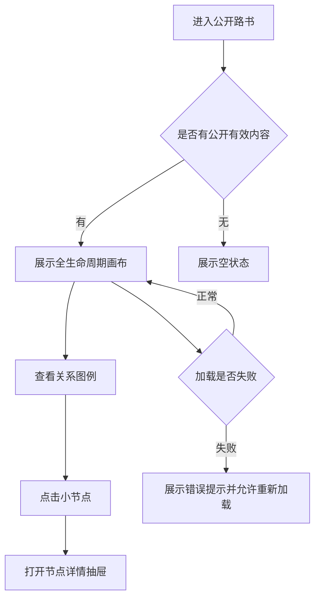

逐段解释：

- `进入公开路书` 后，系统读取最新公开有效路书内容。
- 若存在有效内容，则展示阶段、节点、关系和图例；若没有有效内容，则展示空状态。
- 访客通过图例理解关系含义，再点击小节点打开节点详情抽屉。
- 当页面加载失败时，系统提示错误并允许重新加载，公开内容不应被修改。

##### 核心业务字段

搜索筛选区：本期不包含搜索筛选。

全局操作按钮区：

| 按钮名称 | 类型 | 展示条件 | 点击后行为 | 权限要求 |
|---|---|---|---|---|
| 完整路书 | 文本按钮 | 始终显示 | 滚动到路书画布 | 无 |
| 阅读说明 | 文本按钮 | 始终显示 | 滚动到阅读说明 | 无 |
| 维护入口 | 次按钮 | 始终显示 | 进入维护登录页 | 无，进入后台需登录 |
| 查看完整路书 | 主按钮 | 始终显示 | 滚动到路书画布 | 无 |

列表列定义：

| 列名 | 字段 | 宽度 | 排序 | 说明 |
|---|---|---|---|---|
| 阶段名称 | stageTitle | 自适应 | 按阶段顺序 | 大节点标题 |
| 阶段说明 | stageDescription | 自适应 | 否 | 大节点说明 |
| 小节点名称 | nodeTitle | 自适应 | 按阶段内顺序 | 小节点标题 |
| 节点属性 | requirement | 固定 | 否 | 必需/可选 |
| 特殊关系 | relationType | 自适应 | 否 | 条件、并行、回退关系标签 |

行内操作按钮：

| 按钮 | 图标 | 展示条件 | 点击行为 | 二次确认 | 成功后行为 |
|---|---|---|---|---|---|
| 小节点卡片 | 箭头 | 每个小节点展示 | 打开节点详情抽屉 | 否 | 展示节点知识 |

业务字段：

| 字段含义 | 业务字段名 | 类型 | 必填 | 校验规则 | 默认值 | 权限 | 来源 |
|---|---|---|---|---|---|---|---|
| 路书标题 | title | String | 是 | 非空 | AI 研发路书 | 公开只读 | RoadmapData |
| 路书摘要 | summary | String | 是 | 非空 | 无 | 公开只读 | RoadmapData |
| 更新时间 | updatedAt | DateTime/String | 是 | 有效日期时间 | 保存公开时间 | 公开只读 | RoadmapData |
| 大节点集合 | stages | Stage[] | 是 | 至少 1 个 | 无 | 公开只读 | RoadmapData |
| 小节点集合 | nodes | RoadmapNode[] | 是 | 至少 1 个 | 无 | 公开只读 | RoadmapData |
| 关系集合 | relations | RoadmapRelation[] | 是 | 关系引用有效节点 | 无 | 公开只读 | RoadmapData |

##### Evidence

- code: `src/pages/PublicRoadmap.tsx`
- code: `src/types.ts`
- old_prd: `需求梳理文档.md` 第 5-12 章

#### 4.2.2 [D01] 节点详情抽屉

##### 页面介绍

节点详情抽屉用于在不离开公开路书的情况下展示小节点知识，包括介绍、适用场景、输入、处理流程、输出、模板和资源。

##### 业务意图

让小节点不只是流程卡片，而是一个可进入的知识入口，承载可复用资料。

##### ASCII 原型

```text
+-----------------------------+------------------------------+
| 公开路书主画布                | [X]                          |
|                              | 阶段名 · 必需/可选             |
|                              | 小节点标题                     |
|                              | 摘要                           |
|                              | 介绍 输入 处理 输出 资源        |
|                              |------------------------------|
|                              | 01 节点介绍                    |
|                              | 02 需要准备什么                 |
|                              | 03 如何完成                    |
|                              | 04 你会得到什么                 |
|                              | 05 配套模板                    |
|                              | 06 Skill 与工具                |
+-----------------------------+------------------------------+
```

##### 交互元素清单

| 元素 | 类型 | 点击/触发行为 | 状态 |
|---|---|---|---|
| 关闭 | Icon 按钮 | 关闭抽屉并回到路书画布 | 可用 |
| 目录锚点 | 链接 | 跳转抽屉内对应分区 | 可用 |
| 模板卡片 | 折叠面板 | 展开模板正文 | 有模板时展示 |
| 复制模板 | 按钮 | 复制模板正文并提示已复制 | 有模板时展示 |
| 资源卡片 | 外链 | 新页面打开资源 URL | 有资源时展示 |

##### 业务规则与逻辑

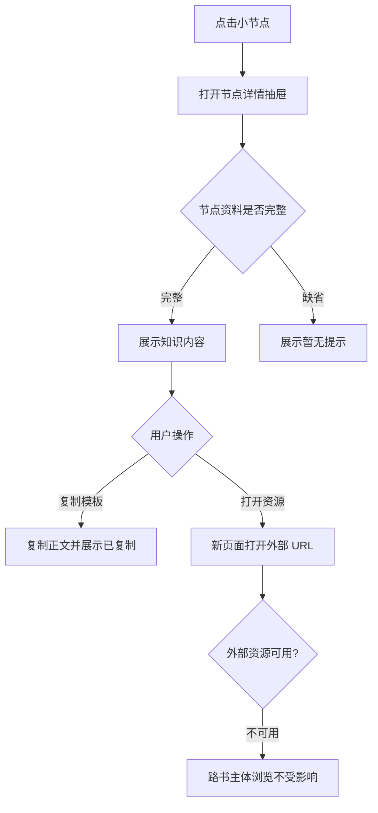

逐段解释：

- 点击小节点后，详情抽屉在当前页面打开，主画布上下文保留。
- 节点资料允许缺省，缺省项展示暂无提示，不阻断浏览。
- 模板复制只复制站内模板正文；资源访问依赖外部 URL，系统不检测可用性。

##### 核心业务字段

| 字段含义 | 业务字段名 | 类型 | 必填 | 校验规则 | 默认值 | 权限 | 来源 |
|---|---|---|---|---|---|---|---|
| 节点名称 | nodeTitle | String | 是 | 非空 | 无 | 公开只读 | RoadmapNode.title |
| 节点属性 | requirement | Enum | 是 | required/optional | required | 公开只读 | RoadmapNode.requirement |
| 节点摘要 | summary | String | 否 | [待确认: 长度限制 | 影响卡片展示 | 产品] | 空 | 公开只读 | RoadmapNode.summary |
| 节点介绍 | introduction | Text | 否 | 无 | 暂无介绍 | 公开只读 | RoadmapNode.introduction |
| 适用场景 | scenarios | String[] | 否 | 每行一条 | 空数组 | 公开只读 | RoadmapNode.scenarios |
| 输入描述 | input | Text | 否 | 无 | 暂无输入描述 | 公开只读 | RoadmapNode.input |
| 输入示例地址 | inputExampleUrl | URL | 否 | [待确认: URL 格式是否校验 | 影响可访问性 | 产品/研发] | 空 | 公开只读 | RoadmapNode.inputExampleUrl |
| 处理流程 | process | String[] | 否 | 每行一步 | 空数组 | 公开只读 | RoadmapNode.process |
| 输出描述 | output | Text | 否 | 无 | 暂无输出描述 | 公开只读 | RoadmapNode.output |
| 输出示例地址 | outputExampleUrl | URL | 否 | [待确认: URL 格式是否校验 | 影响可访问性 | 产品/研发] | 空 | 公开只读 | RoadmapNode.outputExampleUrl |
| 模板 | templates | NodeTemplate[] | 否 | 隶属于小节点 | 空数组 | 公开只读 | RoadmapNode.templates |
| 资源 | resources | NodeResource[] | 否 | 隶属于小节点 | 空数组 | 公开只读 | RoadmapNode.resources |

##### Evidence

- code: `src/components/NodeDetailDrawer.tsx`
- code: `src/types.ts`
- old_prd: `需求梳理文档.md` 第 8、13 章

#### 4.2.3 [P02] 维护登录页

##### 页面介绍

维护登录页用于区分公开访客和内容维护者。公开访客无需登录即可浏览，内容维护者登录后进入工作台。

##### 业务意图

保证公开浏览和内容维护两类行为边界清晰，避免访客直接进入维护工作台。

##### ASCII 原型

```text
+-------------------------------------------------------------+
| AI 研发路书                                  返回公开路书      |
+-------------------------------------------------------------+
| 维护一张路书，让知识持续流动       +------------------------+ |
| 配置阶段、节点、知识与关系         | 维护工作台              | |
|                                   | 欢迎回来                | |
|                                   | 账号 [____________]     | |
|                                   | 密码 [____________] [眼] | |
|                                   | [进入维护工作台]        | |
|                                   | 原型演示凭证            | |
|                                   +------------------------+ |
+-------------------------------------------------------------+
```

##### 交互元素清单

| 元素 | 类型 | 点击/触发行为 | 状态 |
|---|---|---|---|
| 返回公开路书 | 文本按钮 | 回到 P01 | 可用 |
| 账号 | 输入框 | 输入维护者账号 | 默认填充演示账号 |
| 密码 | 密码框 | 输入维护者密码 | 默认填充演示密码 |
| 显示/隐藏密码 | Icon 按钮 | 切换密码可见性 | 可用 |
| 进入维护工作台 | 主按钮 | 提交凭证 | 提交中禁用 |

##### 业务规则与逻辑

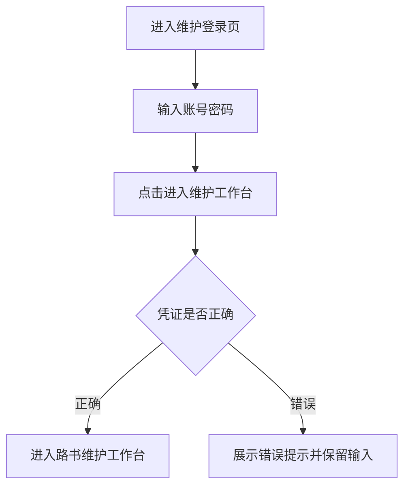

逐段解释：

- 内容维护者通过维护入口进入登录页。
- 系统校验账号密码；原型使用演示凭证，正式认证方式待确认。
- 校验成功进入工作台；校验失败停留当前页面并提示错误。

##### 核心业务字段

| 字段含义 | 业务字段名 | 类型 | 必填 | 校验规则 | 默认值 | 权限 | 来源 |
|---|---|---|---|---|---|---|---|
| 账号 | account | String | 是 | [待确认: 正式账号格式 | 影响登录校验 | 产品/研发] | 演示值 | 维护者 | AdminLogin |
| 密码 | password | Password | 是 | [待确认: 正式密码策略 | 影响安全要求 | 产品/研发] | 演示值 | 维护者 | AdminLogin |
| 提交中状态 | submitting | Boolean | 是 | true/false | false | 系统 | AdminLogin |
| 错误信息 | errorMessage | String | 否 | 凭证错误时展示 | 空 | 系统 | AdminLogin |
| 登录会话 | maintainerSession | Boolean | 是 | 登录成功为 true | false | 系统 | App |

##### Evidence

- code: `src/pages/AdminLogin.tsx`
- code: `src/App.tsx`
- unknown: 正式认证方式未确认

#### 4.2.4 [P03] 路书维护工作台

##### 页面介绍

路书维护工作台是内容维护者维护单一路书的主页面，支持阶段、节点、关系维护，并通过保存校验后公开。

##### 业务意图

让维护者在一个画布中理解和编辑完整生命周期结构，避免阶段、节点和关系分散维护。

##### ASCII 原型

```text
+-------------------------------------------------------------+
| AI 研发路书 | 维护工作台 / 单一路书     [查看公开端] [RW]      |
+-------------------------------------------------------------+
| 路书维护工作台                    有未保存修改 / 已同步        |
| 在同一张画布中维护阶段、节点、知识内容和流程关系               |
+-------------------------------------------------------------+
| [新增阶段] [新增节点] [配置关系]       [-] 90% [+] [适配] [保存并公开] |
| 大节点 N  小节点 N  关系 N     条件 N  并行 N  回退 N           |
+-------------------------------------------------------------+
| 阶段01               -> 阶段02               -> 阶段03          |
| [编辑][删除]            [编辑][删除]            [编辑][删除]     |
| 小节点卡片 [编辑][删除]  小节点卡片 [编辑][删除]                 |
| [+ 添加小节点]                                                |
+-------------------------------------------------------------+
| 修改只保存在当前浏览器编辑态，校验通过后才替换公开内容           |
+-------------------------------------------------------------+
```

##### 交互元素清单

| 区域 | 元素 | 类型 | 点击/触发行为 | 状态 |
|---|---|---|---|---|
| Header | 查看公开端 | 按钮 | 返回 P01 | 可用 |
| Header | 退出登录 | 头像按钮 | 清除维护会话，进入 P02 | 可用 |
| 工具栏 | 新增阶段 | 按钮 | 打开 D02 | 可用 |
| 工具栏 | 新增节点 | 按钮 | 打开 D03 | 可用 |
| 工具栏 | 配置关系 | 按钮 | 打开 D04 | 可用 |
| 工具栏 | 缩放控制 | Icon 按钮 | 调整工作台画布缩放 | 有上下限 |
| 工具栏 | 保存并公开 | 主按钮 | 执行结构校验，打开 D06 | 可用 |
| 阶段卡片 | 编辑/删除 | Icon 按钮 | 打开 D02 或 D05 | 可用 |
| 节点卡片 | 编辑/删除 | Icon 按钮 | 打开 D03 或 D05 | 可用 |
| 阶段内 | 添加小节点 | 按钮 | 打开 D03 并预设所属阶段 | 可用 |

##### 业务规则与逻辑

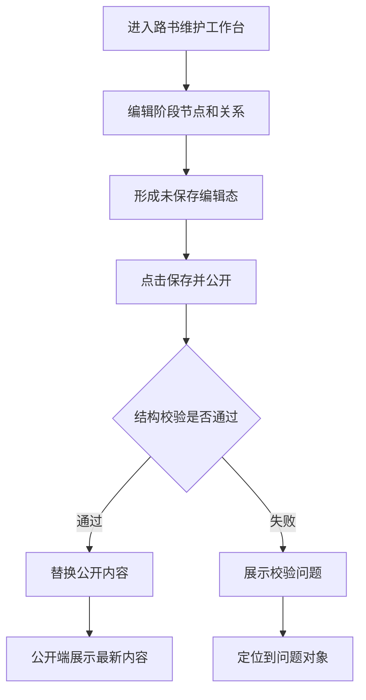

逐段解释：

- 维护者进入工作台后，编辑操作先进入当前编辑态。
- 保存并公开触发结构校验，校验对象包括阶段、节点、关系和循环。
- 校验通过后替换公开内容；校验失败时公开内容保持不变，并允许定位问题对象。

##### 核心业务字段

| 字段含义 | 业务字段名 | 类型 | 必填 | 校验规则 | 默认值 | 权限 | 来源 |
|---|---|---|---|---|---|---|---|
| 编辑态路书 | draftRoadmap | RoadmapData | 是 | 结构合法后可公开 | 当前公开内容克隆 | 内容维护者 | AdminRoadmap |
| 公开路书 | publishedRoadmap | RoadmapData | 是 | 仅保存通过后替换 | 初始路书 | 公开只读/维护者写 | App |
| 未保存状态 | dirty | Boolean | 是 | draft 与 published 不一致 | false | 系统 | AdminRoadmap |
| 关系统计 | relationCounts | Object | 是 | 按类型统计 | 0 | 系统 | AdminRoadmap |
| 画布缩放 | zoom | Number | 是 | 0.65-1.15 | 0.9 | 内容维护者 | AdminRoadmap |
| 校验结果 | validationIssues | ValidationIssue[] | 否 | 保存时生成 | 空数组 | 系统 | roadmap.ts |

##### Evidence

- code: `src/pages/AdminRoadmap.tsx`
- code: `src/lib/roadmap.ts`
- old_prd: `需求梳理文档.md` 第 8、10、12 章

#### 4.2.5 [D02] 大节点编辑弹窗

##### 页面介绍

大节点编辑弹窗用于新增或编辑生命周期阶段分组。

##### 业务意图

让维护者控制生命周期阶段的名称、显示顺序和说明，形成公开路书的横向主结构。

##### ASCII 原型

```text
+------------------------------+
| 新增/编辑大节点           [X] |
+------------------------------+
| 阶段名称 * [____________]     |
| 英文标签   [____________]     |
| 显示顺序 * [____]             |
| 阶段说明   [____________]     |
+------------------------------+
| [取消]          [保存到编辑态] |
+------------------------------+
```

##### 业务规则与逻辑

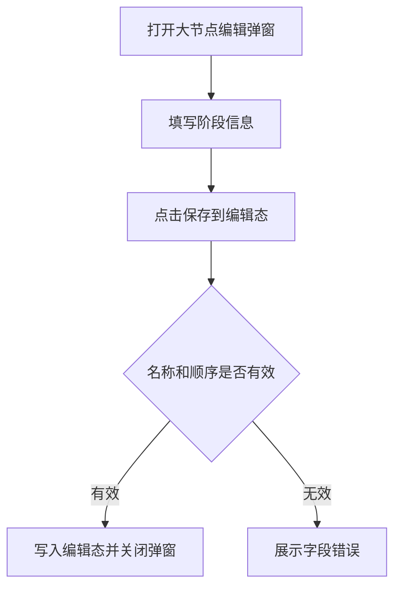

逐段解释：

- 新增阶段时系统提供默认显示顺序；编辑阶段时回显原数据。
- 阶段名称和显示顺序为保存必填校验。
- 保存只进入编辑态，仍需通过整张路书校验后才公开。

##### 表单字段

| 字段 | 类型 | 必填 | 校验规则 | 默认值 | 说明 |
|---|---|---|---|---|---|
| 阶段名称 | 文本 | 是 | 非空 | 空 | 公开路书和维护画布中展示 |
| 英文标签 | 文本 | 否 | 自动转大写；空时默认为 STAGE | 空 | 阶段辅助标签 |
| 显示顺序 | 数字 | 是 | 大于 0 | 当前阶段数 + 1 | 决定横向展示顺序 |
| 阶段说明 | 文本域 | 否 | [待确认: 长度限制 | 影响卡片展示 | 产品] | 空 | 阶段目标说明 |

##### Evidence

- code: `src/components/StageEditorModal.tsx`
- code: `src/types.ts`

#### 4.2.6 [D03] 小节点编辑抽屉

##### 页面介绍

小节点编辑抽屉用于维护单个研发活动节点，包含基础信息、知识内容、模板和外部资源。

##### 业务意图

把节点从“流程点”升级为“知识入口”，让每个节点都有可复用说明和资料。

##### ASCII 原型

```text
+------------------------------+--------------------------------+
| 工作台画布                     | 新增/编辑小节点            [X] |
|                               | [基本信息][知识内容][模板][资源] |
|                               | 节点名称 * [____________]       |
|                               | 所属大节点 * [下拉选择]          |
|                               | 节点属性 * [必需][可选]          |
|                               | 卡片摘要   [____________]        |
|                               | 其他字段分区按 Tab 展开维护       |
|                               | [取消] [保存到编辑态]            |
+------------------------------+--------------------------------+
```

##### 业务规则与逻辑

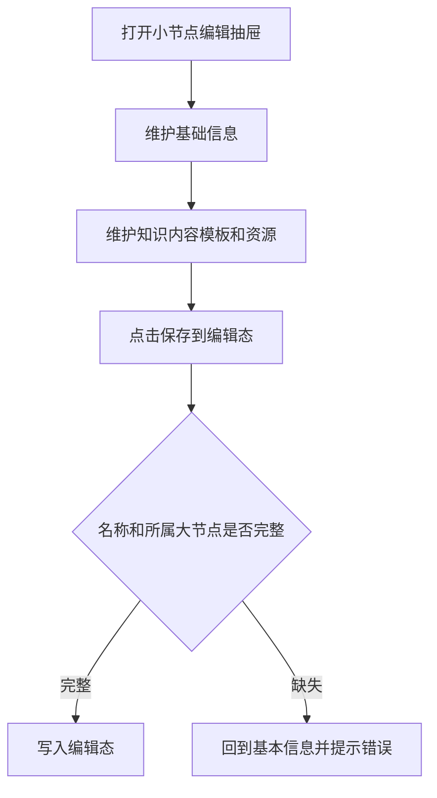

逐段解释：

- 抽屉分为基本信息、知识内容、模板、资源四个分区。
- 小节点名称和所属大节点必须填写；节点属性默认为必需。
- 知识内容、模板和资源允许缺省，不触发最小内容校验。

##### 表单字段

| 字段 | 类型 | 必填 | 校验规则 | 默认值 | 说明 |
|---|---|---|---|---|---|
| 节点名称 | 文本 | 是 | 非空 | 空 | 小节点标题 |
| 所属大节点 | 下拉单选 | 是 | 必须存在于大节点集合 | 默认第一个阶段或入口预设阶段 | 决定节点归属 |
| 节点属性 | 分段控件 | 是 | 必需/可选 | 必需 | 表示是否所有场景都需要经过 |
| 卡片摘要 | 文本域 | 否 | [待确认: 长度限制 | 影响卡片展示 | 产品] | 空 | 公开卡片摘要 |
| 介绍 | 文本域 | 否 | 无 | 空 | 节点介绍 |
| 使用场景 | 文本域 | 否 | 每行一条 | 空 | 展示为场景列表 |
| 输入描述 | 文本域 | 否 | 无 | 空 | 节点输入 |
| 输入示例地址 | URL 输入 | 否 | [待确认: 是否校验 URL 格式 | 影响外链可用性 | 产品/研发] | 空 | 输入示例 |
| 处理流程 | 文本域 | 否 | 每行一步 | 空 | 展示为有序步骤 |
| 输出描述 | 文本域 | 否 | 无 | 空 | 节点输出 |
| 输出示例地址 | URL 输入 | 否 | [待确认: 是否校验 URL 格式 | 影响外链可用性 | 产品/研发] | 空 | 输出示例 |
| 模板名称 | 文本 | 否 | 模板存在时建议非空 | 空 | 模板标题 |
| 模板说明 | 文本 | 否 | 无 | 空 | 模板用途 |
| 模板正文 | 文本域 | 否 | 支持多行文本 | 空 | 站内模板内容 |
| 资源名称 | 文本 | 否 | 资源存在时建议非空 | 空 | 外部资源标题 |
| 资源类型 | 下拉 | 否 | Skill/工具/输入示例/输出示例/其他 | Skill | 资源分类 |
| 来源 | 下拉 | 否 | 自研/第三方 | 自研 | 资源来源 |
| URL | URL 输入 | 否 | [待确认: 是否校验 URL 格式 | 影响外链可用性 | 产品/研发] | 空 | 外部访问地址 |
| 资源说明 | 文本域 | 否 | 无 | 空 | 资源描述 |

##### Evidence

- code: `src/components/NodeEditorDrawer.tsx`
- code: `src/types.ts`
- old_prd: `需求梳理文档.md` 第 9、13 章

#### 4.2.7 [D04] 关系配置抽屉

##### 页面介绍

关系配置抽屉用于维护小节点之间的普通主线、条件分支、并行分支和显式回退关系。

##### 业务意图

让路书不仅是节点集合，更能表达生命周期中的上下游路径、分支和回退规则。

##### ASCII 原型

```text
+------------------------------+--------------------------------+
| 工作台画布                     | 配置流程关系               [X] |
|                               | 新增/编辑关系                  |
|                               | 上游节点 * [下拉] -> 下游节点 * |
|                               | 关系类型 *                     |
|                               | [普通主线][条件分支]            |
|                               | [并行分支][回退关系]            |
|                               | 适用条件/回退说明 [________]    |
|                               | [添加到编辑态]                 |
|                               | 已配置关系列表                  |
+------------------------------+--------------------------------+
```

##### 业务规则与逻辑

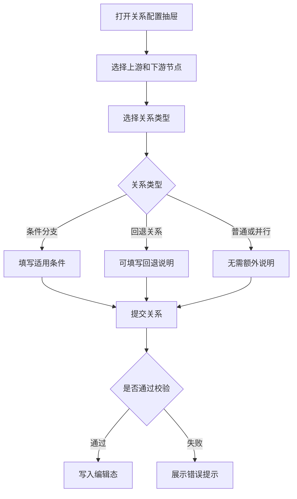

逐段解释：

- 上游和下游节点必须选择。
- 条件分支必须填写适用条件。
- 非回退关系不允许同一节点自循环。
- 相同上游和下游之间不允许重复配置关系。

##### 表单字段

| 字段 | 类型 | 必填 | 校验规则 | 默认值 | 说明 |
|---|---|---|---|---|---|
| 上游节点 | 下拉单选 | 是 | 必须存在于小节点集合 | 第一个节点 | 关系起点 |
| 下游节点 | 下拉单选 | 是 | 必须存在于小节点集合 | 第二个节点 | 关系终点 |
| 关系类型 | 单选卡片 | 是 | default/condition/parallel/rollback | default | 表达路线关系 |
| 适用条件 | 文本域 | 条件分支时是 | 条件分支非空 | 空 | 访客自行判断的条件说明 |
| 回退说明 | 文本域 | 否 | 无 | 空 | 回退原因说明 |

##### Evidence

- code: `src/components/RelationEditorPanel.tsx`
- old_prd: `需求梳理文档.md` 第 1、7、12 章

#### 4.2.8 [D05] 删除确认/阻断弹窗

##### 页面介绍

删除确认/阻断弹窗用于在删除大节点或小节点前展示风险，并在对象仍被引用时阻止删除。

##### 业务意图

防止维护者误删造成流程断链或内容不可读。

##### ASCII 原型

```text
+------------------------------+
| 暂时无法删除 / 确认删除？      |
| 对象名称和风险说明             |
| 关联引用列表                   |
| [返回处理关联] / [取消][确认删除] |
+------------------------------+
```

##### 业务规则与逻辑

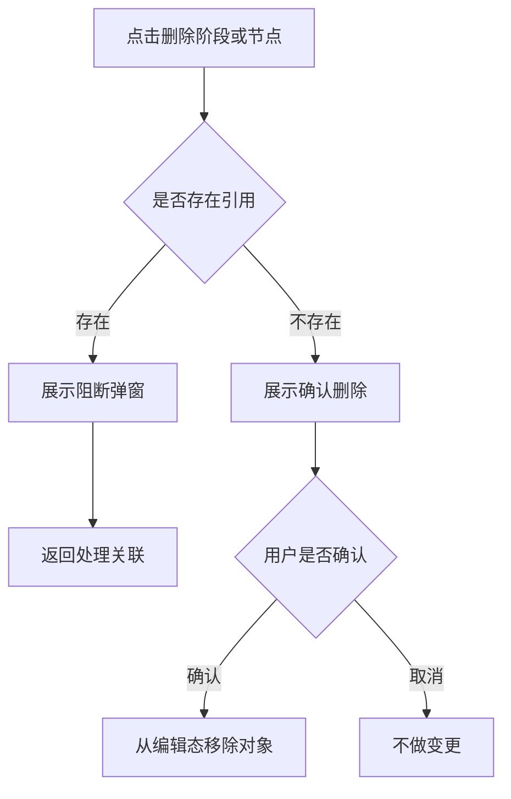

逐段解释：

- 删除阶段时，如果该阶段包含小节点，则阻止删除。
- 删除小节点时，如果该节点存在上下游关系，则阻止删除。
- 无引用时允许确认删除，但删除只影响编辑态。

##### 核心业务字段

| 字段含义 | 业务字段名 | 类型 | 必填 | 校验规则 | 默认值 | 权限 | 来源 |
|---|---|---|---|---|---|---|---|
| 删除对象类型 | deleteKind | Enum | 是 | stage/node | 无 | 内容维护者 | DeleteConfirmDialog |
| 删除对象名称 | deleteName | String | 是 | 非空 | 无 | 内容维护者 | DeleteConfirmDialog |
| 引用列表 | references | String[] | 是 | 可为空 | 空数组 | 系统 | AdminRoadmap |
| 是否阻断 | blocked | Boolean | 是 | references.length > 0 | false | 系统 | DeleteConfirmDialog |

##### Evidence

- code: `src/components/DeleteConfirmDialog.tsx`
- code: `src/pages/AdminRoadmap.tsx`
- old_prd: `需求梳理文档.md` 第 12 章

#### 4.2.9 [D06] 校验结果弹窗

##### 页面介绍

校验结果弹窗用于展示保存并公开后的成功状态或校验失败问题。

##### 业务意图

让维护者知道公开是否生效，并在失败时能逐项定位修正问题。

##### ASCII 原型

```text
+----------------------------------------+
| PUBLISHED / VALIDATION FAILED           |
| 路书已保存并公开 / 还有问题需要处理       |
| 成功: 公开状态、发布时间、历史版本说明     |
| 失败: N 个阻断问题                       |
| 01 问题标题 - 描述 [定位]                |
| [返回工作台] [查看公开路书/定位第一个问题] |
+----------------------------------------+
```

##### 业务规则与逻辑

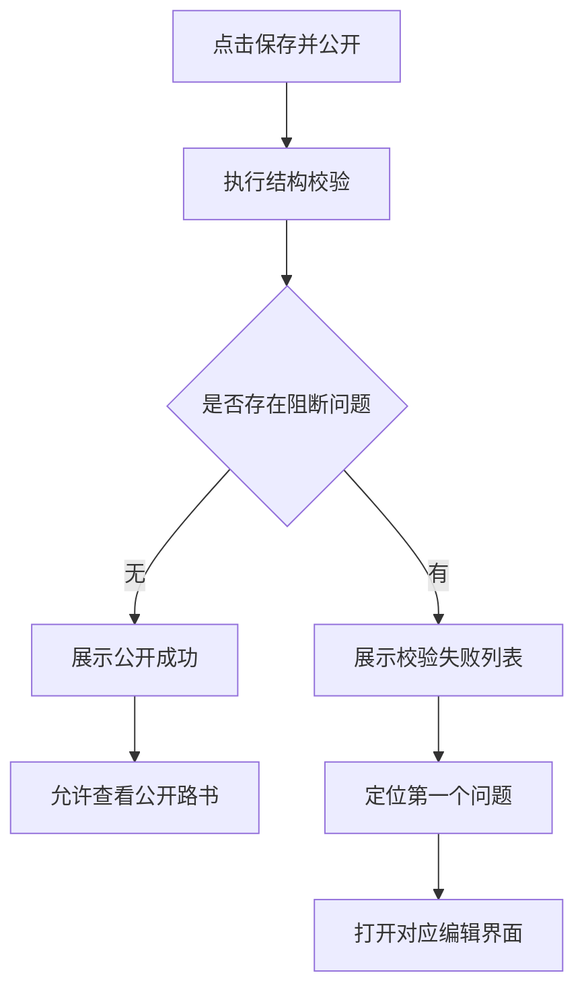

逐段解释：

- 保存并公开总是先执行结构校验。
- 成功时展示公开生效和发布时间。
- 失败时展示问题列表，用户可定位到阶段、小节点或关系配置界面。

##### 核心业务字段

| 字段含义 | 业务字段名 | 类型 | 必填 | 校验规则 | 默认值 | 权限 | 来源 |
|---|---|---|---|---|---|---|---|
| 校验问题 | issues | ValidationIssue[] | 是 | 可为空 | 空数组 | 系统 | ValidationResultModal |
| 发布时间 | publishedAt | DateTime/String | 成功时是 | 有效日期时间 | 当前时间 | 系统 | ValidationResultModal |
| 问题 ID | issueId | String | 是 | 唯一 | 无 | 系统 | ValidationIssue |
| 对象类型 | objectType | Enum | 是 | stage/node/relation | 无 | 系统 | ValidationIssue |
| 对象 ID | objectId | String | 是 | 指向对应对象 | 无 | 系统 | ValidationIssue |
| 问题标题 | issueTitle | String | 是 | 非空 | 无 | 系统 | ValidationIssue |
| 问题描述 | issueDescription | String | 是 | 非空 | 无 | 系统 | ValidationIssue |

##### Evidence

- code: `src/components/ValidationResultModal.tsx`
- code: `src/lib/roadmap.ts`

#### 4.2.10 [M01] 操作反馈 Toast

##### 页面介绍

操作反馈 Toast 用于在维护端编辑后展示轻量反馈，例如“大节点已加入未保存编辑态”“流程关系已从未保存编辑态移除”。

##### 业务意图

让维护者明确当前操作已写入编辑态，但尚未公开。

##### ASCII 原型

```text
[ 信息图标 操作结果文案 ]
```

##### 业务规则与逻辑

- Toast 非阻塞，展示约 2.2 秒后自动消失。
- Toast 只表示写入当前编辑态，不代表公开生效。
- 保存并公开结果使用 D06 弹窗承载，不使用 Toast 替代。

##### 核心业务字段

| 字段含义 | 业务字段名 | 类型 | 必填 | 校验规则 | 默认值 | 权限 | 来源 |
|---|---|---|---|---|---|---|---|
| 提示内容 | notice | String | 否 | 非空时展示 | 空 | 系统 | AdminRoadmap |
| 展示时长 | durationMs | Number | 是 | 2200ms | 2200 | 系统 | AdminRoadmap |

##### Evidence

- code: `src/pages/AdminRoadmap.tsx`

## 5. 用户旅程

### 5.1 端到端主流程

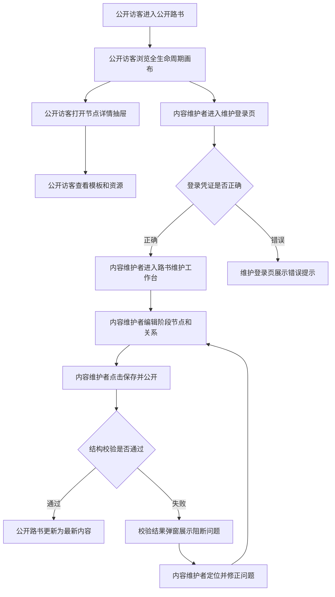

逐段解释：

- 公开访客最高频路径是进入公开路书、浏览生命周期画布、打开节点详情，并查看模板和资源。
- 内容维护者从公开路书或登录路由进入维护登录页，凭证正确后进入维护工作台。
- 维护者编辑阶段、节点和关系后，保存并公开必须通过结构校验。
- 校验通过后，公开路书替换为最新内容；校验失败时保留原公开内容，并通过问题弹窗定位修正。

### 5.2 主流程覆盖模块对齐表

| Coverage Index ID | 页面/模块 | PRD章节定位 | 流程图节点名 | 是否覆盖 |
|---|---|---|---|---|
| P01 | 公开路书 | 4.2.1 | 公开访客进入公开路书 | 已覆盖 |
| P01 | 全生命周期画布 | 4.2.1 | 公开访客浏览全生命周期画布 | 已覆盖 |
| D01 | 节点详情抽屉 | 4.2.2 | 公开访客打开节点详情抽屉 | 已覆盖 |
| P02 | 维护登录页 | 4.2.3 | 内容维护者进入维护登录页 | 已覆盖 |
| P03 | 路书维护工作台 | 4.2.4 | 内容维护者进入路书维护工作台 | 已覆盖 |
| D06 | 校验结果弹窗 | 4.2.9 | 校验结果弹窗展示阻断问题 | 已覆盖 |

### 5.3 状态流转

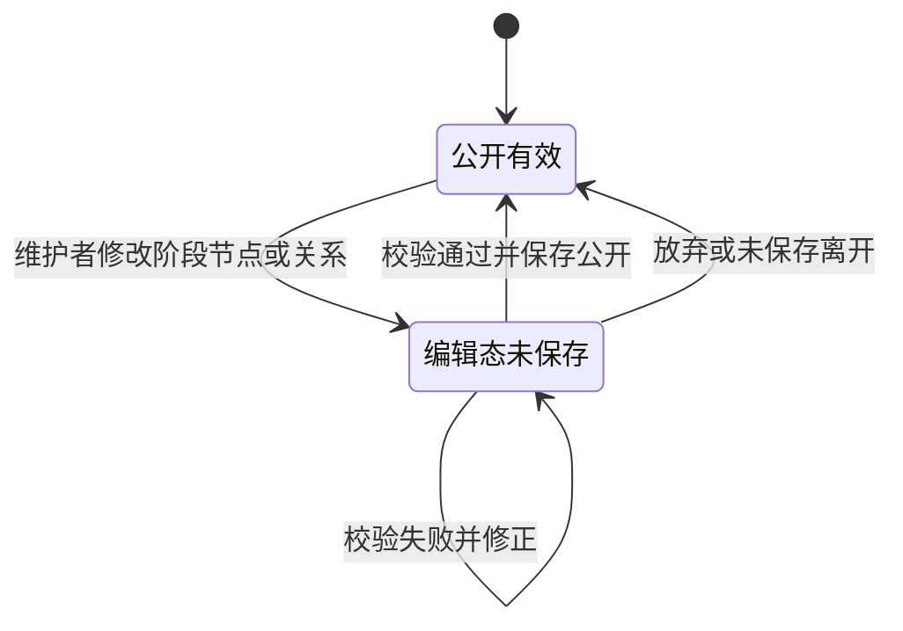

逐段解释：

- 路书默认处于公开有效状态。
- 维护者编辑后进入编辑态未保存状态。
- 只有校验通过并保存公开后，编辑态才替换为新的公开有效内容。
- 校验失败不会改变公开内容，维护者需修正后再次保存。

## 6. 测试标准

### 6.1 功能测试

| 测试项 | 前置条件 | 操作步骤 | 预期结果 | 优先级 |
|---|---|---|---|---|
| 公开页加载 | 存在有效路书 | 打开 `/` | 展示阶段、节点、图例和节点卡片 | P0 |
| 节点详情 | 公开页存在小节点 | 点击任意节点 | 打开详情抽屉，展示介绍、输入、处理、输出、模板和资源 | P0 |
| 空状态 | 无有效阶段或节点 | 打开公开页 | 展示路书内容准备中 | P1 |
| 加载失败状态 | 模拟失败状态 | 打开带失败状态的公开页 | 展示错误提示和重新加载入口 | P1 |
| 登录成功 | 输入正确凭证 | 点击进入维护工作台 | 进入 P03 | P0 |
| 登录失败 | 输入错误凭证 | 点击进入维护工作台 | 展示错误提示，停留登录页 | P0 |
| 新增阶段 | 已登录 | 新增阶段并保存 | 阶段加入编辑态，出现提示 | P0 |
| 新增小节点 | 已登录且有阶段 | 新增节点并保存 | 节点加入编辑态，出现提示 | P0 |
| 条件关系校验 | 已登录 | 新增条件分支但不填条件 | 展示条件必填错误 | P0 |
| 保存公开成功 | 编辑态结构合法 | 点击保存并公开 | 展示公开成功弹窗，公开内容更新 | P0 |
| 保存公开失败 | 编辑态结构不合法 | 点击保存并公开 | 展示阻断问题，公开内容保持不变 | P0 |
| 删除保护 | 阶段含小节点或节点有关系 | 点击删除 | 展示阻断弹窗 | P0 |

### 6.2 性能与体验

| 指标 | 要求 | 优先级 |
|---|---|---|
| 公开页首屏加载 | 普通知识网站体验；建议 ≤ 2s | P1 |
| 关键操作响应 | 编辑态保存、弹窗打开、抽屉打开建议 ≤ 1s | P1 |
| 路书画布交互 | 缩放和横向滚动应平滑，不遮挡节点卡片 | P1 |
| 维护端设备 | 维护工作台仅要求桌面 Web；窄屏展示提示 | P0 |

## 7. 非功能性需求

### 7.1 安全与权限

- 公开访客只允许查看最新公开有效内容，不允许修改、投稿、评论或保存个人状态。
- 内容维护者允许查看、创建、修改、排序、保存和满足约束后的删除。
- 正式认证方式待确认，不应沿用原型演示凭证。
- 关键保存公开和删除操作应有权限控制。

### 7.2 可用性

- 校验失败时，公开内容必须保持不变。
- 外部资源不可用时，路书主体仍可浏览。
- 维护端编辑态需要明确提示“未公开”，避免误以为访客已可见。

### 7.3 兼容性

- 公开页应支持主流桌面浏览器和常见移动浏览器浏览。
- 维护工作台需要较宽操作空间，V1.0 按桌面 Web 设计。

### 7.4 数据保留

- V1.0 只保留最新公开有效内容。
- 不保留历史版本、修改追溯、审核记录或访问统计。

## 8. 技术可行性与风险预判

| 风险 | 描述 | 影响 | 建议 |
|---|---|---|---|
| 正式认证未定义 | 原型使用演示凭证和浏览器会话 | 无法直接用于生产 | 明确正式登录方式和权限模型 |
| 正式存储未定义 | 原型使用浏览器本地存储表达公开内容替换 | 多设备维护和持久化不成立 | 明确后端数据库或静态发布机制 |
| 无历史版本 | V1.0 不保留修改追溯和回滚 | 误操作后恢复困难 | 若风险不可接受，规划版本历史能力 |
| 无资源可用性检测 | 外部 URL 由维护者手动维护 | 访客可能访问失效链接 | 保持 V1.0 边界，后续可加入失效检测 |
| 节点规模未知 | 大节点、小节点、模板、资源数量未确认 | 性能和布局评估不充分 | 补充容量预估后评估画布性能和信息密度 |
| 条件说明口径不一 | 条件分支仅要求非空 | 访客判断标准可能不统一 | 建立条件说明填写规范 |

## 9. 迭代规划

### 9.1 V1.0

- 完成公开路书浏览。
- 完成节点详情查看。
- 完成维护者登录入口。
- 完成大节点、小节点、关系维护。
- 完成保存校验、删除保护和公开生效。

### 9.2 后续候选能力

| 能力 | 价值 | 触发条件 |
|---|---|---|
| 搜索与筛选 | 节点规模变大后提升查找效率 | 节点数量超过人工浏览舒适范围 |
| 正式认证/RBAC | 支持真实维护者管理 | 进入生产环境前 |
| 历史版本与回滚 | 降低误操作风险 | 内容维护频繁或多人协作时 |
| 资源可用性检测 | 降低失效链接影响 | 外部资源数量较多时 |
| 访问统计 | 理解访客关注点 | 需要运营分析时 |

## 10. 附录

### 10.1 术语表

| 术语 | 定义 |
|---|---|
| AI 研发路书 | 集中呈现 AI 产品研发、交付、宣传和反馈生命周期知识的单一路书 |
| 大节点 | 生命周期阶段分组和顺序对象 |
| 小节点 | 表示一项研发活动及其知识、模板和资源的流程节点 |
| 必需节点 | 所有研发场景都需要经过的小节点 |
| 可选节点 | 位于主线、但可按实际场景跳过的小节点 |
| 条件分支 | 由文字条件说明适用路线的分支关系 |
| 并行分支 | 同一上游之后可同时执行的多个下游关系 |
| 回退关系 | 显式返回上游节点的流程关系 |

### 10.2 系统级数据字典

| 实体 | 字段 | 类型 | 必填 | 说明 |
|---|---|---|---|---|
| RoadmapData | title | String | 是 | 路书标题 |
| RoadmapData | summary | String | 是 | 路书摘要 |
| RoadmapData | updatedAt | String/DateTime | 是 | 更新时间 |
| RoadmapData | stages | Stage[] | 是 | 大节点集合 |
| RoadmapData | nodes | RoadmapNode[] | 是 | 小节点集合 |
| RoadmapData | relations | RoadmapRelation[] | 是 | 关系集合 |
| Stage | id | String | 是 | 大节点唯一标识 |
| Stage | title | String | 是 | 大节点名称 |
| Stage | order | Number | 是 | 显示顺序 |
| Stage | label | String | 否 | 英文标签 |
| Stage | description | String | 否 | 阶段说明 |
| RoadmapNode | id | String | 是 | 小节点唯一标识 |
| RoadmapNode | stageId | String | 是 | 所属大节点 |
| RoadmapNode | title | String | 是 | 小节点名称 |
| RoadmapNode | requirement | Enum | 是 | required/optional |
| RoadmapNode | summary | String | 否 | 卡片摘要 |
| RoadmapNode | introduction | Text | 否 | 节点介绍 |
| RoadmapNode | scenarios | String[] | 否 | 使用场景 |
| RoadmapNode | input | Text | 否 | 输入描述 |
| RoadmapNode | process | String[] | 否 | 处理流程 |
| RoadmapNode | output | Text | 否 | 输出描述 |
| RoadmapNode | templates | NodeTemplate[] | 否 | 模板集合 |
| RoadmapNode | resources | NodeResource[] | 否 | 资源集合 |
| RoadmapRelation | id | String | 是 | 关系唯一标识 |
| RoadmapRelation | from | String | 是 | 上游节点 ID |
| RoadmapRelation | to | String | 是 | 下游节点 ID |
| RoadmapRelation | type | Enum | 是 | default/condition/parallel/rollback |
| RoadmapRelation | condition | Text | 条件分支时是 | 条件或回退说明 |
| ValidationIssue | id | String | 是 | 校验问题唯一标识 |
| ValidationIssue | severity | Enum | 是 | error/warning |
| ValidationIssue | objectType | Enum | 是 | stage/node/relation |
| ValidationIssue | objectId | String | 是 | 问题对象 ID |
| ValidationIssue | title | String | 是 | 问题标题 |
| ValidationIssue | description | String | 是 | 问题描述 |

### 10.3 待确认问题

| ID | 问题 | 阻塞级别 | 影响 | 建议负责人 |
|---|---|---:|---|---|
| Q01 | 初期与长期预计维护多少大节点、小节点、模板和外部资源？ | P1 | 影响容量和画布性能评估 | 产品/内容维护者 |
| Q02 | 公开访客访问量级和高峰并发是否有预估？ | P1 | 影响性能与部署评估 | 业务方 |
| Q03 | 正式维护者认证方式是什么？ | P0 | 影响登录、权限和安全实现 | 产品/研发 |
| Q04 | 路书公开内容正式保存在哪里？ | P0 | 影响数据持久化、发布和多人维护 | 研发 |
| Q05 | 条件分支说明是否需要统一填写模板或字数限制？ | P1 | 影响访客理解一致性 | 产品 |
| Q06 | 删除空阶段是否允许，尤其是生命周期中间阶段？ | P1 | 影响生命周期连续性 | 产品 |
| Q07 | 外部资源来源是否只保留自研/第三方？ | P1 | 影响资源分类口径 | 产品 |
| Q08 | 维护端是否需要防止未保存修改离开页面？ | P1 | 影响误操作保护 | 产品/研发 |
| Q09 | 公开页异常状态是否需要展示反馈入口或维护者联系方式？ | P2 | 影响访客遇错后的恢复路径 | 产品 |
| Q10 | “AI 能力编排”是路书内容节点，不是本产品自身 AI 功能，是否确认？ | P1 | 影响产品类型和 PRD 模板判断 | 产品 |

### 10.4 参考文件

- `需求梳理文档.md`
- `src/App.tsx`
- `src/pages/PublicRoadmap.tsx`
- `src/pages/AdminLogin.tsx`
- `src/pages/AdminRoadmap.tsx`
- `src/components/NodeDetailDrawer.tsx`
- `src/components/StageEditorModal.tsx`
- `src/components/NodeEditorDrawer.tsx`
- `src/components/RelationEditorPanel.tsx`
- `src/components/DeleteConfirmDialog.tsx`
- `src/components/ValidationResultModal.tsx`
- `src/lib/roadmap.ts`
- `src/types.ts`
